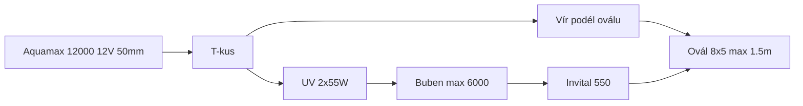

# koi_koupaci_jezirko

Provozní zapojení koupacího oválu **40 m³ / 40 Koi** (8 × 5 m, max. 1,5 m) se dvěma 12V větvemi. Cíl je **průzračná voda** bez výměny stávající techniky.

Verze **[1.1.4](CHANGELOG.md)** · licence [GPL-3.0](LICENSE)

Technický popis **současného** zapojení, odkazy na e-shopy a odhad ceny: [zapojeni.md](zapojeni.md). Cílový postup u vody: [provoz.md](provoz.md). Kbelík a zákal: [lab.md](lab.md). Záloha a FVE (12 V as-built → plán 48 V + Orion): [solar.md](solar.md). Při tagu `v*` GitHub Action složí vše do [all_in_one.md](all_in_one.md).

## Verdikt

- Větev 2: **UV 2×55 W → netlakový buben (max. 6000 l/h) → Invital Biofiltr 550**. Vír jen jako obchoz.
- Kbelík **5. 9. 2026** (čisté filtry, vír zavřený, vše přes UV): větev 1 **950 l/h**, větev 2 **2 250 l/h** — to je strop 12 V, ne krádež vírem. Zákal tmavě zelený až šedý: [lab.md](lab.md).
- **Nekupovat** větší tlakový filtr na větev 2 (včetně SUNSUN CPF-10000 před UV), další 55 W UV, satelit na dno, bazénový písek. Zeolit jen nouzově na NH₄ (pak ven); uhlí jen 7–14 dní bez Dyofixu, až po zeolitu.
- Hadice od Aquamax 12000: **50 mm v kuse** k T-kusu, ne Y z 2×40 mm.

## Větve (beze změny sortimentu)

| Větev | Tok | Úloha |
| --- | --- | --- |
| 1 | Skimmer CSP-8000 (koš) → Aquamax 6000 12V → Sicce Green Reset 100 → IBC 1000 l / Hel-X 300 l | Mechanika + hlavní bio |
| 2 | Aquamax 12000 12V → T-kus: vír **nebo** UV → buben → Biofiltr 550 | Cirkulace + průzračnost |

Tlakový zůstává jen Green Reset. Za ním žádné další čerpadlo.
