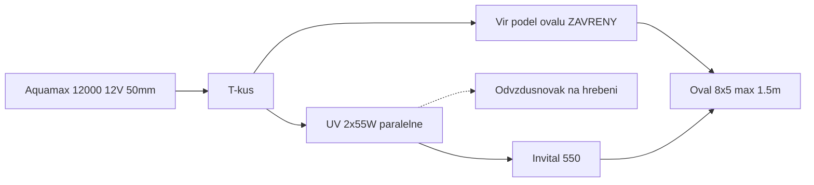

# koi_koupaci_jezirko

Provozní zapojení koupacího oválu 8 × 5 m (max. 1,5 m) se dvěma 12V větvemi. Obsádka k 5. 9. 2026: **5× Koi cca 40 cm + cca 20 mladých cca 8 cm**. Cíl je **průzračná voda** bez výměny stávající techniky.

Verze **[1.2.0](CHANGELOG.md)** · licence [GPL-3.0](LICENSE)

Revize návrhu a pořadí dalších kroků: [doporuceni.md](doporuceni.md). Průtoky, výšky a tlakové ztráty: [hydraulika.md](hydraulika.md). Postup u vody: [provoz.md](provoz.md). Kbelík a zákal: [lab.md](lab.md). Technický popis **současného** zapojení, odkazy na e-shopy a odhad ceny: [zapojeni.md](zapojeni.md). Záloha a FVE (12 V as-built → plán 48 V + Orion): [solar.md](solar.md). Při tagu `v*` GitHub Action složí vše do [all_in_one.md](all_in_one.md).

## Verdikt

- **Buben zatím neinstalovat.** Při 5–7 kg biomasy není co odvádět, vana přeruší sifon a na řasu pod 2 µm je to nejhorší typ síta. Rozbor: [doporuceni.md](doporuceni.md).
- **Nejdřív to, co je zadarmo:** změřit hladinu IBC pásmem a nádrž snížit, otevřít ventil větve B naplno, odvzdušnit hřeben U. Po každé změně kbelík.
- Kbelík **5. 9. 2026** (čisté filtry, vír zavřený, vše přes UV): větev 1 **950 l/h**, větev 2 **2 250 l/h**. **To nejsou stropy 12 V** — obě čerpadla táhnou 2,6–3,1 m ze 3,2 m a část toho odporu je odstranitelná ([hydraulika.md](hydraulika.md)).
- **UV přepojit paralelně**, ne v sérii: stejná dávka na litr, zhruba **8× nižší odpor**.
- **Zelená voda není z ryb.** Odpověď je víc průchodů přes UV plus odběr živin — osázet 30cm polici, změřit KH a PO₄, přehodnotit dávku Dyofixu.
- **Nekupovat** větší tlakový filtr na větev 2 (včetně SUNSUN CPF-10000), další 55 W UV, satelit na dno, bazénový písek, stálý zeolit.
- Hadice od Aquamax 12000: **50 mm** co nejdál k lampám; na trnech UV **38 mm**. Lampy zůstanou **nastojato na ~1 m polici** kvůli elektroinstalaci.

## Větve (beze změny sortimentu)

| Větev | Tok | Úloha |
| --- | --- | --- |
| 1 | Skimmer CSP-8000 (koš) → Aquamax 6000 12V → Sicce Green Reset 100 → IBC 1000 l / Hel-X 300 l | Mechanika + hlavní bio |
| 2 | Aquamax 12000 12V → T-kus: vír **nebo** UV 2×55 W → Biofiltr 550 | Cirkulace + průzračnost |

Tlakový zůstává jen Green Reset. Za ním žádné další čerpadlo. Buben je v majetku, ale mimo řadu.
