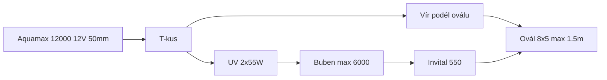
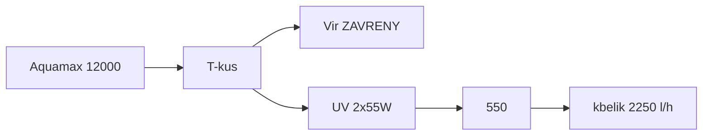
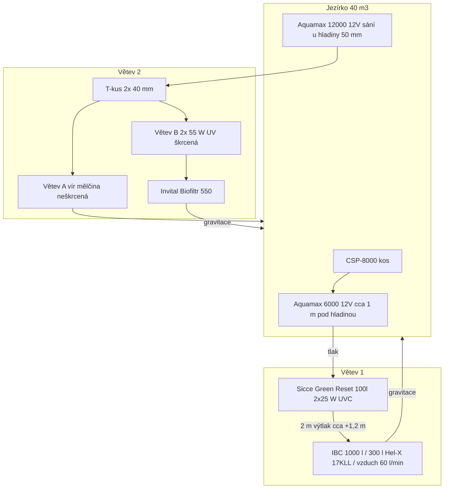
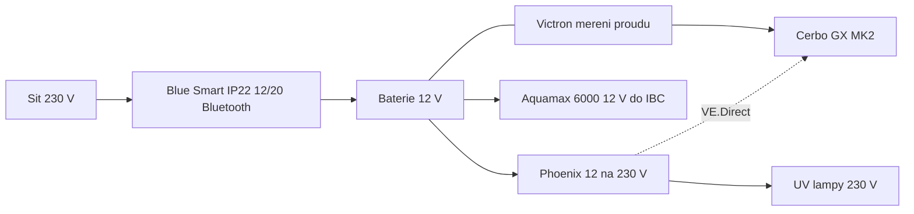
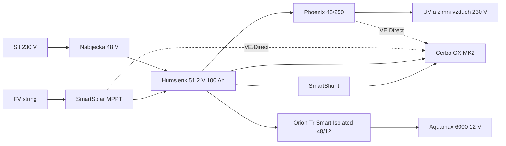

<!-- Generated by scripts/build-all-in-one.sh. Do not edit. Source: v1.1.5 -->

# Vše v jednom souboru

Automaticky sloučeno z markdown souborů v kořeni při tagu / ref `v1.1.5`.


---

<!-- source: README.md -->

# koi_koupaci_jezirko

Provozní zapojení koupacího oválu **40 m³ / 40 Koi** (8 × 5 m, max. 1,5 m) se dvěma 12V větvemi. Cíl je **průzračná voda** bez výměny stávající techniky.

Verze **[1.1.5](CHANGELOG.md)** · licence [GPL-3.0](LICENSE)

Technický popis **současného** zapojení, odkazy na e-shopy a odhad ceny: [zapojeni.md](zapojeni.md). Cílový postup u vody: [provoz.md](provoz.md). Kbelík a zákal: [lab.md](lab.md). Záloha a FVE (12 V as-built → plán 48 V + Orion): [solar.md](solar.md). Při tagu `v*` GitHub Action složí vše do [all_in_one.md](all_in_one.md).



## Verdikt

- Větev 2: **UV 2×55 W → netlakový buben (max. 6000 l/h) → Invital Biofiltr 550**. Vír jen jako obchoz.
- Kbelík **5. 9. 2026** (čisté filtry, vír zavřený, vše přes UV): větev 1 **950 l/h**, větev 2 **2 250 l/h** — to je strop 12 V, ne krádež vírem. Zákal tmavě zelený až šedý: [lab.md](lab.md).
- **Nekupovat** větší tlakový filtr na větev 2 (včetně SUNSUN CPF-10000 před UV), další 55 W UV, satelit na dno, bazénový písek. Zeolit jen nouzově na NH₄ (pak ven); uhlí jen 7–14 dní bez Dyofixu, až po zeolitu.
- Hadice od Aquamax 12000: **50 mm v kuse** k T-kusu, pokud se vejde; na trnech UV **38 mm**. Lampy **svislé U na ~1 m polici** — naklánět ani spouštět k hladině kvůli l/h ne.

## Větve (beze změny sortimentu)

| Větev | Tok | Úloha |
| --- | --- | --- |
| 1 | Skimmer CSP-8000 (koš) → Aquamax 6000 12V → Sicce Green Reset 100 → IBC 1000 l / Hel-X 300 l | Mechanika + hlavní bio |
| 2 | Aquamax 12000 12V → T-kus: vír **nebo** UV → buben → Biofiltr 550 | Cirkulace + průzračnost |

Tlakový zůstává jen Green Reset. Za ním žádné další čerpadlo.


---

<!-- source: provoz.md -->

# Provoz a zapojení — krok za krokem

Čísla níže jdou v pořadí prací. 12V čerpadla, Green Reset i IBC se nemění. Satelit, druhý tlakový filtr a stálý zeolit/uhlí se neinstalují.

---

## 1. Diagnostika zákalu a kbelíkový test

Nejdřív vzhled vody, pak čísla. Média a ventily se ladí podle barvy, ne podle katalogu.

### Typ zákalu

| Vzhled | Co to je | Co zvedne průzračnost |
| --- | --- | --- |
| Zelená | Jednobuněčné řasy | Víc vody přes UV 2×55 W + buben za nimi; volitelně Dyofix |
| Hnědá / prachová | Zvířený kal, detrit | Buben + 550; mírný vír **ne** do 30cm police; občas vysavač v 1,5 m |
| Mléčná | Bakterie, rozpuštěná organika | Méně krmení, kyslík v hlubině, odvoz kalu z bubnu na zahradu |
| Žlutá, ale čirá | Rozpuštěné organiky (DOC) | Výměna vody; uhlí jen 7–14 dní **bez** Dyofixu |

Celý objem je v dosahu slunce (max. 1,5 m). Zelená voda je u tohoto tvaru očekávatelná — proto UV a buben, ne další houby v tlaku.

### Kbelíkový test

Měřit na **výtoku z Biofiltru 550** (větev 2) a zvlášť na **výtoku z IBC** (větev 1). Ne u čerpadla.

1. Kbelík 10 l, stopky.
2. Plný kbelík: `průtok (l/h) = 10 / sekundy × 3600`.
3. Cíl větve 2 po zapojení bubnu: **4000–5500 l/h**.
4. Strop bubnu je **6000 l/h**. Nad ním teče voda přepadem **neošetřená** zpět do jezírka.
5. IBC: zapsat výchozí hodnotu. **5. 9. 2026: 950 l/h při čistém Green Resetu** — viz [lab.md](lab.md). Nesnažit se honit větev 1 na 6000 — čerpadlo na to nemá výtlak.

Když buben pere nonstop, stáhnout větev B (víc na vír), nepřidávat průtok.

---

## 2. Zapojení bubnu (větev 2)

Pořadí je dané kvůli průzračnosti: UV shlukne řasy, síto je zachytí, 550 jen leští.

```
Aquamax 12000 12V
  --50 mm--> T-kus
               |-- větev A: vír podél oválu --> jezírko
               |-- větev B: UV 2×55 W --> buben --> Invital 550 --> jezírko
                              buben přepad --> jezírko (mimo sání 12000)
                              buben prací odpad --> zahrada
```

### Hadice

- Od čerpadla k T-kusu **jedna 50 mm**. Neslučovat dvě 40 mm Y jako „vstup 50 mm“ — víc ztrát, nerovnoměrné dělení.
- Větev B smí jít 40 mm do UV, pokud UV větší trn nemá.
- Dvě 40 mm až **za** 550 jako dvě mírné vratné trysky, ne jako vstup do filtru.

### Výšky (za UV je vše netlakové)

1. Výtok z UV **nad** provozní hladinu bubnu.
2. Čistý výtok bubnu **nad** vtok Invital 550.
3. Výtok 550 **nad** hladinu jezírka.
4. Havarijní přepad bubnu: volný spád do jezírka, vyústění **mimo** sání 12000.

Bez tohoto schodu 550 nepoteče a buben poleje okolí.

### Přepad vs. praní

- Přepad = nouze, voda zpět do jezírka (neošetřená).
- Prací/odkalovací voda ze síta = koncentrovaná špina na **zahradu**, ne do 550, ne do IBC, ideálně ne zpět do jezírka.

### Biofiltr 550

Po bubnu nechat stávající houby jako dočištění. Jemná japonská rohož na výstupu je volitelná. Čistit, až stoupne hladina ve 550, ne obě komory naráz.

### Zima

Ostřik a elektronika bubnu nesmí zmrznout: bypass (UV → 550 nebo UV → jezírko) nebo nezámrzná šachta.

### Křemenky UV

**Křemenka** je křemenná trubice kolem UV-C zářivky: zářivka v ní nesmí do vody, voda teče okolo a UV-C prochází sklem. Obyčejné sklo by záření sežralo. Náhradní díl v e-shopu je „křemenná trubice“ / quartz sleeve — to není zářivka.

Při pořadí UV → buben se pouzdra špiní rychleji (předfiltrace je jen sání u hladiny). Otírat, jinak 110 W svítí do mlhy. Kdyby UV přestalo být vidět, teprve pak zvážit buben **před** UV — pro zelenou vodu je to horší (shluky skončí v 550).

### Orientace UV — svislé U

As-built: 1. lampa **zdola nahoru**, propoj **nahoře**, 2. lampa **shora dolů**, police **~1 m** (havárie mimo elektro). **Nesnižovat na hladinu.** Komory jsou plné (bublina v křemence u tohoto U není); 45° není půlka mezi svislou a vodorovnou — při plné komoře je dávka stejná a průtok **+0–5 %**. 38 mm na trnech lamp (strop analogu Vitronic). 50 mm jen k T-kusu, pokud se vejde. [lab.md](lab.md).

Sifon zpět pod hladinu po stopu čerpadla může vysát ovál — výtok 550 nad hladinou nebo přisátí vzduchu na hřebeni.

### Třetí 55 W UV — nekupovat

Wattů je dost: **2×55 W + 2×25 W = 160 W** na 40 m³ (cca 4 W/m³; běžně stačí 2–4 W/m³), plus Dyofix. Úzké hrdlo je **průtok skrz stávající lampy** a **síto za nimi**, ne další trubice.

Další 55 W: ~1,3 kWh/den, další křemenka, větší ztráta výtlaku. Paralelně by rozdělilo dávku na průchod; v sérii dává smysl až když po bubnu, 4000–5500 l/h a čistých křemenkách voda pořád zelená.

---

## 3. Vír

Proud vody v oválu je **vír**. Výr je sova.

Neškrtit větev A natvrdo, **až bude na UV přebytek** nad stropem bubnu. Kbelík 5. 9. 2026 při **zavřeném víru**: jen **2 250 l/h** přes UV — přebytek není, A by lampám ještě ubrala. Až 50 mm a nový kbelík ukážou rezervu, A je obchoz podél oválu, ne do 30 cm police.

- Teď: A **zavřená** (kbelík 2 250 l/h přes UV). Cíl 4 000–5 500 l/h na 550 až po 50 mm a novém kbelíku.
- Až bude rezerva nad stropem bubnu: A otevřít jako obchoz, ne natvrdo škrtit B pod 2 250.
- Trysku vést **podél hlubšího oválu**, ať vodu z 30cm police stahuje ke skimmeru / k sání 12000.
- **Nesměřovat** trysku do 30 cm mělčiny (zvíří dno, mléčná voda, bije do nohou).

Mělká zóna 30 cm (šířka 0,3–1,5 m) je past na kal a vláknité řasy. Pohyb ano, tornado ne.

---

## 4. Větší tlakový filtr na větev 2 — neinstalovat

Úzké hrdlo je výtlak 12V (max. **3,2 m**), ne průměr hadice.

Největší běžný hobby tlak s 50 mm (řádově Oase FiltoClear 31000): max. **0,2 bar (= 2 m)**, katalog **7,5 m³ s Koi**, set s AquaMax 17000 230 V. Na 40 m³ / 40 Koi to není skok v čistotě; sériově s UV + bubnem + 550 12V čerpadlo udusí.

Green Reset na větvi 1 už tlakové houby + UV dělá. Buben má jemnější záchyt než houby a pere se sám.

**[SUNSUN CPF-10000](https://www.jezirkabanat.cz/tlakovy-filtr-sunsun-cpf-10000-x14955)** (3 749 Kč, kód B04842) před 2×55 W na větvi 2 **nedávat**, ani se silnějším čerpadlem.

| | CPF-10000 | Větev 2 / jezírko |
| --- | --- | --- |
| S rybami dle výrobce | **6 m³** | 40 m³ / 40 Koi |
| Nádoba | 25 l, 5 pěnovek | Green Reset už 100 l |
| Max. tlak | **0,3 bar ≈ 3 m** | Aquamax 12000 12 V má strop 3,2 m |
| Hadice | max. **38 mm** | plán **50 mm** |
| Vestavěné UV | **11 W** | už **2×55 W** (+ 2×25 W v Green Resetu) |

Silnější čerpadlo tlakové hobby víko nespásí — strop zůstane ~3 m vodního sloupce; 230 V by navíc zrušilo 12 V u koupání. Pěny **před** UV křemenky trochu šetří, ale zelený zákal nechytí (UV má shluknout, síto až za lampami). Údržba „1× týdně kličkou“ u 40 Koi by byla spíš denně.

Bead / bazénový písek chtějí 0,8–1,5 bar — 12V to neutáhne.

Kdyby tlak přesto: jen ≤0,2 bar, 50 mm v kuse, **místo** bubnu v řadě. Pro průzračnost krok zpět.

---

## 5. Satelitní dnové sání — neinstalovat

Vyzkoušeno: malý dopad, v zimě vadí Koi, v 1,5 m koupání překáží lidem. Náhrada dna v tomto systému není. Kal v nejhlubším místě nechat v klidu, občas vysavač. Buben čistí to, co obíhá ve sloupci.

---

## 6. Zeolit, uhlí, písek — ne jako stálá náplň na průzračnost

Průhlednost v tomto oválu zvedne **UV 2×55 W + buben za ním** (4000–5500 l/h na výtoku 550, čisté křemenky, vír ne do 30 cm police). Zeolit bere **NH₄**, uhlí **žlutý DOC a Dyofix**. Řasy ani kalový prach nesberou.

| Médium | Rozhodnutí | Proč |
| --- | --- | --- |
| Zeolit | Nekupovat kvůli zákalu | Nouzový sáček 5–10 kg jen při špičce amoniaku, pak ven. Nasycený NH₄ pouští zpět. |
| Aktivní uhlí | Ne se Dyofixem | Vytáhne barvivo i žlutý DOC. Max. 7–14 dní, jen bez barviva, pak vyjmout. |
| Bazénový písek | Ne na 12V | Chce 0,8–1,5 bar. Za bubnem je to duplicita sita. |

### Kam (jen krátká kúra)

Ani jedno **ne** do Green Resetu (dusí 12 V výtlak), **ne** do vířícího Hel-X (oděr, lůžko je biofilm), **ne** do vany bubnu (pere se to ven).

| Médium | Místo |
| --- | --- |
| Zeolit | Síťka v **IBC až za Hel-X**, u klidného výtoku |
| Uhlí | Síťka na **výtoku IBC**, nebo **poslední komora 550** (až za bubnem) |

### Pořadí, když jdou obě kúry

Od ryb, ne od vzhledu. Souběžně v pytlích to nemá smysl.

1. Změřit **NH₄ / NO₂**. Při amoniaku nejdřív zeolit.
2. Až je NH₄ v nule, zeolit **ven**.
3. Uhlí až potom: voda **žlutá a jinak čirá**, **bez Dyofixu**. Dokud Pond Blue v jezírku je, uhlí nedávat.

Dyofix u 1,5 m hloubky stíní dno (víc smyslu než v hlubokém jezírku). S bubnem + UV lze později zkusit slabší dávku.

---

## 7. Dva měřiče (teplota, pH, EC)

Zákal neměří; oddělí řasy od chemie a hlídají 40 Koi.

### Měřič 1 — jezírko

- Děrovaná KG/PVC šachta v **hlubině**, sonda v **~0,7–1 m**.
- Ne na 30cm polici (přehřev, slunce, lidé).
- Mimo vratné trysky, skimmer a dosah Koi.
- Ranní pH (noční CO₂), teplota pro krmení, trend EC (odpar, krmení, skok = něco se rozpustilo).

### Měřič 2 — výtok IBC

- Žlábek / nádobka **za** Hel-X, **před** smícháním s jezírkem.
- pH tu bývá o 0,1–0,4 nižší (nitrifikace). Rozestup vs. jezírko se zvětšuje = bio jede / klesá KH.
- Teplota IBC (vzduchování chladí). EC má kopírovat jezírko.

### Kam sondy nedávat

Green Reset (tlak), vířící Hel-X (oděr, bubliny), UV (UV-C ničí elektrody), vana bubnu (kolísání, ostřik).

pH elektroda nesmí vyschnout; kalibrace ze začátku po 2 týdnech, pak měsíčně; v mrazu sundat. EC je venku stabilnější. Občas kapky NH₄ / NO₂ / NO₃ / PO₄ — tohle dva přístroje nenahradí.

| Čtení | Vzhled vody | Význam |
| --- | --- | --- |
| pH/EC v normě | Zelená | Řasy, ne chemie → UV, buben, křemenky, případně Dyofix |
| Rostoucí EC | Mléčná / hnědá | Zátěž, málo odkalu / výměny — zeolit zákal nesebere |
| Ranní pH pod ~6,8 | Mléčná | Organika a CO₂ → vzduch v hlubině, méně krmení |
| EC v normě | Žlutá, čirá | DOC → výměna vody nebo krátké uhlí bez Dyofixu |

Orientačně: pH 7,0–8,2, EC stovky µS/cm podle zdroje vody. Důležitější je stabilita než ideální číslo.

---

## Větev 1 (jen provoz, bez přestavby)

- Green Reset čistit podle **výtoku z IBC**, odpad z režimu čištění na zahradu, ne do IBC.
- Skimmer je jen **koš**; hladinu táhne Aquamax 6000. Druhé čerpadlo do stejného Green Resetu **ne**.
- IBC / Hel-X neměnit, dokud médium víří a teče voda. Snížení IBC a přepážka nejsou v tomto kroku.

V horku: vzduchovací kámen v hlubině mimo brouzdaliště (40 Koi, 1,5 m, málo nočního kyslíku). Nebrat vzduch Hel-X tak, aby přestaly rotovat.

---

## Co cíleně nedělat

- Větší tlakový filtr na větev 2 (sériově s bubnem nebo jako náhrada sita), včetně SUNSUN CPF-10000 před UV.
- Vstup 2×40 mm Y místo 50 mm.
- Bead / bazénový písek na 12V.
- Tryska do 30cm zóny.
- Satelit na dno.
- Stálý zeolit na zákal, uhlí + Dyofix.
- Druhé čerpadlo za Green Reset.
- Silnější čerpadlo kvůli hobby tlaku (strop ~0,3 bar).
- Další 55 W UV — wattů je dost (50 + 110 W); nejdřív průtok skrz stávající lampy a buben za nimi.


---

<!-- source: lab.md -->

# Laboratorní poznámky — kbelík a zákal

Měření **5. 9. 2026** (kbelíkový test). Hydraulika as-built: [zapojeni.md](zapojeni.md). Cílový postup: [provoz.md](provoz.md).

Podmínky (doplněno po měření): **filtry vyčištěné**; větev 2 se **zavřeným vírem** — **všechno šlo přes UV** (2×55 W → Biofiltr 550). Místa: větev 1 = **výtok IBC**, větev 2 = **výtok 550**.

---

## Naměřené hodnoty

| Větev | Podmínka | Naměřeno | Katalog čerpadla | Dříve v dokumentaci | Cíl po bubnu |
| --- | --- | ---: | ---: | ---: | ---: |
| 1 (skimmer → 6000 → Green Reset → IBC) | čisté pěny | **950 l/h** | 6 000 l/h | 1 500–3 000 l/h | nehonit na 6 000 |
| 2 (12000 → UV → 550) | vír **zavřený**, vše přes UV, čisté filtry | **2 250 l/h** | 11 400 l/h | „A krade“ — **na tomto kbelíku neplatí** | **4 000–5 500 l/h** |

2 250 l/h je **strop** 12 V AquaMax 12000 proti 2×40 mm + 2×55 W v sérii + 550, ne zbytek po víru. Otevřený vír by z 2 250 jen ubral.

### Objem za den vs. 40 m³

| Tok | m³ / 24 h | Objemů jezírka / den |
| --- | ---: | ---: |
| Větev 1 | 22,8 | 0,57× |
| Větev 2 přes UV+550 (vír zavřený) | 54,0 | 1,35× |
| Součet přes UV (50 W + 110 W) | 76,8 | **1,9×** |
| Cíl větve 2 v [provoz.md](provoz.md) (4 500 l/h) | 108 | 2,7× |

Wattů UV je dost (160 W / 40 m³). **Záchyt shluků chybí.** Průtok 12 V čerpadly je ten, co je — ne špína v pěnách.

---

## Zákal

Vzhled: **velmi tmavě zelený až šedý**, vidět **jen na dně**. Odhad: **převážně mrtvá řasa** (plus zbytek živého fytoplanktonu a Dyofix).

UV při 2 250 l/h má na průchod **dlouhý kontakt** (na zabití spíš dobře). Šedé dno = buňky umírají, **síto za lampami není**. Buben v as-built není v řadě. 550 a Green Reset shluky neudrží.

| Co to není | Proč |
| --- | --- |
| Málo wattů UV | 2×55 W + 2×25 W; třetí 55 W nekupovat |
| Špinavé filtry při tomto kbelíku | pěny čisté |
| Vír ukradl 2 250 l/h | vír byl zavřený |
| Zeolit / uhlí | NH₄ / Dyofix+DOC, ne šedý prach |
| CPF-10000 / silnější čerpadlo | 6 m³, 0,3 bar; viz provoz |

Dno vysát na zahradu. Tryska ne do 30 cm police.

---

## Větev 1 — 950 l/h (čistý Green Reset)

AquaMax 6000 12 V: max. výtlak **3,2 m**. Statická výška k IBC **~1,2 m** plus čistý Green Reset (až 0,4 bar = 4 m — filtr umí čerpadlo udusit i prázdný). Katalog 6 000 l/h je bez této zátěže. Odhad 1 500–3 000 l/h byl **optimistický**; **950 l/h je reálný strop této větve**, dokud se nesníží výtlak (níž vtok IBC, kratší/širší hadice), ne dokud se znovu myjí pěny.

Hel-X: 950 l/h × IBC 1 000 l ≈ 1 h — nitrifikace OK při **60 l/min** vzduchu. UVC 2×25 W: 0,57 objemu/den.

---

## Větev 2 — 2 250 l/h (vír zavřený)

Cíl 4 000–5 500 l/h z [provoz.md](provoz.md) počítal s tím, že 12000 má přebytek na vír. **Přebytek není.** 2 250 / 11 400 ≈ **20 % katalogu**. 12 V, 3,2 m, **dvě UV v sérii**, **2×40 mm** místo 50 mm, gravitační 550.

**50 mm v kuse k T-kusu** (a dál k UV, pokud trn dovolí) může přidat stovky až nízké tisíce l/h — ne nutně na 4 500. Po 50 mm znovu kbelík. Buben (max. 6 000 l/h) při 2 250 **nepřeteče**; za UV pořád patří kvůli mrtvé řase, ne kvůli průtoku.

Vír jako obchoz dává smysl **až** bude na UV víc vody, než má jít přes buben. Teď otevřít A = méně než 2 250 přes lampy.

Křemenky otírat — voda je pořád hustá.

---

## Výšky výtlaku (doplněno)

Ponorné Oase: **statická výška = od hladiny k nejvyššímu bodu výtlaku**, ne od čerpadla a ne od dna. Sloupec vody nad čerpadlem se nepočítá — čerpadlo ho nemusí „zvedat“.

Obě 12 V mají katalog **max. 3,2 m** (průtok → 0). Každý metr statiky + kolena + filtr žerou l/h z té křivky.

### Větev 1 — cca 2,5 m „ze dna pod skimmerem“

Měřeno **od dna pod skimmerem** k vysokému bodu (IBC). To je geometrie jámy, ne to, co vidí 6000.

Hloubka vody pod skimmerem u oválu 1,5 m max. je řádově **1–1,5 m**. Pak:

`statika ≈ 2,5 m − hloubka vody pod skimmerem ≈ 1,0–1,5 m` k vtoku IBC.

To sedí na dřívější **~1,2 m nad hladinou**. **950 l/h při čistém Green Resetu** je pak: ~1,2 m statiky + odpor pěn (i čistých, až 0,4 bar) + hadice, na křivce 3,2 m. Kdyby čerpadlo opravdu tlačilo **2,5 m statiky** (IBC 2,5 m *nad hladinou*), 950 l/h by bylo ještě pochopitelnější — 2,5 / 3,2 už je skoro strop. **Změřit pásmem: vtok IBC minus hladina**, ne dno.

Snížit IBC / zkrátit svislý kus pomůže víc než mytí pěn. Hloubka čerpadla pod skimmerem průtok nezvedne.

### Větev 2 — 1 m od hladiny do UV

Sání 12000 u hladiny, výtlak **1 m nad hladinu k lampám**. Statika k hrdlu UV je mírná (~1 m z 3,2 m). **2 250 l/h** při zavřeném víru tedy není „1 m výšky“, ale **tření**: 2×40 mm, **dvě UV v sérii**, sifonové oblouky, 550.

Když 550 teče gravitací zpět k hladině, *nettó* statika běžící větve je spíš výška výtoku 550 nad jezírkem než vrchol sifonu. Vrchol sifonu drží **podtlak** a přidává **kolena** — při 2 250 l/h v 38 mm to kolenům skoro nic nedělá (viz níž).

---

## UV — U ze dvou svislých lamp

As-built: **vstup 1. lampy dole → výstup nahoře → hadice do vstupu 2. lampy nahoře → výstup 2. lampy dole.** Police **~1 m** nad hladinou (havárie: voda pod policí nejde do elektro). **Na úroveň hladiny nesnižovat** — zmizí ten sifon, elektro hlava a těsnění jsou u vody.

**V křemence bublina není.** První lampa se plní zdola a odvzdušní se horním výstupem, druhá je uzavřená trubice shora dolů a vzduch jde ven spodním výtokem. Vzduch by mohl sedět jen v **koruně hadice mezi vrcholy**, ne v obalu zářivky — na dávku UV to nesvítí. Dřívější rada „položit, ať se vyplní pouzdro“ na toto U **neplatí**.

Úhel **není půlka účinku**. Když je komora plná, svisle / 45° / vodorovně je na UV **skoro totéž** (řádově 0–10 %, spíš teplota trubice). 45° komoru „víc nenaplní“.

| Úprava | Dávka UV | Průtok proti 2 250 l/h |
| --- | --- | --- |
| Nechat svislé U na 1 m polici | výchozí (plné komory) | **2 250 l/h** |
| Naklonit ~45° na stejné polici | cca **0 až −5 %** | **cca 0–5 %** (kbelík = šum) |
| Vodorovně na stejné 1 m polici | cca **0 až −5 %** | totéž **0–5 %** |
| Ležato **u hladiny** | stejné UV, **horší elektřina** | pořád ne tisíce l/h |

Při **2 250 l/h** a vnitřku **38 mm** je rychlost ~0,55 m/s, `v²/2g` ~1,5 cm. Extra koleno je milimetry sloupce. Vnitřní odpor dvou lamp se náklonem nemění. Běžící sifon: čerpadlo vidí výtok 550 nad hladinou, ne výšku U. Z 2 250 to 4 000 poloha neudělá.

Na trnech lamp nechat **38 mm** (u analogu Vitronic je strop trnu 38 mm — jiná se tam nevejde). 50 mm jen **od 12000 k T-kusu**, pokud se vejde.

**Nechat jak je.** Náklon kvůli UV ani kvůli l/h nemá cenu.

Pozor: trvalý sifon zpět **pod hladinu** umí po vypnutí čerpadla **vysát jezírko**. Výtok 550 nad hladinou, nebo přisátí vzduchu na hřebeni.

---

## Verdikt z tohoto měření

1. **Zákal = mrtvá (a zbylá živá) řasa bez záchytu.** UV při zavřeném víru už vodu vidí; chybí buben.
2. **950 a 2 250 l/h jsou stropy čistého 12 V zapojení**, ne špinavé pěny a ne otevřený vír. Větev 1: statika **od hladiny** k IBC (2,5 m od dna pod skimmerem minus hloubka vody). Větev 2: **1 m k UV** + svislý sifon; 2 250 je tření, ne ten 1 m.
3. **Buben za 2×55 W, před 550** — prací odpad na zahradu. 2 250 l/h je pod stropem síta.
4. **Svislé U nechat na ~1 m polici.** Komory plné; 45° ani vodorovno l/h skoro nezvedne. **Nesnižovat na hladinu.** 38 mm na trnech UV; 50 mm jen k T-kusu, pokud se vejde.
5. **Vír nechat zavřený** (nebo skoro), dokud kbelík na 550 neukáže rezervu nad tím, co má jít přes buben.
6. Vysavač dna. Nekupovat další UV, CPF-10000, zeolit na zákal, uhlí se Dyofixem.




---

<!-- source: zapojeni.md -->

# Technický popis současného zapojení

Stav k **5. 9. 2026**. Jde o **as-built** okruh, ne o cílový stav v [provoz.md](provoz.md) (buben za UV tam ještě není v řadě).

Ceny ve **filtraci** jsou **odhad náhrady s DPH** podle veřejných e-shopů k **5. 9. 2026**, ne faktury. Fólie je **skutečný nákup** (12. 7. 2020). Kde je známý nákupní odkaz z podkladů, je použit. Kde model chybí, je to v poznámce a cena je analog.

---

## Jezírko

| Parametr | Hodnota |
| --- | --- |
| Objem | 40 000 l (40 m³) |
| Půdorys | ovál ve vnějším obdélníku 8 × 5 m |
| Plocha hladiny | cca 30–35 m² |
| Max. hloubka | cca 1,5 m |
| Mělká zóna | 30 cm, šířka 30–150 cm |
| Obsádka | 40× Koi |
| Provoz | koupací, čerpadla ve vodě 12 V |
| Fólie | Firestone PondGard EPDM 1 mm, šíře 9,15 m × 7 bm (64,05 m²) |

Celý sloupec je v dosahu slunce. Barvivo **Dyofix Pond Blue** je v jezírku kvůli stínění řas (spolu s UV).

---

## Hydraulika — současný tok

Tlakový je **jen** Sicce Green Reset. Za ním žádné další čerpadlo. IBC a Biofiltr 550 jsou netlakové (gravitační výtok).



### Větev 1 — skimmer, tlaková mechanika, MBBR

1. **Stěnový skimmer CSP-8000** na okraji, koš 12 l, výkyv hladiny do 100 mm, plocha do 50 m². **Bez vlastního čerpadla** — hladinu táhne Aquamax 6000. Do Green Resetu nepatří druhé čerpadlo souběžně s 6000 (přetlak / EFC).
2. **Oase AquaMax Eco Premium 6000 12 V** (art. 50730) pod skimmerem. Katalog 6 000 l/h, max. výtlak **3,2 m**. Geometrie: **~2,5 m od dna pod skimmerem** k vysokému bodu (IBC); **statika čerpadla = od hladiny**, ne od dna ([lab.md](lab.md)). Trafo 230/12 V v dodávce. Ponořené čerpadlo: satelit se nepoužívá. Hrubé nečistoty do 10 mm.
3. Čerpadlo tlačí do **Sicce Green Reset 100 l** (vstup na úrovni hladiny): 5 pěn, **2× 25 W UVC**, max. 16 000 l/h, max. 0,4 bar, trn 32/38/50. Režim čištění: odpad **na zahradu**, ne do IBC.
4. Z filtru **2 m výtlak** do IBC, vtok IBC cca **1,2 m nad hladinou** jezírka. Kbelík **5. 9. 2026 = 950 l/h při čistém Green Resetu** ([lab.md](lab.md)); katalog 6 000 l/h na tento výtlak nesedí.
5. **IBC 1 000 l**, náplň **300 l Hel-X 17 KLL bílý** (30 % objemu; chráněný povrch 393 m²/m³ → cca 118 m²). Spodní distanční rastr, **60 l/min vzduchu** (3,6 m³/h) na fluidní lůžko. Výtok gravitačně zpět do jezírka (síto proti úniku média).

### Větev 2 — cirkulace, UV, gravitační biofiltr

1. **Oase AquaMax Eco Premium 12000 12 V** (art. 50382) sání **těsně u hladiny**, přívod **50 mm**. Katalog 11 400 l/h, max. výtlak **3,2 m**, nečistoty do 11 mm, druhý vstup (satelit zkoušen, **nevyhovoval** — koupání v 1,5 m, zima, malý efekt). Trafo v dodávce.
2. Výtlak rozdělen na **dvě 40 mm** s regulací:
   - **A — vír / mělká zóna:** neškrcená, vratná voda pravotočivě roztáčí mělčinu a strhává kal. Tryska má jít **podél oválu**, ne kolmo do 30 cm police.
   - **B — filtrace:** škrcená, **2× 55 W UV nastojato jako U** (vstup 1. dole, propoj nahoře, výstup 2. dole), 1 m výšky **od hladiny k lampám**, v sérii před **INVITAL Biofiltr 550** (130 l, vstup 20–40 mm, výtok 40–72 mm, max. 12 000 l/h). Výtok gravitací do jezírka. Náklon ani spouštění k hladině kvůli l/h ne: [lab.md](lab.md).
3. Neškrcená A bere tok z B, **když je otevřená**. Kbelík **5. 9. 2026: vír zavřený, vše přes UV, čisté filtry → 2 250 l/h** na výtoku 550 ([lab.md](lab.md)). To je strop 12 V + 2×40 mm + 2× UV, ne krádež vírem.

### Chemie a měření

- **Dyofix Pond Blue** v objemu jezírka (stínění PAR). UV barvivo postupně bledí; uhlí barvivo vytáhne.
- **2× akvarijní měřič** teplota / pH / EC — v majetku, osazení: hlubina 0,7–1 m a výtok IBC ([provoz.md](provoz.md)).

### V majetku, mimo popsanou řadu

- **Malý netlakový buben**, strop **6 000 l/h**, s přepadem. Zamýšlené místo: **za UV, před Biofiltr 550**, s obchozem A. Zatím není v diagramu as-built.

---

## Položky, odkazy, odhad ceny

Částky **Kč s DPH**. Sloupec *Zdroj ceny* je e-shop použitý pro odhad (ideálně stejný jako nákup).

| Položka | ks | Kč / ks | Kč celkem | Odkaz | Poznámka |
| --- | ---: | ---: | ---: | --- | --- |
| Skimmer SUNSUN CSP-8000 (koš) | 1 | 6 900 | 6 900 | [jezirkabanat.cz](https://www.jezirkabanat.cz/skimmer-stenovy-csp-8000-s-cerpadlem-x14950) | analog e-shopu „s čerpadlem“; **v zapojení jen koš, bez 230 V čerpadla** |
| Oase AquaMax Eco Premium 6000 12 V | 1 | 16 268 | 16 268 | [jezirkabanat.cz](https://www.jezirkabanat.cz/oase-aquamax-eco-premium-6000-12v-jezirkove-cerpadlo-x147) | art. 50730, trafo v ceně |
| Sicce Green Reset 100 l, UVC 2×25 W | 1 | 13 790 | 13 790 | [jezirka-eshop.cz](https://www.jezirka-eshop.cz/sicce-green-reset-100l-tlakovy-filtr-s-uvc-2x-25w/pro2364.html) | nákupní odkaz z podkladů |
| Hel-X 17 KLL bílý, 300 l | 3×100 l | 2 500 | 7 500 | [bubnovefiltrace.cz](https://www.bubnovefiltrace.cz/filtracni-material/hel-x/) | analog; koipro uvádí 24 Kč/l |
| IBC 1 000 l (zahradní / vymytý) | 1 | 2 600 | 2 600 | [nadrze.navsechno.cz](https://nadrze.navsechno.cz/cs/6-ibc) | model nádoby neuveden |
| Vzduchování 60 l/min | 1 | 2 370 | 2 370 | [doltak.cz Hailea HAP-60](https://www.doltak.cz/vzduchovani-pro-jezirko-hailea-hap-60/) | značka kompresoru neuvedena; analog 60 l/min |
| Oase AquaMax Eco Premium 12000 12 V | 1 | 23 385 | 23 385 | [jezirkabanat.cz](https://www.jezirkabanat.cz/oase-aquamax-eco-premium-12000-12v-jezirkove-cerpadlo-x151) | art. 50382, trafo v ceně |
| UV-C 55 W průtočná | 2 | 5 999 | 11 998 | [jezirkabanat.cz Vitronic 55 W](https://www.jezirkabanat.cz/uv-lampa-oase-vitronic-55-w-x1957) | značka 2×55 W neuvedena; analog ze stejného e-shopu jako čerpadla |
| INVITAL Biofiltr 550 | 1 | 4 670 | 4 670 | [rostlinna-akvaria.cz](https://www.rostlinna-akvaria.cz/invital-biofiltr-550-pro-jezirka) | nákupní odkaz z podkladů |
| Dyofix Pond Blue (dávka na 40 m³) | 1 | 1 000 | 1 000 | [dyofix.co.uk](https://www.dyofix.co.uk/) | český e-shop nenašli; odhad SGP Blue 50 / malé sáčky |
| Hadice 38/40/50 mm, T-kusy, šoupátka | 1 sada | 8 000 | 8 000 | [50 mm spirálová](https://www.jezirka-eshop.cz/sicce-green-reset-100l-tlakovy-filtr-s-uvc-2x-25w/pro2364.html) (příslušenství 272 Kč/m) | délky přesně nezadané; paušál |
| **Součet v okruhu** | | | **98 481** | | |

### Stavba — fólie (nákup)

| Položka | ks / bm | Kč / bm | Kč celkem | Odkaz | Poznámka |
| --- | ---: | ---: | ---: | --- | --- |
| Firestone PondGard EPDM 1 mm, šíře 9,15 m (EPDM915) | 7 bm | ≈1 912 | 13 386 | [eshop.okzahrady.cz](https://eshop.okzahrady.cz/kaucukova-jezirkova-folie-1mm-firestone-epdm-pondgard-s-9-15m-p15525/) | nákup **12. 7. 2020** 20:11; 7 × 9,15 m = **64,05 m²**; doprava zdarma. Náhrada k 5. 9. 2026: 2 736 Kč/bm → **19 152 Kč** |

### Mimo řadu (majetek)

| Položka | ks | Kč / ks | Kč celkem | Odkaz | Poznámka |
| --- | ---: | ---: | ---: | --- | --- |
| Netlakový buben max. 6 000 l/h | 1 | 12 000 | 12 000 | — | model neuveden; střed odhadu malého čerpadlového bubnu, ne Oase ProfiClear |
| Akvarijní měřič teplota / pH / EC | 2 | 990 | 1 980 | — | nákupní e-shop neuveden |
| **Součet mimo řadu** | | | **13 980** | | |

### Celkem odhad

| | Kč s DPH |
| --- | ---: |
| Technika v popsaném zapojení (odhad náhrady 2026) | 98 481 |
| Buben + měřiče (zatím mimo řadu, odhad 2026) | 13 980 |
| Fólie EPDM (nákup 12. 7. 2020) | 13 386 |
| **Součet technika 2026 + fólie 2020** | **125 847** |
| Fólie, kdyby se kupovala 5. 9. 2026 | 19 152 |

Není v součtu: výkop a geotextilie, elektropřípojky, krmivo, náhradní pěny/zářivky, vysavač.

---

## Katalog vs. reálný provoz (12 V)

| Čerpadlo | Katalog l/h | Max. výtlak | Příkon (řádově) | Co ho v zapojení brzdí |
| --- | ---: | ---: | ---: | --- |
| AquaMax 6000 12 V | 6 000 | 3,2 m | 45–55 W | Green Reset + výtlak +1,2 m; kbelík 950 l/h čistý |
| AquaMax 12000 12 V | 11 400 | 3,2 m | 90–95 W | 2×40 mm + 2× UV + 550; kbelík 2 250 l/h, vír zavřený |

Hobby tlakový filtr třídy FiltoClear má max. **0,2 bar**. Proto se na větev 2 **nedává** druhý velký tlakový stupeň — viz [provoz.md](provoz.md).


---

<!-- source: solar.md -->

# Solární a záložní napájení

Hydraulika je v [zapojeni.md](zapojeni.md) a [provoz.md](provoz.md). Tady je elektřina: současná **12 V záloha** a plánovaný **48 V bus** (Humsienk 5,12 kWh + izolovaný Orion 48/12).

---

## Verdikt (48 V)

**48 V sběrnice + izolovaný Victron Orion 48 → 12 V na mokrou větev je správný směr.** Ne „jen vyměnit baterii a dát stepdown“.

| Co | Proč |
| --- | --- |
| 48 V na FVE, baterii, Cerbo, MPPT, střídač | Proud na 2 kWp klesne z ~140 A (12 V) na ~36 A; stačí **jeden** SmartSolar 150/35 místo 150/70–100 |
| 12 V jen do jezírka (Aquamax 6000) přes **izolovaný** Orion | SELV u vody; galvanické oddělení od FV stringu (Orion-Tr Smart Isolated, 200 V) |
| Střídač **48 → 230 V** (Phoenix 48/250), ne 48 → 12 → 230 | UV a zimní vzduchovač 230 V; 12 V Phoenix by žral celý Orion |
| Blue Smart IP22 12/20 pryč | Nabíjet 48 V baterii (Phoenix Smart IP43 48/10–15, nebo MultiPlus 48/500) |
| Humsienk 51,2 V 100 Ah (5,12 kWh) stačí na plán | Zima: vzduch 3–4 dny; léto: větev 1 + Green Reset UV ~1,5 dne. Celý objekt ostrovně **ne** |

Zima v Polabí: **vzduchování + Cerbo**, čerpadla a UV vypnuté. Na průměrný prosinec stačí **~2 kWp** jih, sklon spíš 45–60° než 30°. Inverzní týdny pořád chtějí síťovou 48 V nabíječku.

---

## Současný stav (as-built, 12 V)

Síť 230 V je hlavní zdroj. 12 V baterie je **záloha při výpadku**. Na ní visí větev 1 (Aquamax 6000) a přes střídač UV.



| Kus | Role |
| --- | --- |
| Baterie 12 V | Ostrov při výpadku; Ah doplnit, pokud 12 V sběrnice ještě žije |
| Victron měření proudu (SmartShunt / BMV) | Proud, Ah, SOC; VE.Direct do Cerbo |
| Victron Blue Smart 20 A, 230 V → 12 V, Bluetooth | Dobíjení ze sítě; typicky **IP22 12/20**, bez VE.Direct |
| Victron Cerbo GX MK2 | VRM; napájení 8–70 V (půjde i na 48 V) |
| Aquamax Eco Premium **6000 12 V** | Jediné čerpadlo na baterii (větev 1 → Green Reset → IBC) |
| Nejmenší Victron střídač 12 → 230 V | UV; Phoenix **12/250**: **200 W** trvale / 250 VA / špička 400 W |

Na baterii **není**: Aquamax 12000 (12 V trafo ze sítě), vzduchování IBC (230 V), buben. Skimmer CSP-8000 je jen koš (bez 230 V čerpadla).

---

## Zátěže

Oase 6000 12 V má v sadě spínaný zdroj **12 V DC / 8 A**. Na DC sběrnici má viset **12 V strana čerpadla**, ne 230 V trafo přes střídač.

Na 12 V baterii (dnes): nabíjení cca 14,4 V vs. regulovaných 12 V z Oase zdroje — ověřit, nebo **Orion-Tr 12/12**.

Na 48 V (plán): izolovaný Orion v režimu **power supply**, výstup **12,0–12,5 V** (ne 14,4 V). Čerpadlo pak vidí stejné napětí jako z Oase zdroje.

| Spotřebič | Napětí | Příkon řádově | Kde teď | Při výpadku / v plánu 48 V |
| --- | --- | ---: | --- | --- |
| Aquamax 6000 12 V | 12 V DC | 45–55 W (až 8 A na zdroji) | 12 V baterie | Orion 48/12 izolovaný |
| Green Reset UVC 2×25 W | 230 V | 50 W | Střídač nebo síť | Phoenix **48**/250; jen když teče větev 1 |
| UV 2×55 W (větev 2) | 230 V | 110 W | Střídač nebo síť | **Bez Aquamax 12000 vypnout** |
| Phoenix 12/250 (klid) | 12 V DC | 4,2 W (ECO 0,8 W) | 12 V baterie | Nahradit **48/250** (ne tahat přes Orion) |
| Cerbo GX MK2 | 8–70 V DC | cca 3–7 W | 12 V baterie | Přímo z 48 V |
| SmartShunt | 6,5–70 V | zanedbatelné | 12 V | Minus 48 V sběrnice |
| Aquamax 12000 12 V | 12 V přes síťové trafo | 90–95 W | Jen 230 V | Léto ze sítě; zima vypnuto |
| Vzduch 60 l/min | 230 V | 30–55 W | Síť | Zima **jediná** filtrační zátěž na Phoenix 48/250 |

### Střídač vs. UV (platí pro 12/250 i 48/250)

Oba mají **200 W** trvale při 25 °C (při 40 °C klesá na 175 W).

- 2×55 W = 110 W AC → na DC cca 130 W — v pohodě.
- 2×55 W + Green Reset 50 W = 160 W AC → na DC cca 185 W — rezerva malá.
- Vzduch 40 W + Green Reset 50 W — v pohodě.
- 2×55 W + vzduch + Green Reset — **ne** na 250 VA.

UV bez průtoku křemen přehřívá. Při výpadku / zimě:

1. Čerpadlo 6000 běží → Green Reset UVC **smí** na střídači.
2. Čerpadlo 12000 stojí → **2×55 W vypnout** (relé / asistovaný spínač Cerbo, nebo ručně).

### Denní energie (hrubý odhad, 24 h)

| Scénář | Wh / den | Poznámka |
| --- | ---: | --- |
| Zima: vzduch 40 W + Cerbo 5 W + ztráty Orion/střídač | cca **1 200–1 400** | Cílový zimní provoz |
| Jen 6000 + Cerbo | cca 1 300 | Větev 1 bez UV |
| 6000 + Green Reset UVC 50 W + střídač | cca 2 800 | Léto minimum na baterii |
| + 2×55 W | cca 6 000 | Jen když teče 12000 |
| Vše (12000 + obě UV + vzduch) | cca **6–8 kWh** | 5,12 kWh baterie to neunese ostrovně |

---

## Cílový 48 V bus



12 V Phoenix a Blue Smart IP22 12/20 na téhle sběrnici **nejsou**. Cerbo z 48 V, SmartShunt na minusu 48 V. Orion **nemá** VE.Direct — proud do 12 V větve je vidět na SmartShuntu jako zátěž 48 V.

### Kusovník (plán, nic nekupovat naslepo)

| Kus | Role | Poznámka |
| --- | --- | --- |
| [Humsienk 48 V 100 Ah 3U](https://allegro.cz/produkt/bateriove-uloziste-humsienk-48v-100ah-lifepo4-3u-rack-2def33de-5578-4f6d-aa42-1723393b91e8) | 5,12 kWh, 100 A BMS | IP20, nabíjení **jen 0–55 °C**; EU shop cca 800–1 100 EUR |
| SmartSolar **150/35** (nebo 250/45 při 3s stringu) | FV → 48 V | 2 kWp ≈ 36 A při 56 V; 150/35 stačí |
| **Orion-Tr Smart Isolated 48/12-20** (240 W / 20 A) | 48 → 12 V SELV | Režim power supply, 12,0–12,5 V. Čerpadlo ~5 A — rezerva velká |
| Phoenix **48/250** VE.Direct | 48 → 230 V | UV + zimní vzduchovač; stávající 12/250 prodat / nechat jako náhradní |
| 48 V síťová nabíječka | Zima, inverze, výpadek FVE | Phoenix Smart IP43 48/10–15 (~0,5–0,8 kW) |
| Cerbo GX MK2 + SmartShunt | VRM, SOC | Už jsou; Shunt 6,5–70 V OK na 48 V |
| Pojistky / DC spínače 48 V | MPPT→baterie, střídač, Orion | 48 V DC jističe, ne 12 V auto pojistky naslepo |

**Orion 48/12-20 izolovaný** utáhne jen čerpadlo. Kdyby na 12 V zůstal i Phoenix 12/250 + UV, 20 A je na hraně (pumpa ~5 A + střídač ~15 A) — to nedělat. Neizolovaný Orion 48/12-60 je výkonnější, ale **společný minus** s 48 V; do jezírka ne.

Volitelně malá 12 V buffer baterie za Orionem (20–40 Ah) proti restartu DC-DC. Není nutná, pokud čerpadlo snese krátký výpadek.

---

## Humsienk 51,2 V 100 Ah 3U

Nabídka: 5 120 Wh, Bluetooth, CAN/RS232/RS485, 100 A BMS, paralelně až 16 ks, články inzerované jako BYD A+. SKU v inzerátu `HS48V100AH100RACK-3U-EU`.

**Hodnocení: použitelná 48 V LiFePO₄ rack baterie za cenu, ne plug-and-play Victron a ne „15 000 cyklů / BYD auto“.**

| Tvrzení inzerátu | Co platí |
| --- | --- |
| 15 000 cyklů | Manuál řady: **≥8 000** při 25 °C / 70 % SOH; FAQ **6 000 při 80 % DoD**; při 45 °C **≥3 000**. Počítat 6–8 tis. |
| Active balancing | Manuál téže řady uvádí **pasivní** vyrovnání. Neplatit prémii za aktivní, dokud to neschválí BMS app |
| Články BYD | Rebrand Grade A; brát jako slušné LFP, ne jako BYD Battery-Box |
| Kompatibilita Victron | Komunita: protokol **Pylontech, 500 kbit/s**, často **vlastní kabel** (Type B **bez GND**). Ověřit CAN, než se spolehne DVCC |
| Doporučené nabíjecí napětí 51,2 V (web EU) | To je **nominál**, ne absorpce. LFP absorpce **56,8–57,6 V**, strop BMS 58,4 V. Victron LiFePO4 asistent / CAN z BMS |
| Rychlé nabíjení 1C | Maximum BMS 100 A. **Doporučeno 20 A (0,2C)** ≈ 1 kW — sedí na 2 kWp MPPT |
| IP20 | Vnitřek, sucho. Ne ven, ne do vlhké šachty u jezírka |
| Nabíjení 0–55 °C | Polabí: v nevytápěné kůlně v zimě **BMS zakáže nabíjení**. Místnost nad 0 °C, nebo malý temper (a ten počítat do zimní spotřeby) |

CAN není podmínka provozu. Záložní režim: BMS samostatně + SmartShunt + v MPPT/nabíječce ruční LiFePO4 limity. Bluetooth app „HumSienk Smart BMS“ pro články.

Umístění: ~44 kg, 3U 500×440×133 mm, větrání, ne vedle Green Resetu ve vlhku.

Využitelná energie: cca **4,6 kWh** při 90 % DoD (šetrněji 80 % → 4,1 kWh).

| Scénář | Autonomie z 4,6 kWh |
| --- | ---: |
| Zima jen vzduch ~1,3 kWh/den | **3–3,5 dne** |
| Léto 6000 + Green Reset UV ~2,8 kWh/den | **~1,5 dne** |
| Plný letní provoz 6–8 kWh/den | **půl dne** — nesmysl ostrovně |

---

## Proč 48 V šetří MPPT

| | 12 V bus | 48 V bus |
| --- | ---: | ---: |
| 2 kWp nabíjecí proud (při ~14,4 / 56 V) | ~140 A | ~36 A |
| Jeden Victron MPPT | 150/70 = max ~1 kW; na 2 kWp 150/100 nebo dva kusy | **150/35** utáhne 2 kWp |
| Průřez kabelů baterie | tlusté, drahé, ztráty | běžné 16–25 mm² na krátko |
| Oase 6000 | přímo | přes izolovaný Orion (~4–8 % ztráta na ~50 W = 2–4 W) |

Na 400 Wp etapě 1 by 12 V MPPT 100/20 stačil a 48 V by se nevyplatilo. Na **1,5–2 kWp** (zima v Polabí) 48 V dává smysl. Ztráta Orionu na čerpadle je zanedbatelná proti úspoře mědi a regulátoru.

String (orientačně, vždy podle Voc panelu v −10 °C):

- Typický 400–450 Wp: Voc ~50 V, Vmp ~42 V, Isc ~13 A.
- **2s2p** na MPPT **150/35**: Voc za studena 2×50×~1,2 ≈ 120 V < 150 V. Proud 2×13 A = 26 A < 35 A.
- **3s** na 150 V **ne** (studený Voc > 150 V) → MPPT **250/45** nebo 250/60.

---

## Panely v Polabí (~50,1 °N, 220 m n. m.)

Proxy: PVGIS Litoměřice 50,5 °N / 178 m, sklon 34°, jih, 1 kWp, ztráty 14 % (tabulka je spíš AC; DC do baterie bývá o něco lepší). Polabí 220 m je srovnatelné; mlha a inverze v údolí Labe zhorší **prosinec** víc než nadmořská výška.

| Měsíc | kWh / kWp · den (průměr) |
| --- | ---: |
| Prosinec | **0,70** |
| Leden | 0,85 |
| Únor | 1,65 |
| Březen | 2,84 |
| Červen | **4,00** |
| Rok | 2,60 (~950 kWh/kWp·rok) |

Inverzní týden: i **0,2–0,4 kWh/kWp·den** několik dní v kuse — na to je 48 V nabíječka ze sítě, ne víc panelů.

Sklon **45–60°** (zimní bias, sníh sklouzne) zvedne prosinec řádově o 10–20 % proti 30–35°. Léto klesne málo; na jezírko to nevadí.

### Kolik Wp k zimnímu vzduchování

Zátěž: vzduch 30–55 W × 24 h = 0,7–1,3 kWh + Cerbo/Orion/střídač ~0,2 kWh → plánovat **~1,3 kWh/den**.

| Pole | Průměrný prosinec | Verdikt |
| --- | ---: | --- |
| 1,0 kWp | ~0,7 kWh/den | Málo; skoro každý šedý den síť |
| **1,5 kWp** | ~1,05 kWh/den | Na hraně průměru; strmější sklon pomůže |
| **2,0 kWp** | ~1,4 kWh/den | **Cíl** — průměrný prosinec pokryje vzduch; inverze pořád ze sítě |
| 3,0 kWp | ~2,1 kWh/den | Rezerva na listopad/leden a letní větev 1+UV bez přemýšlení; MPPT pořád jeden 150/35 nebo 250/45 |

**Doporučení: 4× 400–450 Wp ≈ 1,6–1,8 kWp, nebo 4× 500 Wp ≈ 2 kWp**, 2s2p, jih, sklon 50° pokud střecha/konstrukce dovolí. Víc než 2,5 kWp kvůli zimě nemá smysl — baterie 5 kWh stejně nesežere celodenní letní přebytek a inverzi panely nezlomí.

Léto (2 kWp × 4 kWh/kWp ≈ **8 kWh/den**):

- Větev 1 + Green Reset UV (~2,8 kWh) — bez problému, baterie se dobije dopoledne.
- + 12000 24 h (~2,3 kWh) — průměrný červen utáhne, přeháňkový týden už sahá do sítě.
- Plný provoz 6–8 kWh — průměrně na nule, bez rezervy. **12000 a 2×55 W nechat na síti** (nebo sezónně), baterii šetřit na výpadek a na větev 1.

---

## Zimní provoz (jen vzduch)

1. Aquamax 6000 i 12000 **stojí** (led, hadice, koi u dna).
2. UV **vypnuté** (bez průtoku).
3. Skimmer (koš) bez průtoku — 6000 stojí.
4. IBC Hel-X: bez cirkulace vody nitrifikace spí; **vzduch 60 l/min** drží biofilm a kyslík, pokud IBC nezamrzne.
5. Střídač 48/250 napájí **jen** vzduchovač (30–55 W). ECO mode, když kompresor cykli.
6. Orion 48/12 může být vypnutý (žádné 12 V čerpadlo) — ušetří klidový odběr.
7. Baterie v místnosti **> 0 °C**, jinak MPPT/nabíječka nesmí tlačit proud (BMS cut-off).

Kámen v hlubině jezírka (kyslík pro 40 Koi pod ledem) je pořád 230 V ze sítě, pokud není na stejném střídači. Pokud má jít ze zálohy, musí se vejít do 200 W spolu se vzduchovačem IBC.

---

## Cerbo, nabíječky, FVE

Blue Smart IP22 **nemá VE.Direct**. Proud z něj je na SmartShuntu. Po přechodu na 48 V ho **nepoužívat** (12 V výstup).

VE.Direct na Cerbo (3 porty) po přestavbě:

1. SmartShunt  
2. Phoenix **48**/250  
3. SmartSolar MPPT  

Humsienk CAN: samostatný VE.Can / BMS-Can, protokol Pylontech 500 kbit/s, kabel podle pinoutu v manuálu baterie (komunita: Type B bez země). Dokud CAN neběží, SOC ze SmartShuntu.

MPPT a 48 V nabíječka ze sítě smí viset paralelně (Victron, stejné LiFePO4 limity, nebo DVCC z BMS).

---

## Co při výpadku / zimě tahle záloha neřeší

- Cirkulace mělčiny a UV 2×55 W, dokud 12000 není na 48 V střídači (a na 250 VA se nevejde).
- Hladinový sběr (koš CSP-8000) bez Aquamax 6000.
- Čištění Green Resetu (230 V ventily podle modelu).
- Nabíjení Humsienk pod 0 °C.

Priorita je **kyslík a biofilm v zimě** (vzduch) a **větev 1 v létě při výpadku**, ne ostrovní dům.

---

## Otevřené otázky

1. Kam přesně půjde rack (místnost > 0 °C v zimě)?  
2. Půjde CAN (Pylontech) napevno, nebo stačí Shunt + Bluetooth BMS?  
3. Zimní vzduchovač IBC a/nebo kámen v hlubině na Phoenix 48/250?  
4. Střecha/konstrukce: azimut, sklon, stín stromů (Polabí inverze + ranní mlha).  
5. Nechat 12000 natrvalo na síti, nebo později větší střídač (MultiPlus 48/500–800) jen na sezónu?

Dokud není 1 a 4, držet **2 kWp / 2s2p / MPPT 150/35** jako výchozí číslo, ne 400 Wp z původní 12 V etapy.


---

<!-- source: CHANGELOG.md -->

# Changelog

Formát podle [Keep a Changelog](https://keepachangelog.com/cs/1.1.0/), verze podle [Semantic Versioning](https://semver.org/lang/cs/).

## [Unreleased]

## [1.1.5] — 2026-09-05

### Changed

- UV U: **nesnižovat na hladinu**; 45° není půlka účinku (plné komory ⇒ dávka stejná). Náklon **+0–5 %** l/h. 38 mm na trnech lamp, 50 mm jen k T-kusu.

## [1.1.4] — 2026-09-05

### Changed

- UV: dvě lampy jako **svislé U** (zdola nahoru, propoj nahoře, shora dolů) — komory plné; náklon průtok skoro nezvedne. 38 mm na trnech lamp.

## [1.1.3] — 2026-09-05

### Changed

- UV: **sifon hadic a 1 m police kvůli elektřině zůstanou**; svislá tělesa ne. Položit lampy na polici, zásuvky nad nimi.

## [1.1.2] — 2026-09-05

### Added

- [lab.md](lab.md) — výtlak větve 1 ~2,5 m od dna pod skimmerem (statika od **hladiny**); větev 2: 1 m k UV. Lampy **položit naležato**, ne sifon nastojato.

## [1.1.1] — 2026-09-05

### Fixed

- [lab.md](lab.md) — kbelík 5. 9. 2026 byl při **čistých filtrech** a **zavřeném víru** (vše přes UV). 950 / 2 250 l/h jsou stropy 12 V, ne špína a ne krádež vírem.

## [1.1.0] — 2026-09-05

### Added

- [lab.md](lab.md) — kbelík 5. 9. 2026 (větev 1: 950 l/h, větev 2: 2 250 l/h), tmavě zelený až šedý zákal jako mrtvá řasa bez záchytu za UV.

## [1.0.2] — 2026-09-05

### Added

- [provoz.md](provoz.md) — CPF-10000 a třetí 55 W UV nekupovat; definice křemenky; vír krade průtok z UV, dokud není B na 4000–5500 l/h.
- [zapojeni.md](zapojeni.md) — do BOM fólie Firestone PondGard EPDM 1 mm, 7 bm × 9,15 m, nákup 12. 7. 2020 za 13 386 Kč.

### Fixed

- Terminologie: proud vody je **vír**, ne výr.
- Skimmer CSP-8000 je jen koš — v zapojení **není** 230 V čerpadlo 80 W / 10 000 l/h.

## [1.0.1] — 2026-09-05

### Added

- [zapojeni.md](zapojeni.md) — as-built popis větví, nákupní odkazy a odhad ceny k 5. 9. 2026.
- [solar.md](solar.md) — 12 V záloha as-built; plán 48 V sběrnice (Humsienk 5,12 kWh, izolovaný Orion 48/12, Phoenix 48/250) a FVE ~2 kWp na zimní vzduchování v Polabí.
- [provoz.md](provoz.md) — zeolit a uhlí jen jako krátká kúra (místo, pořadí NH₄ → uhlí bez Dyofixu); průzračnost pořád UV + buben.
- GitHub Action: při tagu `v*` složí [all_in_one.md](all_in_one.md) a pushne ho na `main`.

## [1.0.0] — 2026-09-05

První vydání provozního zapojení koupacího jezírka 40 m³ / 40 Koi.

### Added

- Větev 2: UV 2×55 W → netlakový buben (max. 6000 l/h) → Invital Biofiltr 550, vír jako obchoz.
- Diagnostika zákalu a kbelíkový test (cíl větve B 4000–5500 l/h).
- Umístění dvou měřičů (hlubina 0,7–1 m, výtok IBC).

### Fixed

- Hadice od Aquamax 12000: 50 mm k T-kusu, ne Y 2×40 mm.

### Removed

- Větší tlakový filtr na větvi 2, satelitní dnové sání, bazénový písek na 12 V, stálý zeolit a uhlí souběžně s Dyofixem.

[1.1.5]: https://github.com/fedurca/koi_koupaci_jezirko/releases/tag/v1.1.5
[1.1.4]: https://github.com/fedurca/koi_koupaci_jezirko/releases/tag/v1.1.4
[1.1.3]: https://github.com/fedurca/koi_koupaci_jezirko/releases/tag/v1.1.3
[1.1.2]: https://github.com/fedurca/koi_koupaci_jezirko/releases/tag/v1.1.2
[1.1.1]: https://github.com/fedurca/koi_koupaci_jezirko/releases/tag/v1.1.1
[1.1.0]: https://github.com/fedurca/koi_koupaci_jezirko/releases/tag/v1.1.0
[1.0.2]: https://github.com/fedurca/koi_koupaci_jezirko/releases/tag/v1.0.2
[1.0.1]: https://github.com/fedurca/koi_koupaci_jezirko/releases/tag/v1.0.1
[1.0.0]: https://github.com/fedurca/koi_koupaci_jezirko/releases/tag/v1.0.0

