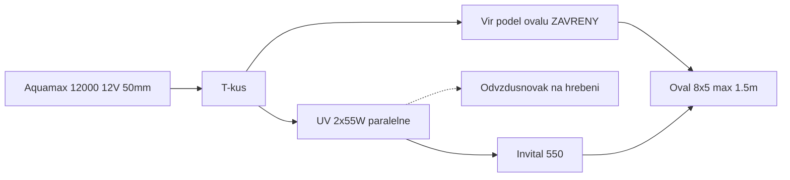
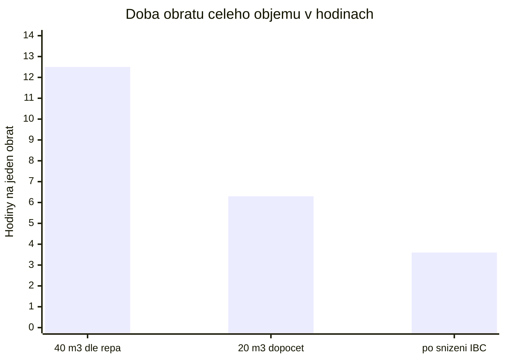
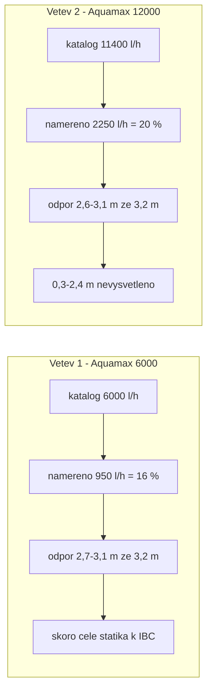
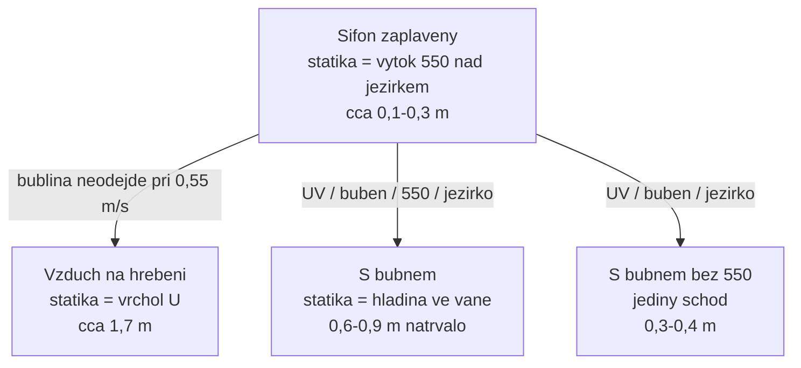
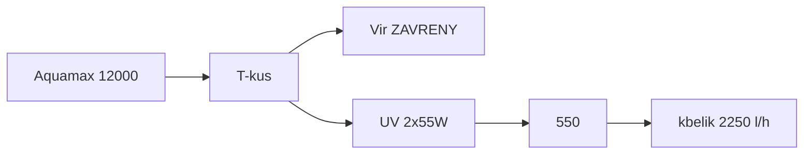
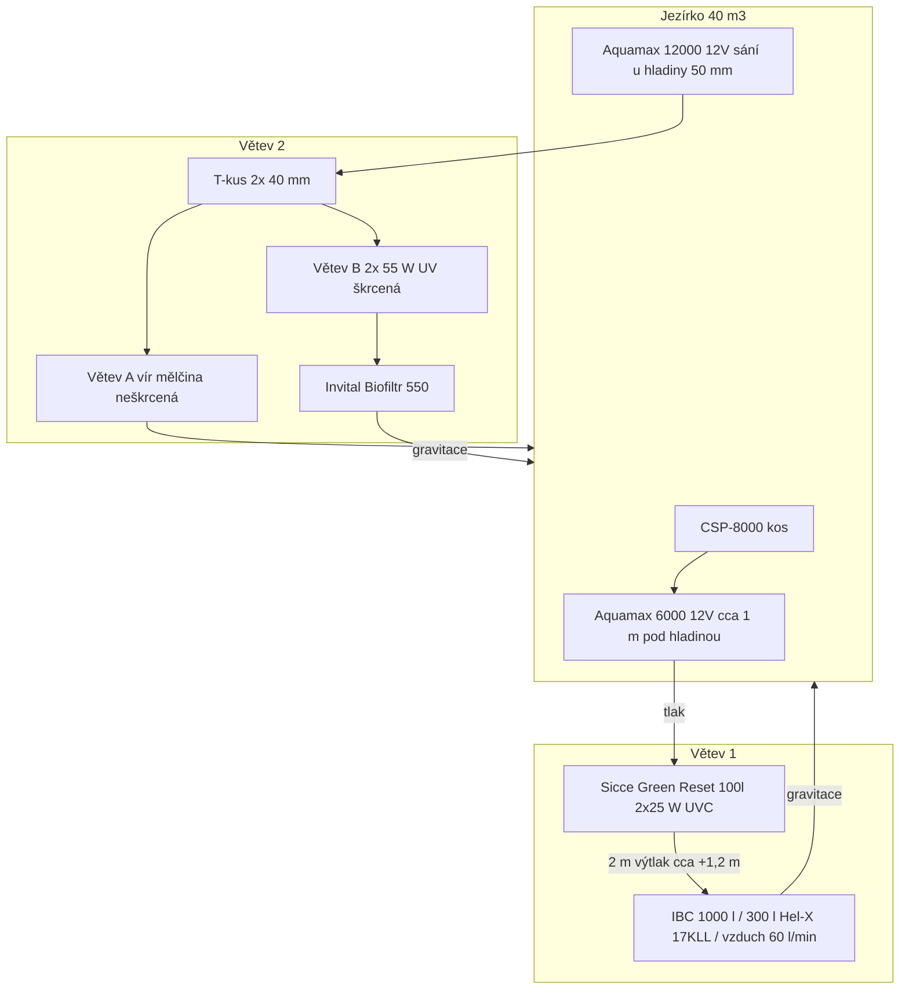
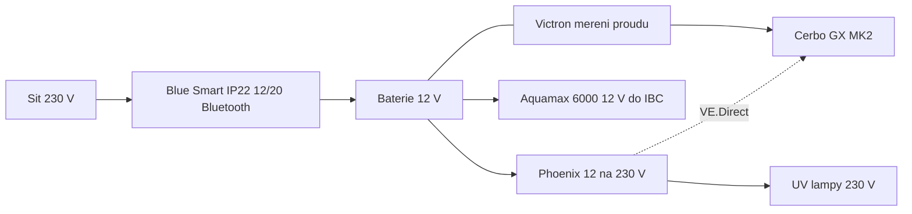
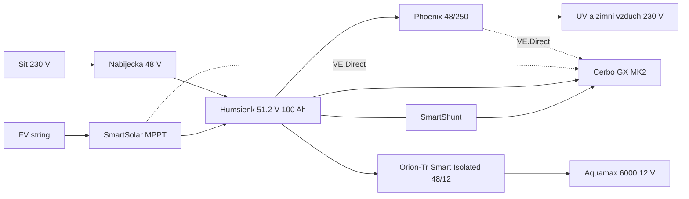

<!-- Generated by scripts/build-all-in-one.sh. Do not edit. Source: v1.2.0 -->

# Vše v jednom souboru

Automaticky sloučeno z markdown souborů v kořeni při tagu / ref `v1.2.0`.


---

<!-- source: README.md -->

# koi_koupaci_jezirko

Provozní zapojení koupacího oválu 8 × 5 m (max. 1,5 m) se dvěma 12V větvemi. Obsádka k 5. 9. 2026: **5× Koi cca 40 cm + cca 20 mladých cca 8 cm**. Cíl je **průzračná voda** bez výměny stávající techniky.

Verze **[1.2.0](CHANGELOG.md)** · licence [GPL-3.0](LICENSE)

Revize návrhu a pořadí dalších kroků: [doporuceni.md](doporuceni.md). Průtoky, výšky a tlakové ztráty: [hydraulika.md](hydraulika.md). Postup u vody: [provoz.md](provoz.md). Kbelík a zákal: [lab.md](lab.md). Technický popis **současného** zapojení, odkazy na e-shopy a odhad ceny: [zapojeni.md](zapojeni.md). Záloha a FVE (12 V as-built → plán 48 V + Orion): [solar.md](solar.md). Při tagu `v*` GitHub Action složí vše do [all_in_one.md](all_in_one.md).



## Verdikt

- **Buben zatím neinstalovat.** Při 5–7 kg biomasy není co odvádět, vana přeruší sifon a na řasu pod 2 µm je to nejhorší typ síta. Rozbor: [doporuceni.md](doporuceni.md).
- **Nejdřív to, co je zadarmo:** změřit hladinu IBC pásmem a nádrž snížit, otevřít ventil větve B naplno, odvzdušnit hřeben U. Po každé změně kbelík.
- Kbelík **5. 9. 2026** (čisté filtry, vír zavřený, vše přes UV): větev 1 **950 l/h**, větev 2 **2 250 l/h**. **To nejsou stropy 12 V** — obě čerpadla táhnou 2,6–3,1 m ze 3,2 m a část toho odporu je odstranitelná ([hydraulika.md](hydraulika.md)).
- **UV přepojit paralelně**, ne v sérii: stejná dávka na litr, zhruba **8× nižší odpor**.
- **Zelená voda není z ryb.** Odpověď je víc průchodů přes UV plus odběr živin — osázet 30cm polici, změřit KH a PO₄, přehodnotit dávku Dyofixu.
- **Nekupovat** větší tlakový filtr na větev 2 (včetně SUNSUN CPF-10000), další 55 W UV, satelit na dno, bazénový písek, stálý zeolit.
- Hadice od Aquamax 12000: **50 mm** co nejdál k lampám; na trnech UV **38 mm**. Lampy zůstanou **nastojato na ~1 m polici** kvůli elektroinstalaci.

## Větve (beze změny sortimentu)

| Větev | Tok | Úloha |
| --- | --- | --- |
| 1 | Skimmer CSP-8000 (koš) → Aquamax 6000 12V → Sicce Green Reset 100 → IBC 1000 l / Hel-X 300 l | Mechanika + hlavní bio |
| 2 | Aquamax 12000 12V → T-kus: vír **nebo** UV 2×55 W → Biofiltr 550 | Cirkulace + průzračnost |

Tlakový zůstává jen Green Reset. Za ním žádné další čerpadlo. Buben je v majetku, ale mimo řadu.


---

<!-- source: doporuceni.md -->

# Doporučení — revize návrhu a další kroky

Revize celého repa na verzi **1.1.5** (commit `2406a51`), doplněná o skutečnou obsádku zjištěnou **5. 9. 2026**. Hydraulický rozpočet je v [hydraulika.md](hydraulika.md), měření v [lab.md](lab.md), as-built v [zapojeni.md](zapojeni.md), postup u vody v [provoz.md](provoz.md).

---

## Verdikt

**Buben je správný stupeň, ale jako další krok je předčasný.** Sníží průtok větve 2, je krmený sáním u hladiny, zatímco zákal je popsaný na dně, a hlavně: při **5–7 kg biomasy** není co odvádět.

Před ním jsou tři kroky zadarmo a tři levné, které zvednou průtok přes stávající UV víc, než by kdy zvedl jakýkoliv nákup.

| | |
| --- | ---: |
| Nálezů celkem | **13** |
| Z toho měnících rozhodnutí | **7** |
| Objem v repu vs. dopočet z fólie | **40 vs. ~20 m³** |
| Obsádka v repu vs. skutečná | **40 Koi vs. 5 + ~20 mladých** |
| Nevysvětlený odpor na větvi 2 | **0,3–2,4 m** |
| Snížení odporu UV při paralelním zapojení | **cca 8×** |

---

## Nálezy

Závažnost: **A** mění rozhodnutí, **B** vnitřní rozpor nebo chybějící údaj, **C** drobnost.

| | Nález | Kde | Proč to nesedí |
| --- | --- | --- | --- |
| **A** | Obsádka „40 Koi“ | celé repo | Skutečnost k 5. 9. 2026: **5× Koi cca 40 cm + cca 20 mladých cca 8 cm**, dohromady 5–7 kg. Celá logika návrhu (těžká filtrace, žádné rostliny, zeolit v záloze) stojí na osminásobku. |
| **A** | Objem 40 m³ | zapojeni.md | Fólie 7 × 9,15 m = 64,05 m² neobalí ovál 8 × 5 m hluboký 1,5 m. Na 40 m³ je potřeba přes 90 m². Geometrie dává **15–28 m³**. |
| **A** | „950 a 2 250 l/h jsou stropy 12 V“ | lab.md | Nejsou. Je to odpor systému 2,6–3,1 m ze 3,2 m. Větev 1 je skoro čistá statika k IBC — po snížení nádrže **2 400–4 200 l/h**. |
| **A** | Rozpočet výtlaku větve 2 nevychází | lab.md | Hadice, kolena, dvě UV a 550 dají 0,7–2,3 m. Čerpadlo ale táhne 2,6–3,1 m. **Chybí 0,3–2,4 m** a nikdo je nehledal. |
| **A** | „Paralelně by rozdělilo dávku na průchod“ | provoz.md | Nerozdělí. Při stejném průtoku je dávka stejná, ale odpor dvojice klesne zhruba **8×**. Tímhle argumentem se paralelní zapojení zamítalo. |
| **A** | Buben prý průtok neovlivní | lab.md, provoz.md | Ovlivní. Vana má volnou hladinu a tím se **natrvalo přeruší sifon**, o který se větev 2 opírá. |
| **A** | Sání větve 2 je u hladiny | zapojeni.md | Zákal je popsaný „vidět jen na dně“ a satelit byl zamítnut. Povrchové sání kal ze dna k sítu nedonese. |
| **B** | „Green Reset 0,4 bar = 4 m, udusí čerpadlo i prázdný“ | lab.md | 0,4 bar je **max. tlak nádoby**, ne ztráta na čistých pěnách. Při 4 m ztráty by čerpadlo s 3,2 m nedalo nic — a přitom dává 950 l/h. |
| **B** | 230 V ostřik bubnu | provoz.md | Repo jinde 230 V u koupací vody odmítá. Buben chce ostřik ~2 bar a řídicí elektroniku; stejné pravidlo se na něj neuplatnilo. |
| **B** | Skimmer jako funkční stupeň | zapojeni.md | Při 950 l/h stěnový skimmer hladinu prakticky netáhne. |
| **B** | Zavřený vír vs. buben | provoz.md, lab.md | Zavřený vír = ovál skoro bez cirkulace. Buben ale zachytí jen to, co obíhá. Dva kroky si odporují. |
| **C** | Green Reset 100 s rybami | zapojeni.md | Výrobce: 35 m³ bez ryb, ale jen ~9 m³ s Koi. V repu byl jen průtok a tlak. |
| **C** | 40 mm vs. 38 mm do UV | provoz.md vs. lab.md | Dvě různá čísla pro tentýž trn. |

---

## Obsádka mění zadání

Původní návrh řešil rybí kal od 40 Koi. Ten problém tu není.

| Veličina | Odhad |
| --- | ---: |
| 5× 40 cm Koi | 5–6,5 kg |
| 20× 8 cm | ~0,2 kg |
| **Biomasa celkem** | **5–7 kg** |
| Krmivo při 1 % biomasy | ~60 g/den |
| Produkce amoniaku | ~1,8 g TAN/den |
| Kapacita 118 m² Hel-X | ~35 g TAN/den |

**Rezerva biofiltru je řádově dvacetinásobná.** Zelená voda tedy nepochází z ryb, ale ze slunce na celý 1,5m sloupec a z fosforu, který se do jezírka dostává listím, prachem, dopouštěnou vodou a usazeninou.

Odpověď proto není větší mechanika, ale **víc průchodů přes stávající UV** a **odběr živin**.

Mladí ale porostou. Až bude 25 Koi kolem 40 cm, biomasa vyskočí zhruba pětinásobně a rozvaha o bubnu se otevře znovu.

---

## Obrat objemu — kde to vázne

Součet obou větví je dnes **3 200 l/h** (kbelík 5. 9. 2026, čisté filtry, vír zavřený).



| Stav | Průtok | Objem | Doba obratu |
| --- | ---: | ---: | ---: |
| Dnes, uváděný objem | 3 200 l/h | 40 m³ | **12,5 h** |
| Dnes, dopočtený objem | 3 200 l/h | 20 m³ | **6,3 h** |
| Po snížení IBC | ~5 500 l/h | 20 m³ | **3,6 h** |
| Běžná praxe Koi | — | — | 1–2 h |

Koupací hybrid na Koi normu dosáhnout nemusí, ale 12,5 h je mimo i velmi volnou praxi. Obě čerpadla přitom běží skoro na doraz výtlaku — problém je odpor systému, ne výkon.

---

## Kde čerpadla stojí na svých křivkách



Detailní rozpočet, rychlosti a ztráty na metr jsou v [hydraulika.md](hydraulika.md).

---

## Sifon — proč na tom záleží

Dokud je trasa zaplavená až do jezírka, výška U se čerpadlu vrací a nepočítá se. Jakmile se na cestě objeví volná hladina — bublina na hřebeni nebo vana bubnu — stane se z té výšky skutečná statika.



Odnést bublinu ze sestupné větve chce zhruba **0,6–1,0 m/s**. Naměřená rychlost v 38 mm při 2 250 l/h je **0,55 m/s** — bublina tedy nemá jak odejít sama. Zavzdušněný hřeben zavře skoro celý nevysvětlený zbytek v rozpočtu.

Řešení je **odvzdušňovák na nejvyšším bodě** za 200–500 Kč, ne naklánění lamp.

---

## UV sériově vs. paralelně

| | Sériově (dnes) | Paralelně (2 T-kusy) |
| --- | --- | --- |
| Průtok jednou lampou | Q | Q / 2 |
| Ztráta na dvojici | 2 · k · Q² | k · Q² / 4 → **8× méně** |
| Dávka na průchod při stejném Q | úměrná 2V / Q | úměrná 2V / Q — **stejná** |
| Když jedna lampa zhasne | voda projde bez dávky | polovina projde bez dávky |
| Materiál | — | 2 T-kusy + ~2 m hadice 38 mm |

Voda v paralelním zapojení stráví v lampě dvakrát déle, protože každá dostane půlku průtoku. Dávka na litr proto vyjde stejně, jen odpor spadne na osminu.

Poctivá výhrada: až průtok vzroste, dávka na průchod klesne úměrně. To je ale přesně ta výměna, kterou repo chce — kontakt je dnes zbytečně dlouhý, chybí počet průchodů. Hadice k oběma lampám musí být stejně dlouhé.

---

## Co buben opravdu udělá

| Funkce | Verdikt | Poznámka |
| --- | --- | --- |
| Zachytí kal a nedožrané krmivo, co obíhá | Ano | Hlavní přínos bubnu — jenže při 5–7 kg biomasy není co odvádět |
| Zachytí zelenou řasu zabitou UV | Jen zčásti | Buňky mají pod 2 µm, síta bývají 60–120 µm. Chytí jen vločky a při odumření se rychle zaslepí |
| Zvedne průtok větve 2 | **Ne, sníží** | Volná hladina ve vaně přeruší sifon natrvalo |
| Sebere kal ze dna oválu | Ne | Sání je u hladiny, satelit byl zamítnut |
| Sníží NH₄ | Nepřímo | Nitrifikaci dělá Hel-X v IBC, a přes ten teče 950 l/h |
| Zapadne do 12V konceptu | Ne | Ostřik ~2 bar a řídicí elektronika = 230 V u koupací vody |

Levnější mezikrok na shluky z UV: **jemná japonská rohož** v poslední komoře 550.

---

## Pořadí, které dává smysl

```mermaid
flowchart LR
  k0["ZDARMA"] --> k1["1. Zmerit hladinu IBC<br/>a snizit nadrz"]
  k1 --> k2["2. Otevrit ventil B naplno"]
  k2 --> k3["3. Odvzdusnit hreben U"]
  k3 --> k4["4. Odvzdusnovak<br/>200-500 Kc"]
  k4 --> k5["5. UV paralelne<br/>600-1200 Kc"]
  k5 --> k6["6. 50 mm k lampam<br/>1500-3000 Kc"]
  k6 --> k7["7. Osazet 30cm polici"]
  k7 --> k8["8. KH a PO4, vazac fosfatu"]
  k8 --> k9["9. Prehodnotit Dyofix"]
  k9 --> k10["10. Buben az potom"]
```



| # | Krok | Cena | Čas | Co přinese |
| ---: | --- | ---: | ---: | --- |
| 1 | Změřit hladinu IBC nad jezírkem, pak nádrž snížit | 0 Kč + práce | půl dne | Větev 1 z 950 na **2 400–4 200 l/h**. Největší zisk v systému. |
| 2 | Otevřít ventil větve B naplno | 0 Kč | 5 min | As-built ho popisuje jako škrcený. Může to být celý nevysvětlený zbytek. |
| 3 | Odvzdušnit hřeben U za chodu | 0 Kč | 15 min | Zjistí, jestli sifon vůbec funguje. |
| 4 | Kohout nebo automatický odvzdušňovák na vrcholu | 200–500 Kč | 1 h | Trvalé řešení bubliny, která při 0,55 m/s sama neodejde. |
| 5 | Přepojit UV paralelně | 600–1 200 Kč | 2 h | Stejná dávka, zhruba 8× nižší odpor dvojice. |
| 6 | 50 mm co nejdál k lampám | 1 500–3 000 Kč | půl dne | Čtvrtinová ztráta proti 38 mm. Na trnech lamp zůstane 38 mm. |
| 7 | Osázet 30cm polici | 3 000–8 000 Kč | den | Pět kaprů rostliny nezničí. Odebírá živiny řasám u zdroje. |
| 8 | Změřit KH a PO₄, pak vazač fosfátu | 1 000–2 000 Kč | 1 h | Fosfor je u téhle obsádky reálně limitovatelný. |
| 9 | Přehodnotit Dyofix | — | — | Pravděpodobně dvojnásobná dávka, a stíní i rostliny z kroku 7. |
| 10 | Buben — až bude z čeho ubrat | koupený | den | Nebo až mladí vyrostou a biomasa půjde přes ~25 kg. |

**Po každé změně kbelík, jednu změnu po druhé.** Jinak se nedá poznat, co zabralo.

---

## Co v repu naopak sedí

- **Statika ponorného čerpadla se počítá od hladiny**, ne ode dna. Správně a na dvou místech.
- **Sifonová rekuperace** je principiálně správně; jen se nesmí předpokládat, že sifon je zaplavený, když rychlost je pod prahem odnosu vzduchu.
- **Diagnóza „mrtvá řasa bez záchytu za lampami“** sedí na tmavě šedé dno i na to, že 160 W UV je na tenhle objem víc než dost.
- **Zamítnutí CPF-10000, satelitu, bazénového písku a stálého zeolitu** je odůvodněné a po opravě obsádky platí ještě víc.
- **Aritmetika.** Přepočítáno: m³/den u obou větví, součty ceníku (98 481 / 13 980 / 125 847 Kč), 64,05 m² fólie, 118 m² chráněného povrchu Hel-X. Vše sedí.
- **Oprava orientace UV z v1.1.5.** Svislé U má plné komory a náklon dávku nezvedne. Ta úvaha platí dál — jen se týká těles, ne toho, co se stane po vložení volné hladiny do trasy.

---

## Jedna věta na závěr

Repo bylo do detailu vyladěné na rybí kal od 40 Koi. Ryb je pět a filtrace má dvacetinásobnou rezervu. Zbývající problém je **málo průchodů přes UV** a **příliš mnoho živin ve vodě** — a obojí se řeší levněji než bubnem.


---

<!-- source: provoz.md -->

# Provoz a zapojení — krok za krokem

Čísla níže jdou v pořadí prací. 12V čerpadla, Green Reset i IBC se nemění. Satelit, druhý tlakový filtr a stálý zeolit/uhlí se neinstalují.

## 0. Nejdřív to, co je zadarmo

Rozpočet výtlaku v [hydraulika.md](hydraulika.md) říká, že obě čerpadla běží skoro na doraz (2,6–3,1 m ze 3,2 m) a **část toho odporu není vysvětlená**. Než se cokoliv kupuje nebo instaluje:

1. **Změřit hladinu v IBC nad hladinou jezírka** pásmem. Při 950 l/h je tření zanedbatelné — je to skoro čistě výška. Snížení IBC na 1,2–1,5 m znamená **2 400–4 200 l/h** místo 950.
2. **Otevřít ventil větve B naplno.** As-built ho popisuje jako škrcený.
3. **Odvzdušnit vrchol U u lamp za chodu.** Při 0,55 m/s bublina sama neodejde a zavzdušněný hřeben stojí čerpadlo ~1,7 m místo 0,2 m.
4. Po každé změně **kbelík**, jednu změnu po druhé.

Teprve pak má smysl mluvit o hadicích, paralelním UV a bubnu.

---

## 1. Diagnostika zákalu a kbelíkový test

Nejdřív vzhled vody, pak čísla. Média a ventily se ladí podle barvy, ne podle katalogu.

### Typ zákalu

| Vzhled | Co to je | Co zvedne průzračnost |
| --- | --- | --- |
| Zelená | Jednobuněčné řasy | Víc vody přes UV 2×55 W; živiny dolů (osázená police, vazač fosfátu) |
| Hnědá / prachová | Zvířený kal, detrit | Buben + 550; mírný vír **ne** do 30cm police; občas vysavač v 1,5 m |
| Mléčná | Bakterie, rozpuštěná organika | Méně krmení, kyslík v hlubině, odvoz kalu z bubnu na zahradu |
| Žlutá, ale čirá | Rozpuštěné organiky (DOC) | Výměna vody; uhlí jen 7–14 dní **bez** Dyofixu |

Celý objem je v dosahu slunce (max. 1,5 m). Zelená voda je u tohoto tvaru očekávatelná — proto UV a odběr živin, ne další houby v tlaku.

**Zákal není z ryb.** Obsádka k 5. 9. 2026 je **5× Koi cca 40 cm + cca 20 mladých cca 8 cm**, dohromady kolem **5–7 kg**. To je zlomek běžné Koi zátěže a biofiltr má proti tomu asi dvacetinásobnou rezervu. Živiny pro řasy jdou ze slunce, listí, dopouštěné vody a usazeniny na dně — ne z rybího kalu.

### Kbelíkový test

Měřit na **výtoku z Biofiltru 550** (větev 2) a zvlášť na **výtoku z IBC** (větev 1). Ne u čerpadla.

1. Kbelík 10 l, stopky.
2. Plný kbelík: `průtok (l/h) = 10 / sekundy × 3600`.
3. **Po každé jednotlivé změně znovu.** Dvě změny naráz = nikdo neví, co zabralo.
4. Výchozí hodnoty **5. 9. 2026**: větev 1 **950 l/h**, větev 2 **2 250 l/h** ([lab.md](lab.md)).
5. Cíl není katalogové číslo. Cíl je **odebrat systému odpor** — obě čerpadla dnes táhnou 2,6–3,1 m ze 3,2 m ([hydraulika.md](hydraulika.md)).

---

## 2. Větev 2 — víc vody přes stávající lampy

Buben je **odložený** (viz níž). Cílem téhle větve je počet průchodů přes 110 W, ne další stupeň v řadě.

```
Aquamax 12000 12V
  --50 mm--> T-kus
               |-- větev A: vír podél oválu --> jezírko
               |-- větev B: UV 2×55 W paralelně --> Invital 550 --> jezírko
                              odvzdušnění na nejvyšším bodě
```

### Hadice

- Od čerpadla k T-kusu **jedna 50 mm**. Neslučovat dvě 40 mm Y jako „vstup 50 mm“ — víc ztrát, nerovnoměrné dělení.
- 50 mm vést **co nejdál k lampám**; na trnech lamp zůstane **38 mm** (strop analogu Vitronic).
- Ztráta jde s `Q²/d⁵`: 50 mm má při stejném průtoku zhruba **čtvrtinovou** ztrátu proti 38 mm.
- Dvě 40 mm až **za** 550 jako dvě mírné vratné trysky, ne jako vstup do filtru.

### UV paralelně, ne v sérii

Každá lampa dostane **půlku průtoku**, takže v ní voda stráví dvakrát déle. Dávka na litr proto vyjde **stejně jako v sérii**, ale odpor dvojice spadne zhruba **osmkrát** (`k·Q²/4` místo `2·k·Q²`).

Dřívější tvrzení „paralelně by rozdělilo dávku na průchod“ v tomto souboru **neplatilo** a bylo důvodem, proč se paralelní zapojení zamítalo.

- Materiál: 2 T-kusy a ~2 m hadice 38 mm.
- Hadice k oběma lampám **stejně dlouhé**, jinak se tok rozdělí nerovnoměrně.
- Až průtok vzroste, dávka na průchod klesne úměrně. To je záměr: kontakt je dnes zbytečně dlouhý, chybí počet průchodů.
- Když jedna lampa zhasne, polovina vody projde bez dávky. Kontrolovat obě.

### Odvzdušnění hřebene

Na nejvyšší bod trasy patří **kohout nebo automatický odvzdušňovák** (200–500 Kč). Při 0,55 m/s se bublina z hřebene sama neodnese a zavzdušněný sifon stojí čerpadlo ~1,7 m místo ~0,2 m. Detail v [hydraulika.md](hydraulika.md).

### Výšky

Výtok 550 musí zůstat **nad** hladinou jezírka, jinak nepoteče gravitací. Za UV je vše netlakové.

Každý schod nad hladinou jezírka je **trvalá statika**, jakmile na něm je volná hladina. Dokud je trasa zaplavená až do jezírka, sifon výšku vrací zpátky — proto na hřeben odvzdušňovák a proto se nepřidávají otevřené vany bez důvodu.

### Biofiltr 550

Houby dělají dočištění. Jemná japonská rohož na výstupu je volitelná a je to zatím **levnější odpověď na shluky z UV než buben**: řasa zabitá UV má pod 2 µm a chytá se jen jako vločka. Čistit, až stoupne hladina ve 550, ne obě komory naráz.

### Křemenky UV

**Křemenka** je křemenná trubice kolem UV-C zářivky: zářivka v ní nesmí do vody, voda teče okolo a UV-C prochází sklem. Obyčejné sklo by záření sežralo. Náhradní díl v e-shopu je „křemenná trubice“ / quartz sleeve — to není zářivka.

Předfiltrace před lampami je jen sání u hladiny, takže se pouzdra špiní. Otírat, jinak 110 W svítí do mlhy.

### Orientace UV — svislé U

As-built: 1. lampa **zdola nahoru**, propoj **nahoře**, 2. lampa **shora dolů**, police **~1 m** (havárie mimo elektro). **Nesnižovat na hladinu.** Komory jsou plné — bublina v křemence u tohoto U není a náklon na tom nic nezmění. Po přepojení na paralelní zapojení zůstávají obě lampy nastojato na téže polici, jen dostanou vlastní přívod.

Vzduch se v téhle trase drží **na hřebeni propoje**, ne v pouzdrech, a při 0,55 m/s sám neodejde — proto odvzdušňovák, ne přeložení lamp.

Sifon zpět pod hladinu po stopu čerpadla může vysát ovál — výtok 550 nad hladinou nebo přisátí vzduchu na hřebeni.

### Třetí 55 W UV — nekupovat

Wattů je dost: **2×55 W + 2×25 W = 160 W**. I na 40 m³ to je 4 W/m³ (běžně stačí 2–4); při reálném objemu kolem 20 m³ dokonce ~8 W/m³. Úzké hrdlo je **počet průchodů**, ne watty.

Další 55 W: ~1,3 kWh/den, další křemenka, větší ztráta výtlaku. Nejdřív kroky z kapitoly 0 a paralelní zapojení.

---

## 3. Vír

Proud vody v oválu je **vír**. Výr je sova.

Kbelík 5. 9. 2026 při **zavřeném víru**: jen **2 250 l/h** přes UV — přebytek na obchoz není a A by lampám ještě ubrala.

- Teď: A **zavřená**. Otevřít až po krocích z kapitoly 0 a novém kbelíku.
- Trysku vést **podél hlubšího oválu**, ať vodu z 30cm police stahuje ke skimmeru / k sání 12000.
- **Nesměřovat** trysku do 30 cm mělčiny (zvíří dno, mléčná voda, bije do nohou, a jsou tam letošní mladí).

Mělká zóna 30 cm (šířka 0,3–1,5 m) je past na kal a vláknité řasy. Pohyb ano, tornado ne.

**Zavřený vír má cenu, ale i daň:** ovál pak skoro necirkuluje a kal se usadí tam, kde na něj filtrace nedosáhne. Sání 12000 je u hladiny a satelit byl zamítnut, takže dno řeší **vysavač**, ne žádný stupeň v řadě. Až kroky z kapitoly 0 zvednou průtok, mírný vír podél oválu je součást odpovědi na průzračnost, ne konkurent UV.

---

## 4. Větší tlakový filtr na větev 2 — neinstalovat

Úzké hrdlo je výtlak 12V (max. **3,2 m**), ne průměr hadice.

Největší běžný hobby tlak s 50 mm (řádově Oase FiltoClear 31000): max. **0,2 bar (= 2 m)**, set s AquaMax 17000 230 V. Sériově s UV a 550 by 12V čerpadlo udusil — a to už teď táhne 2,6–3,1 m ze 3,2 m.

Green Reset na větvi 1 už tlakové houby + UV dělá.

**[SUNSUN CPF-10000](https://www.jezirkabanat.cz/tlakovy-filtr-sunsun-cpf-10000-x14955)** (3 749 Kč, kód B04842) před 2×55 W na větvi 2 **nedávat**, ani se silnějším čerpadlem.

| | CPF-10000 | Větev 2 / jezírko |
| --- | --- | --- |
| Nádoba | 25 l, 5 pěnovek | Green Reset už 100 l |
| Max. tlak | **0,3 bar ≈ 3 m** | Aquamax 12000 12 V má strop 3,2 m |
| Hadice | max. **38 mm** | 50 mm k T-kusu |
| Vestavěné UV | **11 W** | už **2×55 W** (+ 2×25 W v Green Resetu) |

Silnější čerpadlo tlakové hobby víko nespásí — strop zůstane ~3 m vodního sloupce; 230 V by navíc zrušilo 12 V u koupání. Pěny **před** UV křemenky trochu šetří, ale zelený zákal nechytí.

Bead / bazénový písek chtějí 0,8–1,5 bar — 12V to neutáhne.

Kdyby tlak přesto: jen ≤0,2 bar, 50 mm v kuse, **místo** bubnu v řadě. Pro průzračnost krok zpět.

---

## 5. Satelitní dnové sání — neinstalovat

Vyzkoušeno: malý dopad, v zimě vadí Koi, v 1,5 m koupání překáží lidem. Náhrada dna v tomto systému není. Kal v nejhlubším místě nechat v klidu, občas vysavač.

Důsledek, který je potřeba vyslovit: **sání obou větví je u hladiny**. Co se usadí na dně, žádný stupeň v řadě nevidí — ani buben. Dno je práce pro vysavač.

---

## 6. Zeolit, uhlí, písek — ne jako stálá náplň na průzračnost

Průhlednost v tomto oválu zvedne **víc průchodů přes stávající UV** a **méně živin pro řasy** (kapitola 0 a 6b). Zeolit bere **NH₄**, uhlí **žlutý DOC a Dyofix**. Řasy ani kalový prach nesberou.

| Médium | Rozhodnutí | Proč |
| --- | --- | --- |
| Zeolit | Nekupovat kvůli zákalu | Nouzový sáček 5–10 kg jen při špičce amoniaku, pak ven. Nasycený NH₄ pouští zpět. |
| Aktivní uhlí | Ne se Dyofixem | Vytáhne barvivo i žlutý DOC. Max. 7–14 dní, jen bez barviva, pak vyjmout. |
| Bazénový písek | Ne na 12V | Chce 0,8–1,5 bar. |

Zeolit je při 5–7 kg biomasy skoro jistě zbytečný: biofiltr má proti téhle zátěži asi dvacetinásobnou rezervu.

### Kam (jen krátká kúra)

Ani jedno **ne** do Green Resetu (dusí 12 V výtlak), **ne** do vířícího Hel-X (oděr, lůžko je biofilm).

| Médium | Místo |
| --- | --- |
| Zeolit | Síťka v **IBC až za Hel-X**, u klidného výtoku |
| Uhlí | Síťka na **výtoku IBC**, nebo **poslední komora 550** |

### Pořadí, když jdou obě kúry

Od ryb, ne od vzhledu. Souběžně v pytlích to nemá smysl.

1. Změřit **NH₄ / NO₂**. Při amoniaku nejdřív zeolit.
2. Až je NH₄ v nule, zeolit **ven**.
3. Uhlí až potom: voda **žlutá a jinak čirá**, **bez Dyofixu**. Dokud Pond Blue v jezírku je, uhlí nedávat.

---

## 6b. Živiny — hlavní páka na zelenou vodu

Při **5–7 kg ryb** v 20–40 m³ nevzniká zelená voda z rybího kalu. Vzniká ze slunce na celý 1,5m sloupec a z živin, které do jezírka lezou jinudy: listí, prach, pyl, dopouštěná voda, usazenina na dně. Filtrace uklízí následek. Tohle bere řasám vstup.

### Osázet 30cm polici

Původní návrh polici odepsal jako past na kal, protože počítal se 40 Koi. **Pět kaprů rostliny nezničí.** Police 30 cm, široká 0,3–1,5 m, je přesně regenerační zóna, kterou koupací jezírka běžně mají.

- Rostliny berou dusík a fosfor přímo z vody, celou sezónu, bez elektřiny.
- Stíní dno mělčiny, takže tam nestartují vláknité řasy.
- Mladí Koi v nich mají úkryt.
- Substrát chudý (praný štěrk), ne zahradní zemina — ta by živiny naopak dodala.
- Tryska víru sem pořád **nesmí**.

### Vazač fosfátu

Fosfor je u takhle lehké obsádky reálně limitovatelný. Vazač (na bázi železa nebo lanthanu) v síťce na **výtoku IBC**, u klidného proudu.

- Nejdřív **změřit PO₄**. Bez čísla se dávkovat nedá.
- Vazač je vyčerpatelný, po sezóně ven a nový.
- Do vířícího Hel-X ne (oděr), do Green Resetu ne (tlak).

### Dyofix přehodnotit

Dávka byla počítána na 40 m³. Při reálném objemu kolem 20 m³ je to zhruba **dvojnásobek**. Barvivo navíc stíní i rostliny z kapitoly výš, takže si kroky protiřečí.

Pořadí: nejdřív osázet polici a nechat ji chytit, pak nechat Dyofix vyblednout a **nedávkovat znovu**. Kdyby se voda bez barviva zezelenala, vrátit se ke slabší dávce.

### Krmení

Pět kaprů a dvacet mladých sní velmi málo. Každé zbylé zrno je fosfor pro řasy. Krmit tak, aby bylo do dvou minut po krmivu; mladým spíš častěji a po troškách než jednou hodně.

---

## 6c. Buben — odložit

Buben je koupený, ale jako **další** krok je předčasný.

| Co se čekalo | Jak to je při 5–7 kg biomasy |
| --- | --- |
| Odvede rybí kal dřív, než se rozloží | Hlavní přínos bubnu — jenže tolik kalu tu nevzniká |
| Zachytí řasu zabitou UV | Buňky mají pod 2 µm, síta bývají 60–120 µm. Chytí jen vločky a při odumření se rychle zaslepí |
| Neovlivní průtok | **Ovlivní.** Volná hladina ve vaně přeruší sifon natrvalo, viz [hydraulika.md](hydraulika.md) |
| Sebere kal ze dna | Ne. Sání je u hladiny |
| Zapadne do 12V konceptu | Ostřik chce ~2 bar a řídicí elektroniku — 230 V u koupací vody |

**Kdy ho vrátit do hry:** až letošní mladí vyrostou a biomasa půjde přes ~25 kg, nebo až kroky z kapitoly 0 zvednou průtok tak, že je z čeho ubrat.

Až na to dojde: vanu **co nejníž**, zvážit **UV → buben → jezírko** místo tří schodů s 550, přepad mimo sání 12000, prací vodu na zahradu a započítat dopouštění. Zima: ostřik a elektronika nesmí zmrznout — bypass nebo nezámrzná šachta.

Levnější mezikrok na shluky z UV: **jemná japonská rohož** v poslední komoře 550.

---

## 7. Dva měřiče (teplota, pH, EC)

Zákal neměří; oddělí řasy od chemie.

### Měřič 1 — jezírko

- Děrovaná KG/PVC šachta v **hlubině**, sonda v **~0,7–1 m**.
- Ne na 30cm polici (přehřev, slunce, lidé).
- Mimo vratné trysky, skimmer a dosah Koi.
- Ranní pH (noční CO₂), teplota pro krmení, trend EC (odpar, krmení, skok = něco se rozpustilo).

### Měřič 2 — výtok IBC

- Žlábek / nádobka **za** Hel-X, **před** smícháním s jezírkem.
- pH tu bývá o 0,1–0,4 nižší (nitrifikace). Rozestup vs. jezírko se zvětšuje = bio jede / klesá KH.
- Teplota IBC (vzduchování chladí). EC má kopírovat jezírko.

### Kam sondy nedávat

Green Reset (tlak), vířící Hel-X (oděr, bubliny), UV (UV-C ničí elektrody).

pH elektroda nesmí vyschnout; kalibrace ze začátku po 2 týdnech, pak měsíčně; v mrazu sundat. EC je venku stabilnější.

### Kapky, které dva přístroje nenahradí

Jednou pořádně změřit a mít základní linii. Při 5–7 kg biomasy to není akutní, ale je to laciné a bez toho se dávkuje naslepo.

| Test | Proč zrovna teď |
| --- | --- |
| **KH** | Nejdůležitější. Nitrifikace ji spotřebovává a zelená voda dělá velké denní výkyvy pH. Nízké KH = houpačka pH. |
| **PO₄** | Vstup pro vazač fosfátu z kapitoly 6b. Bez čísla se dávkovat nedá. |
| NH₄ / NO₂ | Kontrola, ne poplach. Letošní mladí jsou na dusitany citlivější než dospělí. |
| NO₃ | Trend přes sezónu, ukazatel zátěže živinami. |

| Čtení | Vzhled vody | Význam |
| --- | --- | --- |
| pH/EC v normě | Zelená | Řasy, ne chemie → víc průchodů přes UV, míň živin |
| Rostoucí EC | Mléčná / hnědá | Zátěž, málo odkalu / výměny — zeolit zákal nesebere |
| Ranní pH pod ~6,8 | Mléčná | Organika a CO₂ → vzduch v hlubině, méně krmení |
| EC v normě | Žlutá, čirá | DOC → výměna vody nebo krátké uhlí bez Dyofixu |

Orientačně: pH 7,0–8,2, EC stovky µS/cm podle zdroje vody. Důležitější je stabilita než ideální číslo.

---

## Větev 1 — snížit IBC

Tady je největší jednotlivý zisk v celém systému a nic se pro něj nekupuje.

- **Změřit hladinu v IBC nad hladinou jezírka** pásmem. Ne ode dna jámy, ne k hornímu okraji nádrže.
- Při 950 l/h je tření v hadici zanedbatelné, takže těch 2,7–3,1 m odporu je skoro celé výška. Snížení na 1,2–1,5 m znamená **2 400–4 200 l/h** ([hydraulika.md](hydraulika.md)).
- Dolní mez je gravitace: výtok IBC musí zůstat nad hladinou jezírka.
- Přívod zaústit **pod hladinu v IBC**, ne volným pádem shora.
- Green Reset čistit podle **výtoku z IBC**, odpad z režimu čištění na zahradu, ne do IBC.
- Skimmer je jen **koš**; hladinu táhne Aquamax 6000. Druhé čerpadlo do stejného Green Resetu **ne**. Při 950 l/h stěnový skimmer hladinu prakticky netáhne — po zvýšení průtoku se to zlepší samo.
- Hel-X neměnit, dokud médium víří a teče voda.

V horku: vzduchovací kámen v hlubině mimo brouzdaliště. Nebrat vzduch Hel-X tak, aby přestaly rotovat.

---

## Co cíleně nedělat

- Větší tlakový filtr na větev 2, včetně SUNSUN CPF-10000 před UV.
- Vstup 2×40 mm Y místo 50 mm.
- Bead / bazénový písek na 12V.
- Tryska do 30cm zóny.
- Satelit na dno.
- Stálý zeolit na zákal, uhlí + Dyofix.
- Druhé čerpadlo za Green Reset.
- Silnější čerpadlo kvůli hobby tlaku (strop ~0,3 bar).
- Další 55 W UV — wattů je dost (50 + 110 W).
- **Instalovat buben, dokud neproběhnou kroky z kapitoly 0.**
- **Naklánět lampy kvůli průtoku.** Vzduch je na hřebeni, ne v křemenkách; patří tam odvzdušňovák.


---

<!-- source: hydraulika.md -->

# Hydraulika — průtoky, výšky, tlaky, ztráty

Rozpočet výtlaku obou větví a z něj plynoucí optimalizace. Naměřená čísla jsou z [lab.md](lab.md) (kbelík **5. 9. 2026**), as-built z [zapojeni.md](zapojeni.md), postup u vody v [provoz.md](provoz.md).

**Co je měřené a co spočítané.** Měřené jsou jen dva průtoky (950 a 2 250 l/h) a katalogové štítky. Všechno ostatní v tomto souboru je **dopočet**. Kde chybí data, je to napsané a je u toho test, ne odhad vydávaný za fakt.

---

## Vstupy

| Veličina | Hodnota | Zdroj |
| --- | --- | --- |
| AquaMax Eco Premium 6000 12 V | 6 000 l/h, max. **3,2 m**, 45–55 W | Oase, art. 50730 |
| AquaMax Eco Premium 12000 12 V | 11 400 l/h, max. **3,2 m**, **95 W**, trny 25/32/38/50 | Oase, art. 50382 |
| Sicce Green Reset 100 | 16 000 l/h, **max. 0,4 bar**, trny 32/38/50 | Sicce |
| UV 2× 55 W | trn max. **38 mm** (analog Vitronic) | e-shop |
| INVITAL Biofiltr 550 | 130 l, gravitační výtok | e-shop |
| Naměřeno větev 1 (výtok IBC) | **950 l/h** | kbelík 5. 9. 2026 |
| Naměřeno větev 2 (výtok 550) | **2 250 l/h** | kbelík 5. 9. 2026, vír zavřený |

**0,4 bar u Green Resetu je maximální tlak nádoby, ne ztráta na pěnách.** Dřívější odvození „čistý filtr bere 4 m, a proto teče 950 l/h“ neplatí — čerpadlo s výtlakem 3,2 m by při 4 m ztráty nedalo vůbec nic.

---

## Rychlosti a dynamická výška

`v = Q / A`, `A₃₈ = 1,134·10⁻³ m²`, `A₅₀ = 1,963·10⁻³ m²`.

| Průtok | v v 38 mm | v²/2g v 38 mm | v v 50 mm | v²/2g v 50 mm |
| ---: | ---: | ---: | ---: | ---: |
| 950 l/h | 0,23 m/s | 0,3 cm | 0,13 m/s | 0,1 cm |
| 2 250 l/h | 0,55 m/s | **1,6 cm** | 0,32 m/s | 0,5 cm |
| 4 500 l/h | 1,10 m/s | **6,2 cm** | 0,64 m/s | 2,1 cm |

Dvě věci, které z toho plynou:

1. **Ztráta roste s druhou mocninou průtoku.** Co při 2 250 l/h nic nedělá, při 4 500 l/h bere čtyřnásobek. Původní cíl „4 000–5 500 l/h“ ve stávající 38mm trase proto není jen otázka čerpadla.
2. **Průměr rozhoduje s pátou mocninou** (`ztráta ∝ Q²/d⁵`). 50 mm má při stejném průtoku zhruba **čtvrtinovou** ztrátu proti 38 mm.

### Ztráty na metr a na tvarovku

| Prvek | Při 950 l/h | Při 2 250 l/h | Při 4 500 l/h |
| --- | ---: | ---: | ---: |
| Hladká hadice 38 mm, 1 bm | ~0,2 cm | ~1 cm | ~4 cm |
| **Spirálová (vroubkovaná) 38 mm, 1 bm** | ~0,5 cm | **~2–4 cm** | ~8–16 cm |
| Koleno 90° (K ≈ 0,5–1) | ~0,2 cm | ~1–1,6 cm | ~3–6 cm |
| Hladká 50 mm, 1 bm | ~0,05 cm | ~0,3 cm | ~1 cm |

**Kolena nejsou problém.** Deset kolen při 2 250 l/h je řádově 10–15 cm sloupce. Dřívější „sifonové oblouky přidávají kolena“ je pravda, ale v číslech to nic neváží. Váží **délka vroubkované hadice**, **průměr** a **výška**.

---

## Kde je čerpadlo na své křivce

Oase pro tyhle 12V modely nezveřejňuje celou křivku, jen dva krajní body (max. průtok při 0 m, max. výtlak při 0 l/h). Reálná křivka leží mezi lineární a kvadratickou spojnicí — proto všude **pásmo**, ne jedno číslo.

| Větev | Naměřeno | % katalogu | Odpor systému (lineární) | Odpor systému (kvadratická) |
| --- | ---: | ---: | ---: | ---: |
| 1 (6000) | 950 l/h | 16 % | 2,7 m | 3,1 m |
| 2 (12000) | 2 250 l/h | 20 % | 2,6 m | 3,1 m |

**Obě čerpadla běží skoro na doraz výtlaku.** Ze 3,2 m jim zbývá pár desítek centimetrů. To není „12 V je slabé“ — je to systém, který bere 2,6–3,1 m. Najít kde, ne kupovat další techniku.

---

## Větev 1 — je to skoro čistě výška

Při 950 l/h je rychlost v 38 mm **0,23 m/s**. Tření v hadici je pak řádově **0,5 cm/m** i u vroubkované; dvacet metrů dá 10–18 cm. Proti 2,7–3,1 m je to šum.

| Položka | Odhad při 950 l/h |
| --- | ---: |
| Hadice + kolena | 0,1–0,2 m |
| Green Reset, čisté pěny | 0,2–0,5 m |
| **Zbytek = statická výška** | **2,0–2,8 m** |

Rozpočet vychází jen tehdy, když je **hladina v IBC zhruba 2 až 2,8 m nad hladinou jezírka**. Číslo „~1,2 m“ jinde v dokumentaci s naměřenými 950 l/h nesedí.

### Test (pásmo, 10 minut)

Změřit **hladinu vody v IBC minus hladina jezírka**. Ne ode dna jámy, ne k hornímu okraji IBC — u ponorného čerpadla se počítá od hladiny k hladině.

- Vyjde **~2,5 m** → záhada je vyřešená a spodní tabulka platí.
- Vyjde **~1,2 m** → výšku to nevysvětluje a viník je jinde: ucpané pěny, dlouhá nebo zalomená hadice, propad napětí na 12 V kabelu, opotřebené oběžné kolo.

### Co udělá snížení IBC

Předpoklad: Green Reset + hadice berou 0,4 m, ty zůstávají.

| Hladina IBC nad jezírkem | Celkový odpor | Průtok (lineární) | Průtok (kvadratická) |
| ---: | ---: | ---: | ---: |
| **2,5 m (dnešní odhad)** | 2,9 m | 560 l/h | 1 840 l/h |
| 2,0 m | 2,4 m | 1 500 l/h | 3 000 l/h |
| 1,5 m | 1,9 m | 2 440 l/h | 3 820 l/h |
| 1,2 m | 1,6 m | 3 000 l/h | 4 240 l/h |

Naměřených 950 l/h leží přesně v pásmu pro 2,5 m. **Snížení IBC na 1,2–1,5 m je největší jednotlivý zisk v celém systému** — i pesimistický odhad je 2,5× víc vody, a to bez nákupu.

Dolní mez je daná gravitací: výtok IBC musí zůstat nad hladinou jezírka. Prakticky to znamená hladinu v IBC kolem **1,2–1,5 m**, ne níž. Přívod zaústit **pod hladinu v IBC**, ne volným pádem shora — čerpadlo pak zvedá k hladině, ne k hrdlu.

---

## Větev 2 — čísla nevycházejí

Při 2 250 l/h se dá poskládat jen část odporu:

| Položka | Odhad |
| --- | ---: |
| Netto statika při **funkčním** sifonu (výtok 550 nad jezírkem) | 0,1–0,3 m |
| Hadice 2× 40 / 38 mm, ~20 bm vroubkované | 0,2–0,8 m |
| T-kus, kolena, přechody | 0,1–0,2 m |
| 2× UV 55 W v sérii | 0,2–0,6 m |
| Biofiltr 550, čisté houby | 0,1–0,4 m |
| **Součet** | **0,7–2,3 m** |
| **Čerpadlo ale musí táhnout** | **2,6–3,1 m** |
| **Nevysvětlený zbytek** | **0,3–2,4 m** |

Čtyři kandidáti, každý s levným testem:

| Hypotéza | Test | Cena |
| --- | --- | ---: |
| **Ventil na větvi B je přiškrcený** (as-built ho popisuje jako „škrcená“) | Otevřít naplno, kbelík znovu | 0 Kč |
| **Sifon je přerušený vzduchem na hřebeni** — pak se počítá celá výška U, ne 0,2 m | Odvzdušnit vrchol za chodu; když ujde vzduch a průtok stoupne, je to ono | 0 Kč |
| Hadice je delší / zalomená / zanesená | Projít trasu, změřit bm | 0 Kč |
| Propad napětí na 12 V, opotřebené kolo | Změřit napětí na čerpadle za chodu | 0 Kč |

Dokud tohle nikdo neproměří, je každý nákup na větev 2 střelba naslepo.

### Vzduch na hřebeni — proč je to nejpravděpodobnější viník

Aby sifon fungoval, musí být celá trasa zaplavená. Vzduch ze sestupné větve se odnese, jen když voda teče dost rychle — orientačně **nad 0,6–1,0 m/s** v potrubí tohoto průměru.

Naměřená rychlost v 38 mm při 2 250 l/h je **0,55 m/s**. To je pod prahem. Bublina na hřebeni tedy **nemá jak sama odejít** a zůstane tam. A přesně tam je jediné místo, kde v tomto zapojení vzduch být může — v propoji mezi vrcholy obou lamp. (V samotných křemenkách ne, to platí dál: první lampa se plní zdola, druhá teče shora dolů.)

Když je hřeben zavzdušněný, čerpadlo netáhne 0,2 m netto statiky, ale **skutečnou výšku U — kolem 1,7 m**. To samo o sobě zavře skoro celý nevysvětlený zbytek v tabulce.

**Oprava:** automatický odvzdušňovací ventil nebo obyčejný kohout na nejvyšším bodě, cca **200–500 Kč**. Ne naklánět lampy.

Tím se také upřesňuje dřívější závěr z [lab.md](lab.md): „vrchol sifonu čerpadlo netíží“ platí **jen u zaplaveného sifonu**. Při 0,55 m/s to není samozřejmost, kterou lze předpokládat.

---

## Co s výtlakem udělá buben

Vana bubnu má **volnou hladinu**. Tím se sifon přeruší natrvalo a jeho výška se stane skutečnou statikou.

| Stav | Statika, kterou čerpadlo vidí |
| --- | --- |
| Dnes, sifon zaplavený | výtok 550 nad jezírkem, ~0,1–0,3 m |
| Dnes, sifon zavzdušněný | vrchol U, ~1,7 m |
| **S bubnem** | **hladina ve vaně bubnu, natrvalo** |

Kaskáda **UV → buben → 550 → jezírko** potřebuje tři schody nad hladinou jezírka, a vana bubnu je z nich nejvýš. Odhad **0,6–0,9 m** statiky natrvalo.

Kaskáda **UV → buben → jezírko** (bez 550 na této větvi) potřebuje schod jediný. Vana může sedět kolem **0,3–0,4 m** a ubere podstatně méně.

Bio tím netrpí: hlavní nitrifikace je 300 l Hel-X v IBC na větvi 1. 130 l hub v 550 je doplněk, který si v první variantě kupuje celý jeden schod výšky.

---

## Obsádka — kolik té zátěže vlastně je

Stav k **5. 9. 2026**: **5× Koi cca 40 cm** a **cca 20 mladých cca 8 cm** (výtěr před měsícem).

| Veličina | Odhad |
| --- | ---: |
| 5× 40 cm Koi | 5–6,5 kg |
| 20× 8 cm | ~0,2 kg |
| **Biomasa celkem** | **cca 5–7 kg** |
| Na 40 m³ | 0,15 kg/m³ |
| Na 20 m³ (viz níž) | 0,3 kg/m³ |
| Krmivo při 1 % biomasy | ~60 g/den |
| Produkce amoniaku (30 g TAN / kg krmiva) | **~1,8 g TAN/den** |
| Kapacita 118 m² Hel-X (0,3 g/m²/den) | ~35 g TAN/den |

**Rezerva biofiltru je řádově dvacetinásobná.** Běžná Koi jezírka jedou 0,5–1 kg/m³; tady je to zlomek.

Dva důsledky:

1. **Zákal není z ryb.** Pět kaprů nevyrobí zelenou vodu ve 20–40 m³. Živiny jdou ze slunce na celý 1,5m sloupec, z listí a prachu, z dopouštěné vody a z usazeniny na dně. Filtrace dimenzovaná na rybí kal řeší problém, který tady není.
2. **Buben ztrácí hlavní důvod.** Jeho největší přínos je odvést rybí kal dřív, než se rozloží. Při 5–7 kg biomasy není co odvádět.

Mladí ale porostou. Až bude 25 Koi kolem 40 cm, biomasa vyskočí zhruba **pětinásobně** a rozvaha o bubnu se otevře znovu.

---

## Objem — číslo, na kterém visí zbytek

Ovál ve 8 × 5 m má hladinu ~31 m². Na 40 m³ by průměrná hloubka musela být **1,27 m** při maximu 1,5 m, tedy skoro svislé stěny a plné dno. Rozvinutý profil takové vany je přes **90 m² fólie**.

Koupeno bylo **64,05 m²** (7 × 9,15 m, jeden kus). To sedí na miskovitý tvar se svahy kolem 45°, mělkou policí a úzkou hlubinou. Frustum se stejnými rozměry vychází na **cca 15–28 m³**.

Ověření je zadarmo: **vodoměr při dopouštění**, nebo pásmo a hloubkový profil po metru.

| Když je objem ~20 m³ místo 40 | Posun |
| --- | --- |
| Obrat obou větví za den | z 1,9× na **~3,8×** |
| UV na m³ | ze 4 W na **~8 W** |
| Dyofix dávkovaný na 40 m³ | zhruba **dvojnásobek** |
| Biomasa na m³ | 0,3 kg/m³ — pořád velmi málo |

---

## Optimalizace k průzračné vodě

Seřazeno podle poměru přínos / cena. První tři jsou zadarmo.

| # | Krok | Cena | Co přinese |
| ---: | --- | ---: | --- |
| 1 | **Změřit hladinu IBC nad jezírkem, pak IBC snížit** | 0 Kč + práce | Větev 1 z 950 na **2 400–4 200 l/h**. Největší zisk v systému. |
| 2 | **Otevřít ventil větve B naplno** | 0 Kč | As-built ho popisuje jako škrcený. Může být celý nevysvětlený zbytek. |
| 3 | **Odvzdušnit hřeben U za chodu** | 0 Kč | Zjistí, jestli sifon vůbec funguje. |
| 4 | **Kohout / automatický odvzdušňovák na vrcholu** | 200–500 Kč | Trvalé řešení bubliny, která při 0,55 m/s sama neodejde. |
| 5 | **UV paralelně, ne v sérii** | 600–1 200 Kč | Stejná dávka na litr, **cca 8× nižší odpor** dvojice. |
| 6 | **50 mm co nejdál k lampám** | 1 500–3 000 Kč | Čtvrtinová ztráta proti 38 mm. Na trnech lamp zůstane 38 mm. |
| 7 | **Osázet 30cm polici** | 3 000–8 000 Kč | Při 5 Koi rostliny přežijí. Odebírá živiny řasám u zdroje. |
| 8 | **Vazač fosfátu na výtoku IBC** | 1 000–2 000 Kč | Při téhle obsádce je limitace fosforem reálně dosažitelná. |
| 9 | **Přehodnotit Dyofix** | −  | Pravděpodobně dvojnásobná dávka. Stíní i rostliny z kroku 7. |
| 10 | **Buben odložit** | — | Málo rybího kalu, bere výtlak, na mrtvou řasu je to nejhorší typ síta. |

### Proč zrovna tohle pořadí

Kroky 1 až 6 dělají jednu věc: **víc vody přes stávající UV**. Wattů je dost (160 W), dávka na průchod je při dnešních průtocích dokonce zbytečně dlouhá. Chybí počet průchodů za den.

Kroky 7 až 9 řeší **živiny**, ne filtraci. Při 5–7 kg ryb ve 20–40 m³ je zelená voda otázka slunce a fosforu, ne rybího kalu. Osázená police a vazač fosfátu berou řasám vstup; UV a síto jen uklízejí následek.

### Buben — kdy ho vrátit do hry

- Až mladí Koi vyrostou a biomasa půjde přes ~25 kg.
- Nebo až kroky 1–6 zvednou průtok na větvi 2 tak, že je z čeho ubrat.

Až na to dojde: vanu **co nejníž**, variantu **UV → buben → jezírko** zvážit dřív než tři schody s 550, prací vodu na zahradu a **dopouštění počítat**. Ostřik chce kolem 2 bar a řídicí elektroniku — u koupací vody to je 230 V se stejnou vážností, s jakou repo odmítá 230 V čerpadla.

---

## Co v tomto souboru neplatí za pravdu

- **Křivky čerpadel.** Oase dává jen krajní body. Všechna pásma jsou interpolace mezi lineární a kvadratickou spojnicí.
- **Délka a typ hadic.** Nezměřeno. Ztráty na metr jsou tabulkové pro vroubkovanou hadici, ne pro tuhle trasu.
- **Ztráta v UV a v 550.** Odhad z třídy zařízení, ne z manometru.
- **Objem jezírka.** Dopočet z geometrie a fólie, ne z vodoměru.

Dva manometry (před UV a za UV) nebo prostě kbelík po každé jednotlivé změně tenhle soubor nahradí měřením.


---

<!-- source: lab.md -->

# Laboratorní poznámky — kbelík a zákal

Měření **5. 9. 2026** (kbelíkový test). Hydraulika as-built: [zapojeni.md](zapojeni.md). Cílový postup: [provoz.md](provoz.md).

Podmínky (doplněno po měření): **filtry vyčištěné**; větev 2 se **zavřeným vírem** — **všechno šlo přes UV** (2×55 W → Biofiltr 550). Místa: větev 1 = **výtok IBC**, větev 2 = **výtok 550**.

---

## Naměřené hodnoty

| Větev | Podmínka | Naměřeno | Katalog čerpadla | Odpor systému | Cíl po opravách |
| --- | --- | ---: | ---: | ---: | ---: |
| 1 (skimmer → 6000 → Green Reset → IBC) | čisté pěny | **950 l/h** | 6 000 l/h | 2,7–3,1 m | **2 400–4 200 l/h** po snížení IBC |
| 2 (12000 → UV → 550) | vír **zavřený**, vše přes UV, čisté filtry | **2 250 l/h** | 11 400 l/h | 2,6–3,1 m | podle toho, co ukážou testy |

2 250 l/h **není** strop 12 V AquaMax 12000, jak tvrdila první verze těchto poznámek. Je to odpor systému, který se dá z velké části odstranit — viz [hydraulika.md](hydraulika.md). Otevřený vír by z 2 250 jen ubral, to platí dál.

### Objem za den vs. 40 m³

| Tok | m³ / 24 h | Objemů jezírka / den |
| --- | ---: | ---: |
| Větev 1 | 22,8 | 0,57× |
| Větev 2 přes UV+550 (vír zavřený) | 54,0 | 1,35× |
| Součet přes UV (50 W + 110 W) | 76,8 | **1,9×** |
| Cíl větve 2 v [provoz.md](provoz.md) (4 500 l/h) | 108 | 2,7× |

Objemy jsou počítané na uváděných 40 m³. Při reálném objemu kolem 20 m³ ([hydraulika.md](hydraulika.md)) se všechny násobky zdvojnásobí.

Wattů UV je dost (160 W). **Chybí počet průchodů a záchyt shluků.** Průtok ale **není** strop 12 V, jak tvrdila první verze těchto poznámek — je to odpor systému, a ten se dá snížit.

---

## Zákal

Vzhled: **velmi tmavě zelený až šedý**, vidět **jen na dně**. Odhad: **převážně mrtvá řasa** (plus zbytek živého fytoplanktonu a Dyofix).

UV při 2 250 l/h má na průchod **dlouhý kontakt** (na zabití spíš dobře). Šedé dno = buňky umírají, **záchyt za lampami chybí**. 550 a Green Reset shluky neudrží.

| Co to není | Proč |
| --- | --- |
| Málo wattů UV | 2×55 W + 2×25 W; třetí 55 W nekupovat |
| Špinavé filtry při tomto kbelíku | pěny čisté |
| Vír ukradl 2 250 l/h | vír byl zavřený |
| Zeolit / uhlí | NH₄ / Dyofix+DOC, ne šedý prach |
| CPF-10000 / silnější čerpadlo | 0,3 bar; viz provoz |
| **Rybí kal** | obsádka je **5× 40 cm + ~20× 8 cm**, dohromady 5–7 kg |

**Zdroj živin nejsou ryby.** Při téhle biomase má biofiltr asi dvacetinásobnou rezervu. Zelenou vodu drží slunce na celý 1,5m sloupec plus fosfor z listí, dopouštěné vody a usazeniny. Odpověď je proto **víc průchodů přes UV** a **odběr živin** (osázená police, vazač fosfátu), ne větší mechanika.

Dno vysát na zahradu — sání obou větví je u hladiny, takže usazený kal nevidí žádný stupeň v řadě. Tryska ne do 30 cm police.

---

## Větev 1 — 950 l/h (čistý Green Reset)

AquaMax 6000 12 V: max. výtlak **3,2 m**. Při 950 l/h bere systém **2,7–3,1 m** — čerpadlo je skoro na dorazu.

**Oprava dřívějšího odvození.** Věta „čistý Green Reset až 0,4 bar = 4 m, filtr umí čerpadlo udusit i prázdný“ **neplatí**: 0,4 bar je maximální tlak nádoby podle výrobce, ne ztráta na pěnách. Kdyby filtr bral 4 m, čerpadlo s výtlakem 3,2 m by nedalo vůbec nic.

Skutečné vysvětlení je prozaičtější: při 950 l/h je rychlost v 38 mm jen **0,23 m/s**, takže tření v hadici je řádově 0,5 cm/m a celá trasa dá 10–20 cm. Zbývá **statická výška 2,0–2,8 m**. Číslo „~1,2 m“ s naměřenými 950 l/h nesedí — **změřit pásmem hladinu IBC nad hladinou jezírka**.

**950 l/h není strop této větve, je to důsledek výšky.** Snížení IBC na 1,2–1,5 m dá podle křivky **2 400–4 200 l/h**. Rozpočet a tabulka v [hydraulika.md](hydraulika.md).

Hel-X: 950 l/h × IBC 1 000 l ≈ 1 h — nitrifikace OK při **60 l/min** vzduchu. UVC 2×25 W: 0,57 objemu/den.

---

## Větev 2 — 2 250 l/h (vír zavřený)

Cíl 4 000–5 500 l/h z [provoz.md](provoz.md) počítal s tím, že 12000 má přebytek na vír. **Přebytek není.** 2 250 / 11 400 ≈ **20 % katalogu**, odpor systému **2,6–3,1 m** ze 3,2 m.

**A tenhle odpor se nedá poskládat.** Hadice, kolena, dvě UV a 550 dají dohromady 0,7–2,3 m. Chybí **0,3–2,4 m**. Dokud se nenajde, je každý nákup na tuhle větev střelba naslepo.

Dva nejpravděpodobnější viníci, oba se testují zadarmo:

1. **Ventil na větvi B je přiškrcený.** As-built ho sám popisuje jako „škrcená“. Otevřít naplno a znovu kbelík.
2. **Sifon je přerušený vzduchem na hřebeni.** Odnést bublinu ze sestupné větve chce zhruba **0,6–1,0 m/s**; naměřená rychlost je **0,55 m/s**. Bublina tedy nemá jak odejít. Zavzdušněný hřeben stojí čerpadlo **~1,7 m** místo ~0,2 m, což skoro celý ten schodek zavře.

To upřesňuje dřívější závěr „vrchol sifonu čerpadlo netíží“: platí **jen u zaplaveného sifonu**, a při 0,55 m/s to není samozřejmost. Řešením je **odvzdušňovák na nejvyšším bodě**, ne naklánění lamp.

**Paralelní zapojení lamp** místo sériového dá při stejném průtoku **stejnou dávku** a zhruba **osminový odpor** dvojice. Dřívější tvrzení, že paralelně by se dávka rozdělila, bylo špatně.

Vír jako obchoz dává smysl až bude na UV víc vody. Teď otevřít A = méně než 2 250 přes lampy.

Křemenky otírat — voda je pořád hustá.

---

## Výšky výtlaku (doplněno)

Ponorné Oase: **statická výška = od hladiny k nejvyššímu bodu výtlaku**, ne od čerpadla a ne od dna. Sloupec vody nad čerpadlem se nepočítá — čerpadlo ho nemusí „zvedat“.

Obě 12 V mají katalog **max. 3,2 m** (průtok → 0). Každý metr statiky + kolena + filtr žerou l/h z té křivky.

### Větev 1 — cca 2,5 m „ze dna pod skimmerem“

Měřeno **od dna pod skimmerem** k vysokému bodu (IBC). To je geometrie jámy, ne to, co vidí 6000.

Hloubka vody pod skimmerem u oválu 1,5 m max. je řádově **1–1,5 m**. Pak:

`statika ≈ 2,5 m − hloubka vody pod skimmerem ≈ 1,0–1,5 m` k vtoku IBC.

To sedí na dřívější **~1,2 m nad hladinou**. **950 l/h při čistém Green Resetu** je pak: ~1,2 m statiky + odpor pěn (i čistých, až 0,4 bar) + hadice, na křivce 3,2 m. Kdyby čerpadlo opravdu tlačilo **2,5 m statiky** (IBC 2,5 m *nad hladinou*), 950 l/h by bylo ještě pochopitelnější — 2,5 / 3,2 už je skoro strop. **Změřit pásmem: vtok IBC minus hladina**, ne dno.

Snížit IBC / zkrátit svislý kus pomůže víc než mytí pěn. Hloubka čerpadla pod skimmerem průtok nezvedne.

### Větev 2 — 1 m od hladiny do UV

Sání 12000 u hladiny, výtlak **1 m nad hladinu k lampám**. Statika k hrdlu UV je mírná (~1 m z 3,2 m). **2 250 l/h** při zavřeném víru tedy není „1 m výšky“, ale **tření**: 2×40 mm, **dvě UV v sérii**, sifonové oblouky, 550.

Když 550 teče gravitací zpět k hladině, *nettó* statika běžící větve je spíš výška výtoku 550 nad jezírkem než vrchol sifonu. Vrchol sifonu drží **podtlak** a přidává **kolena** — při 2 250 l/h v 38 mm to kolenům skoro nic nedělá (viz níž).

---

## UV — U ze dvou svislých lamp

As-built: **vstup 1. lampy dole → výstup nahoře → hadice do vstupu 2. lampy nahoře → výstup 2. lampy dole.** Police **~1 m** nad hladinou (havárie: voda pod policí nejde do elektro). **Na úroveň hladiny nesnižovat** — zmizí ten sifon, elektro hlava a těsnění jsou u vody.

**V křemence bublina není.** První lampa se plní zdola a odvzdušní se horním výstupem, druhá je uzavřená trubice shora dolů a vzduch jde ven spodním výtokem. Vzduch by mohl sedět jen v **koruně hadice mezi vrcholy**, ne v obalu zářivky — na dávku UV to nesvítí. Dřívější rada „položit, ať se vyplní pouzdro“ na toto U **neplatí**.

Úhel **není půlka účinku**. Když je komora plná, svisle / 45° / vodorovně je na UV **skoro totéž** (řádově 0–10 %, spíš teplota trubice). 45° komoru „víc nenaplní“.

| Úprava | Dávka UV | Průtok proti 2 250 l/h |
| --- | --- | --- |
| Nechat svislé U na 1 m polici | výchozí (plné komory) | **2 250 l/h** |
| Naklonit ~45° na stejné polici | cca **0 až −5 %** | **cca 0–5 %** (kbelík = šum) |
| Vodorovně na stejné 1 m polici | cca **0 až −5 %** | totéž **0–5 %** |
| Ležato **u hladiny** | stejné UV, **horší elektřina** | pořád ne tisíce l/h |

Při **2 250 l/h** a vnitřku **38 mm** je rychlost ~0,55 m/s, `v²/2g` ~1,5 cm. Extra koleno je milimetry sloupce. Vnitřní odpor dvou lamp se náklonem nemění. Běžící sifon: čerpadlo vidí výtok 550 nad hladinou, ne výšku U. Z 2 250 to 4 000 poloha neudělá.

Na trnech lamp nechat **38 mm** (u analogu Vitronic je strop trnu 38 mm — jiná se tam nevejde). 50 mm jen **od 12000 k T-kusu**, pokud se vejde.

**Nechat jak je.** Náklon kvůli UV ani kvůli l/h nemá cenu.

Pozor: trvalý sifon zpět **pod hladinu** umí po vypnutí čerpadla **vysát jezírko**. Výtok 550 nad hladinou, nebo přisátí vzduchu na hřebeni.

---

## Verdikt z tohoto měření

1. **Zákal = mrtvá (a zbylá živá) řasa bez záchytu**, ne rybí kal. Obsádka 5× 40 cm + ~20× 8 cm je na to příliš lehká.
2. **950 a 2 250 l/h nejsou stropy 12 V.** Je to odpor systému 2,6–3,1 m ze 3,2 m. Větev 1 je skoro čistá statika k IBC; u větve 2 chybí v rozpočtu 0,3–2,4 m.
3. **Nejdřív to, co je zadarmo:** změřit hladinu IBC pásmem, otevřít ventil B naplno, odvzdušnit hřeben U. Po každé změně kbelík.
4. **Svislé U nechat na ~1 m polici.** Komory jsou plné, náklon nepomůže. Vzduch sedí na hřebeni propoje a při 0,55 m/s sám neodejde — patří tam odvzdušňovák.
5. **UV přepojit paralelně.** Stejná dávka, zhruba osminový odpor.
6. **Buben odložit.** Málo rybího kalu, přeruší sifon, na řasu pod 2 µm je to nejhorší typ síta.
7. **Živiny dolů:** osázet 30cm polici (pět kaprů rostliny nezničí), změřit PO₄ a KH, přehodnotit dávku Dyofixu.
8. Vysavač dna. Nekupovat další UV, CPF-10000, zeolit na zákal, uhlí se Dyofixem.




---

<!-- source: zapojeni.md -->

# Technický popis současného zapojení

Stav k **5. 9. 2026**. Jde o **as-built** okruh, ne o cílový stav v [provoz.md](provoz.md) (buben za UV tam ještě není v řadě).

Ceny ve **filtraci** jsou **odhad náhrady s DPH** podle veřejných e-shopů k **5. 9. 2026**, ne faktury. Fólie je **skutečný nákup** (12. 7. 2020). Kde je známý nákupní odkaz z podkladů, je použit. Kde model chybí, je to v poznámce a cena je analog.

---

## Jezírko

| Parametr | Hodnota |
| --- | --- |
| Objem | uváděno 40 000 l; **z fólie a geometrie vychází spíš 15–28 m³** ([hydraulika.md](hydraulika.md)) |
| Půdorys | ovál ve vnějším obdélníku 8 × 5 m |
| Plocha hladiny | cca 30–35 m² |
| Max. hloubka | cca 1,5 m |
| Mělká zóna | 30 cm, šířka 30–150 cm |
| Obsádka (5. 9. 2026) | **5× Koi cca 40 cm** + **cca 20 mladých cca 8 cm** (výtěr srpen 2026) |
| Biomasa | cca **5–7 kg** — velmi lehká obsádka |
| Provoz | koupací, čerpadla ve vodě 12 V |
| Fólie | Firestone PondGard EPDM 1 mm, šíře 9,15 m × 7 bm (64,05 m²) |

Celý sloupec je v dosahu slunce. Barvivo **Dyofix Pond Blue** je v jezírku kvůli stínění řas (spolu s UV); dávkované na 40 m³, tedy nejspíš dvojnásobek potřeby.

**Objem změřit vodoměrem při dopouštění.** 64 m² fólie neobalí ovál 8 × 5 m hluboký 1,5 m tak, aby v něm bylo 40 m³ — na to je potřeba přes 90 m². Na tom čísle visí dávkování, obrat i W/m³ UV.

---

## Hydraulika — současný tok

Tlakový je **jen** Sicce Green Reset. Za ním žádné další čerpadlo. IBC a Biofiltr 550 jsou netlakové (gravitační výtok).



### Větev 1 — skimmer, tlaková mechanika, MBBR

1. **Stěnový skimmer CSP-8000** na okraji, koš 12 l, výkyv hladiny do 100 mm, plocha do 50 m². **Bez vlastního čerpadla** — hladinu táhne Aquamax 6000. Do Green Resetu nepatří druhé čerpadlo souběžně s 6000 (přetlak / EFC).
2. **Oase AquaMax Eco Premium 6000 12 V** (art. 50730) pod skimmerem. Katalog 6 000 l/h, max. výtlak **3,2 m**. Geometrie: **~2,5 m od dna pod skimmerem** k vysokému bodu (IBC); **statika čerpadla = od hladiny**, ne od dna ([lab.md](lab.md)). Rozpočet výtlaku při 950 l/h sedí jen na **statiku 2,0–2,8 m** — hladinu IBC nad jezírkem změřit pásmem ([hydraulika.md](hydraulika.md)). Trafo 230/12 V v dodávce. Ponořené čerpadlo: satelit se nepoužívá. Hrubé nečistoty do 10 mm.
3. Čerpadlo tlačí do **Sicce Green Reset 100 l** (vstup na úrovni hladiny): 5 pěn, **2× 25 W UVC**, max. 16 000 l/h, trn 32/38/50. **0,4 bar je max. tlak nádoby**, ne ztráta na čistých pěnách. Katalogově 35 m³ bez ryb, ale jen ~9 m³ s Koi — tady dělá mechaniku a UV, bio je v IBC. Režim čištění: odpad **na zahradu**, ne do IBC.
4. Z filtru **2 m výtlak** do IBC, vtok IBC cca **1,2 m nad hladinou** jezírka. Kbelík **5. 9. 2026 = 950 l/h při čistém Green Resetu** ([lab.md](lab.md)); katalog 6 000 l/h na tento výtlak nesedí.
5. **IBC 1 000 l**, náplň **300 l Hel-X 17 KLL bílý** (30 % objemu; chráněný povrch 393 m²/m³ → cca 118 m²). Spodní distanční rastr, **60 l/min vzduchu** (3,6 m³/h) na fluidní lůžko. Výtok gravitačně zpět do jezírka (síto proti úniku média).

### Větev 2 — cirkulace, UV, gravitační biofiltr

1. **Oase AquaMax Eco Premium 12000 12 V** (art. 50382) sání **těsně u hladiny**, přívod **50 mm**. Katalog 11 400 l/h, max. výtlak **3,2 m**, nečistoty do 11 mm, druhý vstup (satelit zkoušen, **nevyhovoval** — koupání v 1,5 m, zima, malý efekt). Trafo v dodávce.
2. Výtlak rozdělen na **dvě 40 mm** s regulací:
   - **A — vír / mělká zóna:** neškrcená, vratná voda pravotočivě roztáčí mělčinu a strhává kal. Tryska má jít **podél oválu**, ne kolmo do 30 cm police.
   - **B — filtrace:** škrcená, **2× 55 W UV nastojato jako U** (vstup 1. dole, propoj nahoře, výstup 2. dole), 1 m výšky **od hladiny k lampám**, v sérii před **INVITAL Biofiltr 550** (130 l, vstup 20–40 mm, výtok 40–72 mm, max. 12 000 l/h). Výtok gravitací do jezírka. Náklon ani spouštění k hladině kvůli l/h ne: [lab.md](lab.md).
3. Neškrcená A bere tok z B, **když je otevřená**. Kbelík **5. 9. 2026: vír zavřený, vše přes UV, čisté filtry → 2 250 l/h** na výtoku 550 ([lab.md](lab.md)). To není krádež vírem. Rozpočet výtlaku ale **2 250 l/h nevysvětlí** — chybí 0,3–2,4 m sloupce. Podezřelí: škrticí ventil na B a vzduch na hřebeni U ([hydraulika.md](hydraulika.md)).

### Chemie a měření

- **Dyofix Pond Blue** v objemu jezírka (stínění PAR). UV barvivo postupně bledí; uhlí barvivo vytáhne.
- **2× akvarijní měřič** teplota / pH / EC — v majetku, osazení: hlubina 0,7–1 m a výtok IBC ([provoz.md](provoz.md)).

### V majetku, mimo popsanou řadu

- **Malý netlakový buben**, strop **6 000 l/h**, s přepadem. Zamýšlené místo: za UV, před Biofiltr 550. **Instalace odložena** — při 5–7 kg biomasy není co odvádět a vana bubnu přeruší sifon ([hydraulika.md](hydraulika.md)).

---

## Položky, odkazy, odhad ceny

Částky **Kč s DPH**. Sloupec *Zdroj ceny* je e-shop použitý pro odhad (ideálně stejný jako nákup).

| Položka | ks | Kč / ks | Kč celkem | Odkaz | Poznámka |
| --- | ---: | ---: | ---: | --- | --- |
| Skimmer SUNSUN CSP-8000 (koš) | 1 | 6 900 | 6 900 | [jezirkabanat.cz](https://www.jezirkabanat.cz/skimmer-stenovy-csp-8000-s-cerpadlem-x14950) | analog e-shopu „s čerpadlem“; **v zapojení jen koš, bez 230 V čerpadla** |
| Oase AquaMax Eco Premium 6000 12 V | 1 | 16 268 | 16 268 | [jezirkabanat.cz](https://www.jezirkabanat.cz/oase-aquamax-eco-premium-6000-12v-jezirkove-cerpadlo-x147) | art. 50730, trafo v ceně |
| Sicce Green Reset 100 l, UVC 2×25 W | 1 | 13 790 | 13 790 | [jezirka-eshop.cz](https://www.jezirka-eshop.cz/sicce-green-reset-100l-tlakovy-filtr-s-uvc-2x-25w/pro2364.html) | nákupní odkaz z podkladů |
| Hel-X 17 KLL bílý, 300 l | 3×100 l | 2 500 | 7 500 | [bubnovefiltrace.cz](https://www.bubnovefiltrace.cz/filtracni-material/hel-x/) | analog; koipro uvádí 24 Kč/l |
| IBC 1 000 l (zahradní / vymytý) | 1 | 2 600 | 2 600 | [nadrze.navsechno.cz](https://nadrze.navsechno.cz/cs/6-ibc) | model nádoby neuveden |
| Vzduchování 60 l/min | 1 | 2 370 | 2 370 | [doltak.cz Hailea HAP-60](https://www.doltak.cz/vzduchovani-pro-jezirko-hailea-hap-60/) | značka kompresoru neuvedena; analog 60 l/min |
| Oase AquaMax Eco Premium 12000 12 V | 1 | 23 385 | 23 385 | [jezirkabanat.cz](https://www.jezirkabanat.cz/oase-aquamax-eco-premium-12000-12v-jezirkove-cerpadlo-x151) | art. 50382, trafo v ceně |
| UV-C 55 W průtočná | 2 | 5 999 | 11 998 | [jezirkabanat.cz Vitronic 55 W](https://www.jezirkabanat.cz/uv-lampa-oase-vitronic-55-w-x1957) | značka 2×55 W neuvedena; analog ze stejného e-shopu jako čerpadla |
| INVITAL Biofiltr 550 | 1 | 4 670 | 4 670 | [rostlinna-akvaria.cz](https://www.rostlinna-akvaria.cz/invital-biofiltr-550-pro-jezirka) | nákupní odkaz z podkladů |
| Dyofix Pond Blue (dávka na 40 m³) | 1 | 1 000 | 1 000 | [dyofix.co.uk](https://www.dyofix.co.uk/) | český e-shop nenašli; odhad SGP Blue 50 / malé sáčky |
| Hadice 38/40/50 mm, T-kusy, šoupátka | 1 sada | 8 000 | 8 000 | [50 mm spirálová](https://www.jezirka-eshop.cz/sicce-green-reset-100l-tlakovy-filtr-s-uvc-2x-25w/pro2364.html) (příslušenství 272 Kč/m) | délky přesně nezadané; paušál |
| **Součet v okruhu** | | | **98 481** | | |

### Stavba — fólie (nákup)

| Položka | ks / bm | Kč / bm | Kč celkem | Odkaz | Poznámka |
| --- | ---: | ---: | ---: | --- | --- |
| Firestone PondGard EPDM 1 mm, šíře 9,15 m (EPDM915) | 7 bm | ≈1 912 | 13 386 | [eshop.okzahrady.cz](https://eshop.okzahrady.cz/kaucukova-jezirkova-folie-1mm-firestone-epdm-pondgard-s-9-15m-p15525/) | nákup **12. 7. 2020** 20:11; 7 × 9,15 m = **64,05 m²**; doprava zdarma. Náhrada k 5. 9. 2026: 2 736 Kč/bm → **19 152 Kč** |

### Mimo řadu (majetek)

| Položka | ks | Kč / ks | Kč celkem | Odkaz | Poznámka |
| --- | ---: | ---: | ---: | --- | --- |
| Netlakový buben max. 6 000 l/h | 1 | 12 000 | 12 000 | — | model neuveden; střed odhadu malého čerpadlového bubnu, ne Oase ProfiClear |
| Akvarijní měřič teplota / pH / EC | 2 | 990 | 1 980 | — | nákupní e-shop neuveden |
| **Součet mimo řadu** | | | **13 980** | | |

### Celkem odhad

| | Kč s DPH |
| --- | ---: |
| Technika v popsaném zapojení (odhad náhrady 2026) | 98 481 |
| Buben + měřiče (zatím mimo řadu, odhad 2026) | 13 980 |
| Fólie EPDM (nákup 12. 7. 2020) | 13 386 |
| **Součet technika 2026 + fólie 2020** | **125 847** |
| Fólie, kdyby se kupovala 5. 9. 2026 | 19 152 |

Není v součtu: výkop a geotextilie, elektropřípojky, krmivo, náhradní pěny/zářivky, vysavač.

---

## Katalog vs. reálný provoz (12 V)

| Čerpadlo | Katalog l/h | Max. výtlak | Příkon (řádově) | Co ho v zapojení brzdí |
| --- | ---: | ---: | ---: | --- |
| AquaMax 6000 12 V | 6 000 | 3,2 m | 45–55 W | kbelík 950 l/h = **16 %**; odpor systému 2,7–3,1 m, skoro celý statika k IBC |
| AquaMax 12000 12 V | 11 400 | 3,2 m | 90–95 W | kbelík 2 250 l/h = **20 %**; odpor 2,6–3,1 m, z toho 0,3–2,4 m nevysvětleno |

Obě čerpadla běží skoro na doraz výtlaku. To není slabé 12 V — je to odpor systému. Rozbor a testy: [hydraulika.md](hydraulika.md).

Hobby tlakový filtr třídy FiltoClear má max. **0,2 bar**. Proto se na větev 2 **nedává** druhý velký tlakový stupeň — viz [provoz.md](provoz.md).


---

<!-- source: solar.md -->

# Solární a záložní napájení

Hydraulika je v [zapojeni.md](zapojeni.md) a [provoz.md](provoz.md). Tady je elektřina: současná **12 V záloha** a plánovaný **48 V bus** (Humsienk 5,12 kWh + izolovaný Orion 48/12).

---

## Verdikt (48 V)

**48 V sběrnice + izolovaný Victron Orion 48 → 12 V na mokrou větev je správný směr.** Ne „jen vyměnit baterii a dát stepdown“.

| Co | Proč |
| --- | --- |
| 48 V na FVE, baterii, Cerbo, MPPT, střídač | Proud na 2 kWp klesne z ~140 A (12 V) na ~36 A; stačí **jeden** SmartSolar 150/35 místo 150/70–100 |
| 12 V jen do jezírka (Aquamax 6000) přes **izolovaný** Orion | SELV u vody; galvanické oddělení od FV stringu (Orion-Tr Smart Isolated, 200 V) |
| Střídač **48 → 230 V** (Phoenix 48/250), ne 48 → 12 → 230 | UV a zimní vzduchovač 230 V; 12 V Phoenix by žral celý Orion |
| Blue Smart IP22 12/20 pryč | Nabíjet 48 V baterii (Phoenix Smart IP43 48/10–15, nebo MultiPlus 48/500) |
| Humsienk 51,2 V 100 Ah (5,12 kWh) stačí na plán | Zima: vzduch 3–4 dny; léto: větev 1 + Green Reset UV ~1,5 dne. Celý objekt ostrovně **ne** |

Zima v Polabí: **vzduchování + Cerbo**, čerpadla a UV vypnuté. Na průměrný prosinec stačí **~2 kWp** jih, sklon spíš 45–60° než 30°. Inverzní týdny pořád chtějí síťovou 48 V nabíječku.

---

## Současný stav (as-built, 12 V)

Síť 230 V je hlavní zdroj. 12 V baterie je **záloha při výpadku**. Na ní visí větev 1 (Aquamax 6000) a přes střídač UV.



| Kus | Role |
| --- | --- |
| Baterie 12 V | Ostrov při výpadku; Ah doplnit, pokud 12 V sběrnice ještě žije |
| Victron měření proudu (SmartShunt / BMV) | Proud, Ah, SOC; VE.Direct do Cerbo |
| Victron Blue Smart 20 A, 230 V → 12 V, Bluetooth | Dobíjení ze sítě; typicky **IP22 12/20**, bez VE.Direct |
| Victron Cerbo GX MK2 | VRM; napájení 8–70 V (půjde i na 48 V) |
| Aquamax Eco Premium **6000 12 V** | Jediné čerpadlo na baterii (větev 1 → Green Reset → IBC) |
| Nejmenší Victron střídač 12 → 230 V | UV; Phoenix **12/250**: **200 W** trvale / 250 VA / špička 400 W |

Na baterii **není**: Aquamax 12000 (12 V trafo ze sítě), vzduchování IBC (230 V), buben. Skimmer CSP-8000 je jen koš (bez 230 V čerpadla).

---

## Zátěže

Oase 6000 12 V má v sadě spínaný zdroj **12 V DC / 8 A**. Na DC sběrnici má viset **12 V strana čerpadla**, ne 230 V trafo přes střídač.

Na 12 V baterii (dnes): nabíjení cca 14,4 V vs. regulovaných 12 V z Oase zdroje — ověřit, nebo **Orion-Tr 12/12**.

Na 48 V (plán): izolovaný Orion v režimu **power supply**, výstup **12,0–12,5 V** (ne 14,4 V). Čerpadlo pak vidí stejné napětí jako z Oase zdroje.

| Spotřebič | Napětí | Příkon řádově | Kde teď | Při výpadku / v plánu 48 V |
| --- | --- | ---: | --- | --- |
| Aquamax 6000 12 V | 12 V DC | 45–55 W (až 8 A na zdroji) | 12 V baterie | Orion 48/12 izolovaný |
| Green Reset UVC 2×25 W | 230 V | 50 W | Střídač nebo síť | Phoenix **48**/250; jen když teče větev 1 |
| UV 2×55 W (větev 2) | 230 V | 110 W | Střídač nebo síť | **Bez Aquamax 12000 vypnout** |
| Phoenix 12/250 (klid) | 12 V DC | 4,2 W (ECO 0,8 W) | 12 V baterie | Nahradit **48/250** (ne tahat přes Orion) |
| Cerbo GX MK2 | 8–70 V DC | cca 3–7 W | 12 V baterie | Přímo z 48 V |
| SmartShunt | 6,5–70 V | zanedbatelné | 12 V | Minus 48 V sběrnice |
| Aquamax 12000 12 V | 12 V přes síťové trafo | 90–95 W | Jen 230 V | Léto ze sítě; zima vypnuto |
| Vzduch 60 l/min | 230 V | 30–55 W | Síť | Zima **jediná** filtrační zátěž na Phoenix 48/250 |

### Střídač vs. UV (platí pro 12/250 i 48/250)

Oba mají **200 W** trvale při 25 °C (při 40 °C klesá na 175 W).

- 2×55 W = 110 W AC → na DC cca 130 W — v pohodě.
- 2×55 W + Green Reset 50 W = 160 W AC → na DC cca 185 W — rezerva malá.
- Vzduch 40 W + Green Reset 50 W — v pohodě.
- 2×55 W + vzduch + Green Reset — **ne** na 250 VA.

UV bez průtoku křemen přehřívá. Při výpadku / zimě:

1. Čerpadlo 6000 běží → Green Reset UVC **smí** na střídači.
2. Čerpadlo 12000 stojí → **2×55 W vypnout** (relé / asistovaný spínač Cerbo, nebo ručně).

### Denní energie (hrubý odhad, 24 h)

| Scénář | Wh / den | Poznámka |
| --- | ---: | --- |
| Zima: vzduch 40 W + Cerbo 5 W + ztráty Orion/střídač | cca **1 200–1 400** | Cílový zimní provoz |
| Jen 6000 + Cerbo | cca 1 300 | Větev 1 bez UV |
| 6000 + Green Reset UVC 50 W + střídač | cca 2 800 | Léto minimum na baterii |
| + 2×55 W | cca 6 000 | Jen když teče 12000 |
| Vše (12000 + obě UV + vzduch) | cca **6–8 kWh** | 5,12 kWh baterie to neunese ostrovně |

---

## Cílový 48 V bus



12 V Phoenix a Blue Smart IP22 12/20 na téhle sběrnici **nejsou**. Cerbo z 48 V, SmartShunt na minusu 48 V. Orion **nemá** VE.Direct — proud do 12 V větve je vidět na SmartShuntu jako zátěž 48 V.

### Kusovník (plán, nic nekupovat naslepo)

| Kus | Role | Poznámka |
| --- | --- | --- |
| [Humsienk 48 V 100 Ah 3U](https://allegro.cz/produkt/bateriove-uloziste-humsienk-48v-100ah-lifepo4-3u-rack-2def33de-5578-4f6d-aa42-1723393b91e8) | 5,12 kWh, 100 A BMS | IP20, nabíjení **jen 0–55 °C**; EU shop cca 800–1 100 EUR |
| SmartSolar **150/35** (nebo 250/45 při 3s stringu) | FV → 48 V | 2 kWp ≈ 36 A při 56 V; 150/35 stačí |
| **Orion-Tr Smart Isolated 48/12-20** (240 W / 20 A) | 48 → 12 V SELV | Režim power supply, 12,0–12,5 V. Čerpadlo ~5 A — rezerva velká |
| Phoenix **48/250** VE.Direct | 48 → 230 V | UV + zimní vzduchovač; stávající 12/250 prodat / nechat jako náhradní |
| 48 V síťová nabíječka | Zima, inverze, výpadek FVE | Phoenix Smart IP43 48/10–15 (~0,5–0,8 kW) |
| Cerbo GX MK2 + SmartShunt | VRM, SOC | Už jsou; Shunt 6,5–70 V OK na 48 V |
| Pojistky / DC spínače 48 V | MPPT→baterie, střídač, Orion | 48 V DC jističe, ne 12 V auto pojistky naslepo |

**Orion 48/12-20 izolovaný** utáhne jen čerpadlo. Kdyby na 12 V zůstal i Phoenix 12/250 + UV, 20 A je na hraně (pumpa ~5 A + střídač ~15 A) — to nedělat. Neizolovaný Orion 48/12-60 je výkonnější, ale **společný minus** s 48 V; do jezírka ne.

Volitelně malá 12 V buffer baterie za Orionem (20–40 Ah) proti restartu DC-DC. Není nutná, pokud čerpadlo snese krátký výpadek.

---

## Humsienk 51,2 V 100 Ah 3U

Nabídka: 5 120 Wh, Bluetooth, CAN/RS232/RS485, 100 A BMS, paralelně až 16 ks, články inzerované jako BYD A+. SKU v inzerátu `HS48V100AH100RACK-3U-EU`.

**Hodnocení: použitelná 48 V LiFePO₄ rack baterie za cenu, ne plug-and-play Victron a ne „15 000 cyklů / BYD auto“.**

| Tvrzení inzerátu | Co platí |
| --- | --- |
| 15 000 cyklů | Manuál řady: **≥8 000** při 25 °C / 70 % SOH; FAQ **6 000 při 80 % DoD**; při 45 °C **≥3 000**. Počítat 6–8 tis. |
| Active balancing | Manuál téže řady uvádí **pasivní** vyrovnání. Neplatit prémii za aktivní, dokud to neschválí BMS app |
| Články BYD | Rebrand Grade A; brát jako slušné LFP, ne jako BYD Battery-Box |
| Kompatibilita Victron | Komunita: protokol **Pylontech, 500 kbit/s**, často **vlastní kabel** (Type B **bez GND**). Ověřit CAN, než se spolehne DVCC |
| Doporučené nabíjecí napětí 51,2 V (web EU) | To je **nominál**, ne absorpce. LFP absorpce **56,8–57,6 V**, strop BMS 58,4 V. Victron LiFePO4 asistent / CAN z BMS |
| Rychlé nabíjení 1C | Maximum BMS 100 A. **Doporučeno 20 A (0,2C)** ≈ 1 kW — sedí na 2 kWp MPPT |
| IP20 | Vnitřek, sucho. Ne ven, ne do vlhké šachty u jezírka |
| Nabíjení 0–55 °C | Polabí: v nevytápěné kůlně v zimě **BMS zakáže nabíjení**. Místnost nad 0 °C, nebo malý temper (a ten počítat do zimní spotřeby) |

CAN není podmínka provozu. Záložní režim: BMS samostatně + SmartShunt + v MPPT/nabíječce ruční LiFePO4 limity. Bluetooth app „HumSienk Smart BMS“ pro články.

Umístění: ~44 kg, 3U 500×440×133 mm, větrání, ne vedle Green Resetu ve vlhku.

Využitelná energie: cca **4,6 kWh** při 90 % DoD (šetrněji 80 % → 4,1 kWh).

| Scénář | Autonomie z 4,6 kWh |
| --- | ---: |
| Zima jen vzduch ~1,3 kWh/den | **3–3,5 dne** |
| Léto 6000 + Green Reset UV ~2,8 kWh/den | **~1,5 dne** |
| Plný letní provoz 6–8 kWh/den | **půl dne** — nesmysl ostrovně |

---

## Proč 48 V šetří MPPT

| | 12 V bus | 48 V bus |
| --- | ---: | ---: |
| 2 kWp nabíjecí proud (při ~14,4 / 56 V) | ~140 A | ~36 A |
| Jeden Victron MPPT | 150/70 = max ~1 kW; na 2 kWp 150/100 nebo dva kusy | **150/35** utáhne 2 kWp |
| Průřez kabelů baterie | tlusté, drahé, ztráty | běžné 16–25 mm² na krátko |
| Oase 6000 | přímo | přes izolovaný Orion (~4–8 % ztráta na ~50 W = 2–4 W) |

Na 400 Wp etapě 1 by 12 V MPPT 100/20 stačil a 48 V by se nevyplatilo. Na **1,5–2 kWp** (zima v Polabí) 48 V dává smysl. Ztráta Orionu na čerpadle je zanedbatelná proti úspoře mědi a regulátoru.

String (orientačně, vždy podle Voc panelu v −10 °C):

- Typický 400–450 Wp: Voc ~50 V, Vmp ~42 V, Isc ~13 A.
- **2s2p** na MPPT **150/35**: Voc za studena 2×50×~1,2 ≈ 120 V < 150 V. Proud 2×13 A = 26 A < 35 A.
- **3s** na 150 V **ne** (studený Voc > 150 V) → MPPT **250/45** nebo 250/60.

---

## Panely v Polabí (~50,1 °N, 220 m n. m.)

Proxy: PVGIS Litoměřice 50,5 °N / 178 m, sklon 34°, jih, 1 kWp, ztráty 14 % (tabulka je spíš AC; DC do baterie bývá o něco lepší). Polabí 220 m je srovnatelné; mlha a inverze v údolí Labe zhorší **prosinec** víc než nadmořská výška.

| Měsíc | kWh / kWp · den (průměr) |
| --- | ---: |
| Prosinec | **0,70** |
| Leden | 0,85 |
| Únor | 1,65 |
| Březen | 2,84 |
| Červen | **4,00** |
| Rok | 2,60 (~950 kWh/kWp·rok) |

Inverzní týden: i **0,2–0,4 kWh/kWp·den** několik dní v kuse — na to je 48 V nabíječka ze sítě, ne víc panelů.

Sklon **45–60°** (zimní bias, sníh sklouzne) zvedne prosinec řádově o 10–20 % proti 30–35°. Léto klesne málo; na jezírko to nevadí.

### Kolik Wp k zimnímu vzduchování

Zátěž: vzduch 30–55 W × 24 h = 0,7–1,3 kWh + Cerbo/Orion/střídač ~0,2 kWh → plánovat **~1,3 kWh/den**.

| Pole | Průměrný prosinec | Verdikt |
| --- | ---: | --- |
| 1,0 kWp | ~0,7 kWh/den | Málo; skoro každý šedý den síť |
| **1,5 kWp** | ~1,05 kWh/den | Na hraně průměru; strmější sklon pomůže |
| **2,0 kWp** | ~1,4 kWh/den | **Cíl** — průměrný prosinec pokryje vzduch; inverze pořád ze sítě |
| 3,0 kWp | ~2,1 kWh/den | Rezerva na listopad/leden a letní větev 1+UV bez přemýšlení; MPPT pořád jeden 150/35 nebo 250/45 |

**Doporučení: 4× 400–450 Wp ≈ 1,6–1,8 kWp, nebo 4× 500 Wp ≈ 2 kWp**, 2s2p, jih, sklon 50° pokud střecha/konstrukce dovolí. Víc než 2,5 kWp kvůli zimě nemá smysl — baterie 5 kWh stejně nesežere celodenní letní přebytek a inverzi panely nezlomí.

Léto (2 kWp × 4 kWh/kWp ≈ **8 kWh/den**):

- Větev 1 + Green Reset UV (~2,8 kWh) — bez problému, baterie se dobije dopoledne.
- + 12000 24 h (~2,3 kWh) — průměrný červen utáhne, přeháňkový týden už sahá do sítě.
- Plný provoz 6–8 kWh — průměrně na nule, bez rezervy. **12000 a 2×55 W nechat na síti** (nebo sezónně), baterii šetřit na výpadek a na větev 1.

---

## Zimní provoz (jen vzduch)

1. Aquamax 6000 i 12000 **stojí** (led, hadice, koi u dna).
2. UV **vypnuté** (bez průtoku).
3. Skimmer (koš) bez průtoku — 6000 stojí.
4. IBC Hel-X: bez cirkulace vody nitrifikace spí; **vzduch 60 l/min** drží biofilm a kyslík, pokud IBC nezamrzne.
5. Střídač 48/250 napájí **jen** vzduchovač (30–55 W). ECO mode, když kompresor cykli.
6. Orion 48/12 může být vypnutý (žádné 12 V čerpadlo) — ušetří klidový odběr.
7. Baterie v místnosti **> 0 °C**, jinak MPPT/nabíječka nesmí tlačit proud (BMS cut-off).

Kámen v hlubině jezírka (kyslík pro ryby pod ledem) je pořád 230 V ze sítě, pokud není na stejném střídači. Pokud má jít ze zálohy, musí se vejít do 200 W spolu se vzduchovačem IBC. Obsádka je lehká (5× 40 cm Koi + ~20 mladých, cca 5–7 kg), takže nároky na zimní kyslík jsou malé.

---

## Cerbo, nabíječky, FVE

Blue Smart IP22 **nemá VE.Direct**. Proud z něj je na SmartShuntu. Po přechodu na 48 V ho **nepoužívat** (12 V výstup).

VE.Direct na Cerbo (3 porty) po přestavbě:

1. SmartShunt  
2. Phoenix **48**/250  
3. SmartSolar MPPT  

Humsienk CAN: samostatný VE.Can / BMS-Can, protokol Pylontech 500 kbit/s, kabel podle pinoutu v manuálu baterie (komunita: Type B bez země). Dokud CAN neběží, SOC ze SmartShuntu.

MPPT a 48 V nabíječka ze sítě smí viset paralelně (Victron, stejné LiFePO4 limity, nebo DVCC z BMS).

---

## Co při výpadku / zimě tahle záloha neřeší

- Cirkulace mělčiny a UV 2×55 W, dokud 12000 není na 48 V střídači (a na 250 VA se nevejde).
- Hladinový sběr (koš CSP-8000) bez Aquamax 6000.
- Čištění Green Resetu (230 V ventily podle modelu).
- Nabíjení Humsienk pod 0 °C.

Priorita je **kyslík a biofilm v zimě** (vzduch) a **větev 1 v létě při výpadku**, ne ostrovní dům.

---

## Otevřené otázky

1. Kam přesně půjde rack (místnost > 0 °C v zimě)?  
2. Půjde CAN (Pylontech) napevno, nebo stačí Shunt + Bluetooth BMS?  
3. Zimní vzduchovač IBC a/nebo kámen v hlubině na Phoenix 48/250?  
4. Střecha/konstrukce: azimut, sklon, stín stromů (Polabí inverze + ranní mlha).  
5. Nechat 12000 natrvalo na síti, nebo později větší střídač (MultiPlus 48/500–800) jen na sezónu?

Dokud není 1 a 4, držet **2 kWp / 2s2p / MPPT 150/35** jako výchozí číslo, ne 400 Wp z původní 12 V etapy.


---

<!-- source: CHANGELOG.md -->

# Changelog

Formát podle [Keep a Changelog](https://keepachangelog.com/cs/1.1.0/), verze podle [Semantic Versioning](https://semver.org/lang/cs/).

## [Unreleased]

## [1.2.0] — 2026-09-05

### Added

- [hydraulika.md](hydraulika.md) — rozpočet výtlaku obou větví, rychlosti, ztráty na metr a na tvarovku, testy na nevysvětlený odpor, seznam optimalizací k průzračné vodě.
- [doporuceni.md](doporuceni.md) — revize celého návrhu: 13 nálezů, obrat objemu, sifon, UV sériově vs. paralelně, co buben opravdu udělá, pořadí kroků.
- [provoz.md](provoz.md) — kapitola 0 (kroky zadarmo), 6b živiny (osázet 30cm polici, vazač fosfátu, Dyofix, krmení), 6c buben odložit.

### Changed

- **Obsádka: 5× Koi cca 40 cm + cca 20 mladých cca 8 cm** (výtěr srpen 2026), biomasa 5–7 kg — ne 40 Koi. Biofiltr má proti tomu asi dvacetinásobnou rezervu, takže zelená voda není z rybího kalu.
- **Buben odložen.** Vana s volnou hladinou přeruší sifon a sníží průtok větve 2; při téhle biomase navíc není co odvádět.
- **UV paralelně, ne v sérii** — při stejném průtoku stejná dávka a zhruba osminový odpor dvojice.
- **950 l/h na větvi 1 není strop.** Je to skoro čistá statika k IBC; po snížení nádrže na 1,2–1,5 m vychází 2 400–4 200 l/h.
- Objem jezírka označen za neověřený: 64 m² fólie nesedí na 40 m³, geometrie dává 15–28 m³.
- Na nejvyšší bod trasy patří **odvzdušňovák** — při 0,55 m/s bublina z hřebene sama neodejde.

### Fixed

- „Paralelně by rozdělilo dávku na průchod“ — chybné odvození, kterým se paralelní zapojení UV zamítalo.
- „Green Reset až 0,4 bar = 4 m, udusí čerpadlo i prázdný“ — 0,4 bar je max. tlak nádoby, ne ztráta na pěnách.
- Rozpor 40 mm vs. 38 mm na trnech UV; Green Reset 100 doplněn o katalogových ~9 m³ s Koi.

## [1.1.5] — 2026-09-05

### Changed

- UV U: **nesnižovat na hladinu**; 45° není půlka účinku (plné komory ⇒ dávka stejná). Náklon **+0–5 %** l/h. 38 mm na trnech lamp, 50 mm jen k T-kusu.

## [1.1.4] — 2026-09-05

### Changed

- UV: dvě lampy jako **svislé U** (zdola nahoru, propoj nahoře, shora dolů) — komory plné; náklon průtok skoro nezvedne. 38 mm na trnech lamp.

## [1.1.3] — 2026-09-05

### Changed

- UV: **sifon hadic a 1 m police kvůli elektřině zůstanou**; svislá tělesa ne. Položit lampy na polici, zásuvky nad nimi.

## [1.1.2] — 2026-09-05

### Added

- [lab.md](lab.md) — výtlak větve 1 ~2,5 m od dna pod skimmerem (statika od **hladiny**); větev 2: 1 m k UV. Lampy **položit naležato**, ne sifon nastojato.

## [1.1.1] — 2026-09-05

### Fixed

- [lab.md](lab.md) — kbelík 5. 9. 2026 byl při **čistých filtrech** a **zavřeném víru** (vše přes UV). 950 / 2 250 l/h jsou stropy 12 V, ne špína a ne krádež vírem.

## [1.1.0] — 2026-09-05

### Added

- [lab.md](lab.md) — kbelík 5. 9. 2026 (větev 1: 950 l/h, větev 2: 2 250 l/h), tmavě zelený až šedý zákal jako mrtvá řasa bez záchytu za UV.

## [1.0.2] — 2026-09-05

### Added

- [provoz.md](provoz.md) — CPF-10000 a třetí 55 W UV nekupovat; definice křemenky; vír krade průtok z UV, dokud není B na 4000–5500 l/h.
- [zapojeni.md](zapojeni.md) — do BOM fólie Firestone PondGard EPDM 1 mm, 7 bm × 9,15 m, nákup 12. 7. 2020 za 13 386 Kč.

### Fixed

- Terminologie: proud vody je **vír**, ne výr.
- Skimmer CSP-8000 je jen koš — v zapojení **není** 230 V čerpadlo 80 W / 10 000 l/h.

## [1.0.1] — 2026-09-05

### Added

- [zapojeni.md](zapojeni.md) — as-built popis větví, nákupní odkazy a odhad ceny k 5. 9. 2026.
- [solar.md](solar.md) — 12 V záloha as-built; plán 48 V sběrnice (Humsienk 5,12 kWh, izolovaný Orion 48/12, Phoenix 48/250) a FVE ~2 kWp na zimní vzduchování v Polabí.
- [provoz.md](provoz.md) — zeolit a uhlí jen jako krátká kúra (místo, pořadí NH₄ → uhlí bez Dyofixu); průzračnost pořád UV + buben.
- GitHub Action: při tagu `v*` složí [all_in_one.md](all_in_one.md) a pushne ho na `main`.

## [1.0.0] — 2026-09-05

První vydání provozního zapojení koupacího jezírka 40 m³ / 40 Koi.

### Added

- Větev 2: UV 2×55 W → netlakový buben (max. 6000 l/h) → Invital Biofiltr 550, vír jako obchoz.
- Diagnostika zákalu a kbelíkový test (cíl větve B 4000–5500 l/h).
- Umístění dvou měřičů (hlubina 0,7–1 m, výtok IBC).

### Fixed

- Hadice od Aquamax 12000: 50 mm k T-kusu, ne Y 2×40 mm.

### Removed

- Větší tlakový filtr na větvi 2, satelitní dnové sání, bazénový písek na 12 V, stálý zeolit a uhlí souběžně s Dyofixem.

[1.2.0]: https://github.com/fedurca/koi_koupaci_jezirko/releases/tag/v1.2.0
[1.1.5]: https://github.com/fedurca/koi_koupaci_jezirko/releases/tag/v1.1.5
[1.1.4]: https://github.com/fedurca/koi_koupaci_jezirko/releases/tag/v1.1.4
[1.1.3]: https://github.com/fedurca/koi_koupaci_jezirko/releases/tag/v1.1.3
[1.1.2]: https://github.com/fedurca/koi_koupaci_jezirko/releases/tag/v1.1.2
[1.1.1]: https://github.com/fedurca/koi_koupaci_jezirko/releases/tag/v1.1.1
[1.1.0]: https://github.com/fedurca/koi_koupaci_jezirko/releases/tag/v1.1.0
[1.0.2]: https://github.com/fedurca/koi_koupaci_jezirko/releases/tag/v1.0.2
[1.0.1]: https://github.com/fedurca/koi_koupaci_jezirko/releases/tag/v1.0.1
[1.0.0]: https://github.com/fedurca/koi_koupaci_jezirko/releases/tag/v1.0.0

