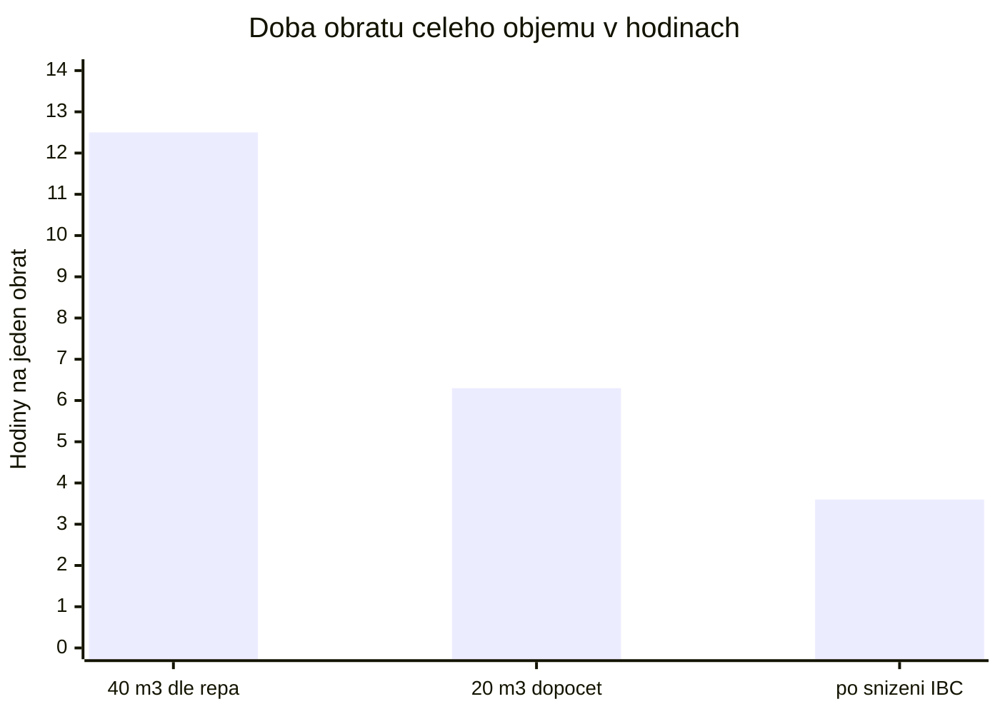
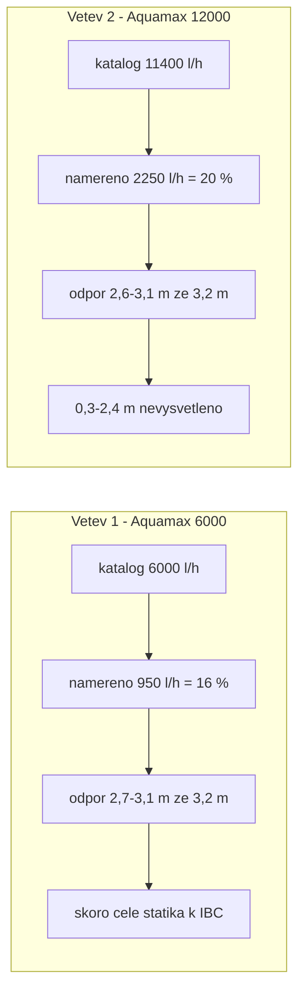
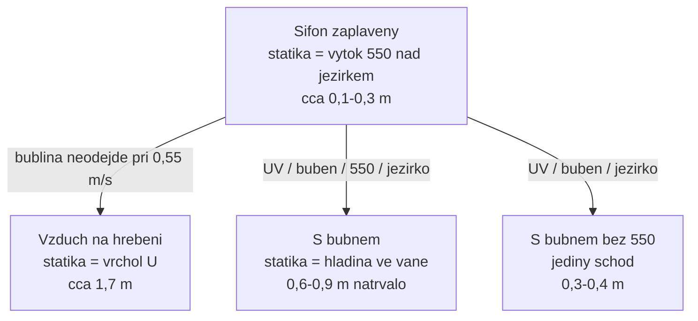

# Doporučení — revize návrhu a další kroky

Revize celého repa na verzi **1.1.5** (commit `2406a51`), doplněná o skutečnou obsádku zjištěnou **5. 9. 2026**. Hydraulický rozpočet je v [hydraulika.md](hydraulika.md), měření v [lab.md](lab.md), as-built v [zapojeni.md](zapojeni.md), postup u vody v [provoz.md](provoz.md).

---

## Verdikt

**Buben je správný stupeň, ale jako další krok je předčasný.** Sníží průtok větve 2, je krmený sáním u hladiny, zatímco zákal je popsaný na dně, a hlavně: při **5–7 kg biomasy** není co odvádět.

Před ním jsou tři kroky zadarmo a tři levné, které zvednou průtok přes stávající UV víc, než by kdy zvedl jakýkoliv nákup.

| | |
| --- | ---: |
| Nálezů celkem | **13** |
| Z toho měnících rozhodnutí | **7** |
| Objem v repu vs. dopočet z fólie | **40 vs. ~20 m³** |
| Obsádka v repu vs. skutečná | **40 Koi vs. 5 + ~20 mladých** |
| Nevysvětlený odpor na větvi 2 | **0,3–2,4 m** |
| Snížení odporu UV při paralelním zapojení | **cca 8×** |

---

## Nálezy

Závažnost: **A** mění rozhodnutí, **B** vnitřní rozpor nebo chybějící údaj, **C** drobnost.

| | Nález | Kde | Proč to nesedí |
| --- | --- | --- | --- |
| **A** | Obsádka „40 Koi“ | celé repo | Skutečnost k 5. 9. 2026: **5× Koi cca 40 cm + cca 20 mladých cca 8 cm**, dohromady 5–7 kg. Celá logika návrhu (těžká filtrace, žádné rostliny, zeolit v záloze) stojí na osminásobku. |
| **A** | Objem 40 m³ | zapojeni.md | Fólie 7 × 9,15 m = 64,05 m² neobalí ovál 8 × 5 m hluboký 1,5 m. Na 40 m³ je potřeba přes 90 m². Geometrie dává **15–28 m³**. |
| **A** | „950 a 2 250 l/h jsou stropy 12 V“ | lab.md | Nejsou. Je to odpor systému 2,6–3,1 m ze 3,2 m. Větev 1 je skoro čistá statika k IBC — po snížení nádrže **2 400–4 200 l/h**. |
| **A** | Rozpočet výtlaku větve 2 nevychází | lab.md | Hadice, kolena, dvě UV a 550 dají 0,7–2,3 m. Čerpadlo ale táhne 2,6–3,1 m. **Chybí 0,3–2,4 m** a nikdo je nehledal. |
| **A** | „Paralelně by rozdělilo dávku na průchod“ | provoz.md | Nerozdělí. Při stejném průtoku je dávka stejná, ale odpor dvojice klesne zhruba **8×**. Tímhle argumentem se paralelní zapojení zamítalo. |
| **A** | Buben prý průtok neovlivní | lab.md, provoz.md | Ovlivní. Vana má volnou hladinu a tím se **natrvalo přeruší sifon**, o který se větev 2 opírá. |
| **A** | Sání větve 2 je u hladiny | zapojeni.md | Zákal je popsaný „vidět jen na dně“ a satelit byl zamítnut. Povrchové sání kal ze dna k sítu nedonese. |
| **B** | „Green Reset 0,4 bar = 4 m, udusí čerpadlo i prázdný“ | lab.md | 0,4 bar je **max. tlak nádoby**, ne ztráta na čistých pěnách. Při 4 m ztráty by čerpadlo s 3,2 m nedalo nic — a přitom dává 950 l/h. |
| **B** | 230 V ostřik bubnu | provoz.md | Repo jinde 230 V u koupací vody odmítá. Buben chce ostřik ~2 bar a řídicí elektroniku; stejné pravidlo se na něj neuplatnilo. |
| **B** | Skimmer jako funkční stupeň | zapojeni.md | Při 950 l/h stěnový skimmer hladinu prakticky netáhne. |
| **B** | Zavřený vír vs. buben | provoz.md, lab.md | Zavřený vír = ovál skoro bez cirkulace. Buben ale zachytí jen to, co obíhá. Dva kroky si odporují. |
| **C** | Green Reset 100 s rybami | zapojeni.md | Výrobce: 35 m³ bez ryb, ale jen ~9 m³ s Koi. V repu byl jen průtok a tlak. |
| **C** | 40 mm vs. 38 mm do UV | provoz.md vs. lab.md | Dvě různá čísla pro tentýž trn. |

---

## Obsádka mění zadání

Původní návrh řešil rybí kal od 40 Koi. Ten problém tu není.

| Veličina | Odhad |
| --- | ---: |
| 5× 40 cm Koi | 5–6,5 kg |
| 20× 8 cm | ~0,2 kg |
| **Biomasa celkem** | **5–7 kg** |
| Krmivo při 1 % biomasy | ~60 g/den |
| Produkce amoniaku | ~1,8 g TAN/den |
| Kapacita 118 m² Hel-X | ~35 g TAN/den |

**Rezerva biofiltru je řádově dvacetinásobná.** Zelená voda tedy nepochází z ryb, ale ze slunce na celý 1,5m sloupec a z fosforu, který se do jezírka dostává listím, prachem, dopouštěnou vodou a usazeninou.

Odpověď proto není větší mechanika, ale **víc průchodů přes stávající UV** a **odběr živin**.

Mladí ale porostou. Až bude 25 Koi kolem 40 cm, biomasa vyskočí zhruba pětinásobně a rozvaha o bubnu se otevře znovu.

---

## Obrat objemu — kde to vázne

Součet obou větví je dnes **3 200 l/h** (kbelík 5. 9. 2026, čisté filtry, vír zavřený).

| Stav | Průtok | Objem | Doba obratu |
| --- | ---: | ---: | ---: |
| Dnes, uváděný objem | 3 200 l/h | 40 m³ | **12,5 h** |
| Dnes, dopočtený objem | 3 200 l/h | 20 m³ | **6,3 h** |
| Po snížení IBC | ~5 500 l/h | 20 m³ | **3,6 h** |
| Běžná praxe Koi | — | — | 1–2 h |

Koupací hybrid na Koi normu dosáhnout nemusí, ale 12,5 h je mimo i velmi volnou praxi. Obě čerpadla přitom běží skoro na doraz výtlaku — problém je odpor systému, ne výkon.

---

## Kde čerpadla stojí na svých křivkách

Detailní rozpočet, rychlosti a ztráty na metr jsou v [hydraulika.md](hydraulika.md).

---

## Sifon — proč na tom záleží

Dokud je trasa zaplavená až do jezírka, výška U se čerpadlu vrací a nepočítá se. Jakmile se na cestě objeví volná hladina — bublina na hřebeni nebo vana bubnu — stane se z té výšky skutečná statika.

Odnést bublinu ze sestupné větve chce zhruba **0,6–1,0 m/s**. Naměřená rychlost v 38 mm při 2 250 l/h je **0,55 m/s** — bublina tedy nemá jak odejít sama. Zavzdušněný hřeben zavře skoro celý nevysvětlený zbytek v rozpočtu.

Řešení je **odvzdušňovák na nejvyšším bodě** za 200–500 Kč, ne naklánění lamp.

---

## UV sériově vs. paralelně

| | Sériově (dnes) | Paralelně (2 T-kusy) |
| --- | --- | --- |
| Průtok jednou lampou | Q | Q / 2 |
| Ztráta na dvojici | 2 · k · Q² | k · Q² / 4 → **8× méně** |
| Dávka na průchod při stejném Q | úměrná 2V / Q | úměrná 2V / Q — **stejná** |
| Když jedna lampa zhasne | voda projde bez dávky | polovina projde bez dávky |
| Materiál | — | 2 T-kusy + ~2 m hadice 38 mm |

Voda v paralelním zapojení stráví v lampě dvakrát déle, protože každá dostane půlku průtoku. Dávka na litr proto vyjde stejně, jen odpor spadne na osminu.

Poctivá výhrada: až průtok vzroste, dávka na průchod klesne úměrně. To je ale přesně ta výměna, kterou repo chce — kontakt je dnes zbytečně dlouhý, chybí počet průchodů. Hadice k oběma lampám musí být stejně dlouhé.

---

## Co buben opravdu udělá

| Funkce | Verdikt | Poznámka |
| --- | --- | --- |
| Zachytí kal a nedožrané krmivo, co obíhá | Ano | Hlavní přínos bubnu — jenže při 5–7 kg biomasy není co odvádět |
| Zachytí zelenou řasu zabitou UV | Jen zčásti | Buňky mají pod 2 µm, síta bývají 60–120 µm. Chytí jen vločky a při odumření se rychle zaslepí |
| Zvedne průtok větve 2 | **Ne, sníží** | Volná hladina ve vaně přeruší sifon natrvalo |
| Sebere kal ze dna oválu | Ne | Sání je u hladiny, satelit byl zamítnut |
| Sníží NH₄ | Nepřímo | Nitrifikaci dělá Hel-X v IBC, a přes ten teče 950 l/h |
| Zapadne do 12V konceptu | Ne | Ostřik ~2 bar a řídicí elektronika = 230 V u koupací vody |

Levnější mezikrok na shluky z UV: **jemná japonská rohož** v poslední komoře 550.

---

## Pořadí, které dává smysl

```mermaid
flowchart LR
  k0["ZDARMA"] --> k1["1. Zmerit hladinu IBC<br/>a snizit nadrz"]
  k1 --> k2["2. Otevrit ventil B naplno"]
  k2 --> k3["3. Odvzdusnit hreben U"]
  k3 --> k4["4. Odvzdusnovak<br/>200-500 Kc"]
  k4 --> k5["5. UV paralelne<br/>600-1200 Kc"]
  k5 --> k6["6. 50 mm k lampam<br/>1500-3000 Kc"]
  k6 --> k7["7. Osazet 30cm polici"]
  k7 --> k8["8. KH a PO4, vazac fosfatu"]
  k8 --> k9["9. Prehodnotit Dyofix"]
  k9 --> k10["10. Buben az potom"]
```

| # | Krok | Cena | Čas | Co přinese |
| ---: | --- | ---: | ---: | --- |
| 1 | Změřit hladinu IBC nad jezírkem, pak nádrž snížit | 0 Kč + práce | půl dne | Větev 1 z 950 na **2 400–4 200 l/h**. Největší zisk v systému. |
| 2 | Otevřít ventil větve B naplno | 0 Kč | 5 min | As-built ho popisuje jako škrcený. Může to být celý nevysvětlený zbytek. |
| 3 | Odvzdušnit hřeben U za chodu | 0 Kč | 15 min | Zjistí, jestli sifon vůbec funguje. |
| 4 | Kohout nebo automatický odvzdušňovák na vrcholu | 200–500 Kč | 1 h | Trvalé řešení bubliny, která při 0,55 m/s sama neodejde. |
| 5 | Přepojit UV paralelně | 600–1 200 Kč | 2 h | Stejná dávka, zhruba 8× nižší odpor dvojice. |
| 6 | 50 mm co nejdál k lampám | 1 500–3 000 Kč | půl dne | Čtvrtinová ztráta proti 38 mm. Na trnech lamp zůstane 38 mm. |
| 7 | Osázet 30cm polici | 3 000–8 000 Kč | den | Pět kaprů rostliny nezničí. Odebírá živiny řasám u zdroje. |
| 8 | Změřit KH a PO₄, pak vazač fosfátu | 1 000–2 000 Kč | 1 h | Fosfor je u téhle obsádky reálně limitovatelný. |
| 9 | Přehodnotit Dyofix | — | — | Pravděpodobně dvojnásobná dávka, a stíní i rostliny z kroku 7. |
| 10 | Buben — až bude z čeho ubrat | koupený | den | Nebo až mladí vyrostou a biomasa půjde přes ~25 kg. |

**Po každé změně kbelík, jednu změnu po druhé.** Jinak se nedá poznat, co zabralo.

---

## Co v repu naopak sedí

- **Statika ponorného čerpadla se počítá od hladiny**, ne ode dna. Správně a na dvou místech.
- **Sifonová rekuperace** je principiálně správně; jen se nesmí předpokládat, že sifon je zaplavený, když rychlost je pod prahem odnosu vzduchu.
- **Diagnóza „mrtvá řasa bez záchytu za lampami“** sedí na tmavě šedé dno i na to, že 160 W UV je na tenhle objem víc než dost.
- **Zamítnutí CPF-10000, satelitu, bazénového písku a stálého zeolitu** je odůvodněné a po opravě obsádky platí ještě víc.
- **Aritmetika.** Přepočítáno: m³/den u obou větví, součty ceníku (98 481 / 13 980 / 125 847 Kč), 64,05 m² fólie, 118 m² chráněného povrchu Hel-X. Vše sedí.
- **Oprava orientace UV z v1.1.5.** Svislé U má plné komory a náklon dávku nezvedne. Ta úvaha platí dál — jen se týká těles, ne toho, co se stane po vložení volné hladiny do trasy.

---

## Jedna věta na závěr

Repo bylo do detailu vyladěné na rybí kal od 40 Koi. Ryb je pět a filtrace má dvacetinásobnou rezervu. Zbývající problém je **málo průchodů přes UV** a **příliš mnoho živin ve vodě** — a obojí se řeší levněji než bubnem.
