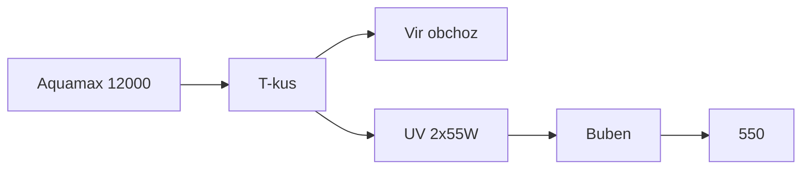

# Laboratorní poznámky — kbelík a zákal

Měření **5. 9. 2026** (kbelíkový test). Hydraulika as-built: [zapojeni.md](zapojeni.md). Cílový postup: [provoz.md](provoz.md).

Předpoklad míst měření podle provozního postupu: větev 1 = **výtok IBC**, větev 2 = **výtok Biofiltru 550** (ne u čerpadla). Kdyby 2250 l/h bylo součet víru + 550, čísla níž by byla ještě horší.

---

## Naměřené hodnoty

| Větev | Místo (předpoklad) | Naměřeno | Katalog čerpadla | Dříve v dokumentaci | Cíl po bubnu |
| --- | --- | ---: | ---: | ---: | ---: |
| 1 (skimmer → 6000 → Green Reset → IBC) | výtok IBC | **950 l/h** | 6 000 l/h | 1 500–3 000 l/h | nehonit na 6 000 |
| 2 (12000 → T → UV → 550) | výtok 550 | **2 250 l/h** | 11 400 l/h | „část 12000, A krade“ | **4 000–5 500 l/h** |

### Objem za den vs. 40 m³

| Tok | m³ / 24 h | Objemů jezírka / den |
| --- | ---: | ---: |
| Větev 1 | 22,8 | 0,57× |
| Větev 2 přes UV+550 | 54,0 | 1,35× |
| Součet přes UV (50 W + 110 W) | 76,8 | **1,9×** |
| Cíl větve 2 po bubnu (4 500 l/h) | 108 | 2,7× |

Wattů UV je dost ([provoz.md](provoz.md): 160 W / 40 m³). **Průtok lampami a záchyt shluků nejsou.**

---

## Zákal

Vzhled: **velmi tmavě zelený až šedý**, vidět **jen na dně**. Odhad: **převážně mrtvá řasa** (plus zbytek živého fytoplanktonu a Dyofix, který sloupec ztmaví).

To sedí na tabulku v [provoz.md](provoz.md): zelená = jednobuněčné řasy → UV má shluknout, **síto má shluky vyhodit**. Šedý nádech a vrstva na dně = UV už část buněk zabíjí, ale **nikde je nesbírá**. Houby v 550 a Green Resetu mrtvou řasu drží chvíli a pouští dál. Buben za UV v as-built **není v řadě**.

| Co to není | Proč |
| --- | --- |
| Málo wattů UV | 2×55 W + 2×25 W; třetí 55 W nekupovat |
| „Chce to zeolit / uhlí“ | Zeolit bere NH₄, uhlí Dyofix a DOC, ne šedý prach |
| CPF-10000 / silnější čerpadlo | 6 m³ filtr, 0,3 bar; viz provoz |
| Čistá hnědá kalová voda | Tmavě zelená složka = řasa, ne jen detrit z mělčiny |

Dno: mrtvá řasa + detrit. Nesmýkat 30 cm polici vírem. Občas vysavač, odpad na zahradu.

---

## Větev 1 — 950 l/h

AquaMax 6000 12 V má max. výtlak **3,2 m**. Statická výška k vtoku IBC je **~1,2 m** plus odpor špinavého Green Resetu. Katalogových 6 000 l/h je bez této zátěže. Dokumentace čekala 1 500–3 000 l/h; **950 je pod tím**.

Nejpravděpodobněji **ucpané pěny Green Resetu** (tmavá voda, pomalý tlakový stupeň). Dál: plný koš skimmeru, ohyb hadice, pokles 12 V.

Hel-X: 950 l/h přes IBC 1 000 l ≈ 1 h zdržení — na nitrifikaci stačí, **vzduch 60 l/min** musí Hel-X pořád vířit. Green Reset UVC 2×25 W má při 950 l/h dlouhý kontakt, ale na 40 m³ to je jen **0,57 objemu/den**.

Čistit Green Reset podle výtoku IBC, odpad na zahradu. Nesnažit se větev 1 na 6 000.

---

## Větev 2 — 2 250 l/h

Cíl po bubnu je **4 000–5 500 l/h** na výtoku 550. Teď je **polovina** a buben ještě není v sérii.

As-built: výtlak **2×40 mm**, větev A (vír) **neškrcená**, B (UV+550) škrcená. A má menší odpor, **krade průtok**. Hadice má jít **50 mm v kuse** k T-kusu.

2 250 l/h přes 2×55 W je na dávku UV spíš pomalé (dobré zabíjení na průchod), ale **17,8 h na jeden průtok 40 m³** lampami. Shluky se vrací do oválu.

Křemenky: při této vodě rychle zahalují; 110 W do mlhy. Otřít.

---

## Verdikt z tohoto měření

1. **Zákal = mrtvá (a zbylá živá) řasa bez záchytu**, ne málo UV.
2. **Buben za 2×55 W, před 550** — tohle číslo 2 250 l/h a šedé dno potvrzují. Prací odpad na zahradu.
3. **Vír přivřít**, větev B kbelíkem na 4 000–5 500 l/h; hadice **50 mm** k T-kusu.
4. **Green Reset vyčistit** — 950 l/h je moc málo i na špinavý 6000.
5. **Vysavač dna**, ne tryska do 30 cm police.
6. Nekupovat další UV, CPF-10000, zeolit na zákal, uhlí se Dyofixem.

Až pojedou 4 000+ l/h přes UV+buben a pěny Green Resetu budou čisté, kbelík zopakovat a zapsat sem.

