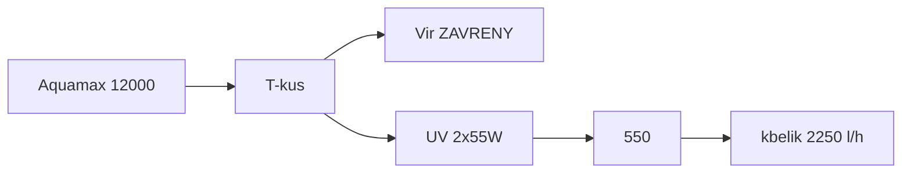

# Laboratorní poznámky — kbelík a zákal

Měření **5. 9. 2026** (kbelíkový test). Hydraulika as-built: [zapojeni.md](zapojeni.md). Cílový postup: [provoz.md](provoz.md).

Podmínky (doplněno po měření): **filtry vyčištěné**; větev 2 se **zavřeným vírem** — **všechno šlo přes UV** (2×55 W → Biofiltr 550). Místa: větev 1 = **výtok IBC**, větev 2 = **výtok 550**.

---

## Naměřené hodnoty

| Větev | Podmínka | Naměřeno | Katalog čerpadla | Odpor systému | Cíl po opravách |
| --- | --- | ---: | ---: | ---: | ---: |
| 1 (skimmer → 6000 → Green Reset → IBC) | čisté pěny | **950 l/h** | 6 000 l/h | 2,7–3,1 m | **2 400–4 200 l/h** po snížení IBC |
| 2 (12000 → UV → 550) | vír **zavřený**, vše přes UV, čisté filtry | **2 250 l/h** | 11 400 l/h | 2,6–3,1 m | podle toho, co ukážou testy |

2 250 l/h **není** strop 12 V AquaMax 12000, jak tvrdila první verze těchto poznámek. Je to odpor systému, který se dá z velké části odstranit — viz [hydraulika.md](hydraulika.md). Otevřený vír by z 2 250 jen ubral, to platí dál.

### Objem za den vs. 40 m³

| Tok | m³ / 24 h | Objemů jezírka / den |
| --- | ---: | ---: |
| Větev 1 | 22,8 | 0,57× |
| Větev 2 přes UV+550 (vír zavřený) | 54,0 | 1,35× |
| Součet přes UV (50 W + 110 W) | 76,8 | **1,9×** |
| Cíl větve 2 v [provoz.md](provoz.md) (4 500 l/h) | 108 | 2,7× |

Objemy jsou počítané na uváděných 40 m³. Při reálném objemu kolem 20 m³ ([hydraulika.md](hydraulika.md)) se všechny násobky zdvojnásobí.

Wattů UV je dost (160 W). **Chybí počet průchodů a záchyt shluků.** Průtok ale **není** strop 12 V, jak tvrdila první verze těchto poznámek — je to odpor systému, a ten se dá snížit.

---

## Zákal

Vzhled: **velmi tmavě zelený až šedý**, vidět **jen na dně**. Odhad: **převážně mrtvá řasa** (plus zbytek živého fytoplanktonu a Dyofix).

UV při 2 250 l/h má na průchod **dlouhý kontakt** (na zabití spíš dobře). Šedé dno = buňky umírají, **záchyt za lampami chybí**. 550 a Green Reset shluky neudrží.

| Co to není | Proč |
| --- | --- |
| Málo wattů UV | 2×55 W + 2×25 W; třetí 55 W nekupovat |
| Špinavé filtry při tomto kbelíku | pěny čisté |
| Vír ukradl 2 250 l/h | vír byl zavřený |
| Zeolit / uhlí | NH₄ / Dyofix+DOC, ne šedý prach |
| CPF-10000 / silnější čerpadlo | 0,3 bar; viz provoz |
| **Rybí kal** | obsádka je **5× 40 cm + ~20× 8 cm**, dohromady 5–7 kg |

**Zdroj živin nejsou ryby.** Při téhle biomase má biofiltr asi dvacetinásobnou rezervu. Zelenou vodu drží slunce na celý 1,5m sloupec plus fosfor z listí, dopouštěné vody a usazeniny. Odpověď je proto **víc průchodů přes UV** a **odběr živin** (osázená police, vazač fosfátu), ne větší mechanika.

Dno vysát na zahradu — sání obou větví je u hladiny, takže usazený kal nevidí žádný stupeň v řadě. Tryska ne do 30 cm police.

---

## Větev 1 — 950 l/h (čistý Green Reset)

AquaMax 6000 12 V: max. výtlak **3,2 m**. Při 950 l/h bere systém **2,7–3,1 m** — čerpadlo je skoro na dorazu.

**Oprava dřívějšího odvození.** Věta „čistý Green Reset až 0,4 bar = 4 m, filtr umí čerpadlo udusit i prázdný“ **neplatí**: 0,4 bar je maximální tlak nádoby podle výrobce, ne ztráta na pěnách. Kdyby filtr bral 4 m, čerpadlo s výtlakem 3,2 m by nedalo vůbec nic.

Skutečné vysvětlení je prozaičtější: při 950 l/h je rychlost v 38 mm jen **0,23 m/s**, takže tření v hadici je řádově 0,5 cm/m a celá trasa dá 10–20 cm. Zbývá **statická výška 2,0–2,8 m**. Číslo „~1,2 m“ s naměřenými 950 l/h nesedí — **změřit pásmem hladinu IBC nad hladinou jezírka**.

**950 l/h není strop této větve, je to důsledek výšky.** Snížení IBC na 1,2–1,5 m dá podle křivky **2 400–4 200 l/h**. Rozpočet a tabulka v [hydraulika.md](hydraulika.md).

Hel-X: 950 l/h × IBC 1 000 l ≈ 1 h — nitrifikace OK při **60 l/min** vzduchu. UVC 2×25 W: 0,57 objemu/den.

---

## Větev 2 — 2 250 l/h (vír zavřený)

Cíl 4 000–5 500 l/h z [provoz.md](provoz.md) počítal s tím, že 12000 má přebytek na vír. **Přebytek není.** 2 250 / 11 400 ≈ **20 % katalogu**, odpor systému **2,6–3,1 m** ze 3,2 m.

**A tenhle odpor se nedá poskládat.** Hadice, kolena, dvě UV a 550 dají dohromady 0,7–2,3 m. Chybí **0,3–2,4 m**. Dokud se nenajde, je každý nákup na tuhle větev střelba naslepo.

Dva nejpravděpodobnější viníci, oba se testují zadarmo:

1. **Ventil na větvi B je přiškrcený.** As-built ho sám popisuje jako „škrcená“. Otevřít naplno a znovu kbelík.
2. **Sifon je přerušený vzduchem na hřebeni.** Odnést bublinu ze sestupné větve chce zhruba **0,6–1,0 m/s**; naměřená rychlost je **0,55 m/s**. Bublina tedy nemá jak odejít. Zavzdušněný hřeben stojí čerpadlo **~1,7 m** místo ~0,2 m, což skoro celý ten schodek zavře.

To upřesňuje dřívější závěr „vrchol sifonu čerpadlo netíží“: platí **jen u zaplaveného sifonu**, a při 0,55 m/s to není samozřejmost. Řešením je **odvzdušňovák na nejvyšším bodě**, ne naklánění lamp.

**Paralelní zapojení lamp** místo sériového dá při stejném průtoku **stejnou dávku** a zhruba **osminový odpor** dvojice. Dřívější tvrzení, že paralelně by se dávka rozdělila, bylo špatně.

Vír jako obchoz dává smysl až bude na UV víc vody. Teď otevřít A = méně než 2 250 přes lampy.

Křemenky otírat — voda je pořád hustá.

---

## Výšky výtlaku (doplněno)

Ponorné Oase: **statická výška = od hladiny k nejvyššímu bodu výtlaku**, ne od čerpadla a ne od dna. Sloupec vody nad čerpadlem se nepočítá — čerpadlo ho nemusí „zvedat“.

Obě 12 V mají katalog **max. 3,2 m** (průtok → 0). Každý metr statiky + kolena + filtr žerou l/h z té křivky.

### Větev 1 — cca 2,5 m „ze dna pod skimmerem“

Měřeno **od dna pod skimmerem** k vysokému bodu (IBC). To je geometrie jámy, ne to, co vidí 6000.

Hloubka vody pod skimmerem u oválu 1,5 m max. je řádově **1–1,5 m**. Pak:

`statika ≈ 2,5 m − hloubka vody pod skimmerem ≈ 1,0–1,5 m` k vtoku IBC.

To sedí na dřívější **~1,2 m nad hladinou**. **950 l/h při čistém Green Resetu** je pak: ~1,2 m statiky + odpor pěn (i čistých, až 0,4 bar) + hadice, na křivce 3,2 m. Kdyby čerpadlo opravdu tlačilo **2,5 m statiky** (IBC 2,5 m *nad hladinou*), 950 l/h by bylo ještě pochopitelnější — 2,5 / 3,2 už je skoro strop. **Změřit pásmem: vtok IBC minus hladina**, ne dno.

Snížit IBC / zkrátit svislý kus pomůže víc než mytí pěn. Hloubka čerpadla pod skimmerem průtok nezvedne.

### Větev 2 — 1 m od hladiny do UV

Sání 12000 u hladiny, výtlak **1 m nad hladinu k lampám**. Statika k hrdlu UV je mírná (~1 m z 3,2 m). **2 250 l/h** při zavřeném víru tedy není „1 m výšky“, ale **tření**: 2×40 mm, **dvě UV v sérii**, sifonové oblouky, 550.

Když 550 teče gravitací zpět k hladině, *nettó* statika běžící větve je spíš výška výtoku 550 nad jezírkem než vrchol sifonu. Vrchol sifonu drží **podtlak** a přidává **kolena** — při 2 250 l/h v 38 mm to kolenům skoro nic nedělá (viz níž).

---

## UV — U ze dvou svislých lamp

As-built: **vstup 1. lampy dole → výstup nahoře → hadice do vstupu 2. lampy nahoře → výstup 2. lampy dole.** Police **~1 m** nad hladinou (havárie: voda pod policí nejde do elektro). **Na úroveň hladiny nesnižovat** — zmizí ten sifon, elektro hlava a těsnění jsou u vody.

**V křemence bublina není.** První lampa se plní zdola a odvzdušní se horním výstupem, druhá je uzavřená trubice shora dolů a vzduch jde ven spodním výtokem. Vzduch by mohl sedět jen v **koruně hadice mezi vrcholy**, ne v obalu zářivky — na dávku UV to nesvítí. Dřívější rada „položit, ať se vyplní pouzdro“ na toto U **neplatí**.

Úhel **není půlka účinku**. Když je komora plná, svisle / 45° / vodorovně je na UV **skoro totéž** (řádově 0–10 %, spíš teplota trubice). 45° komoru „víc nenaplní“.

| Úprava | Dávka UV | Průtok proti 2 250 l/h |
| --- | --- | --- |
| Nechat svislé U na 1 m polici | výchozí (plné komory) | **2 250 l/h** |
| Naklonit ~45° na stejné polici | cca **0 až −5 %** | **cca 0–5 %** (kbelík = šum) |
| Vodorovně na stejné 1 m polici | cca **0 až −5 %** | totéž **0–5 %** |
| Ležato **u hladiny** | stejné UV, **horší elektřina** | pořád ne tisíce l/h |

Při **2 250 l/h** a vnitřku **38 mm** je rychlost ~0,55 m/s, `v²/2g` ~1,5 cm. Extra koleno je milimetry sloupce. Vnitřní odpor dvou lamp se náklonem nemění. Běžící sifon: čerpadlo vidí výtok 550 nad hladinou, ne výšku U. Z 2 250 to 4 000 poloha neudělá.

Na trnech lamp nechat **38 mm** (u analogu Vitronic je strop trnu 38 mm — jiná se tam nevejde). 50 mm jen **od 12000 k T-kusu**, pokud se vejde.

**Nechat jak je.** Náklon kvůli UV ani kvůli l/h nemá cenu.

Pozor: trvalý sifon zpět **pod hladinu** umí po vypnutí čerpadla **vysát jezírko**. Výtok 550 nad hladinou, nebo přisátí vzduchu na hřebeni.

---

## Verdikt z tohoto měření

1. **Zákal = mrtvá (a zbylá živá) řasa bez záchytu**, ne rybí kal. Obsádka 5× 40 cm + ~20× 8 cm je na to příliš lehká.
2. **950 a 2 250 l/h nejsou stropy 12 V.** Je to odpor systému 2,6–3,1 m ze 3,2 m. Větev 1 je skoro čistá statika k IBC; u větve 2 chybí v rozpočtu 0,3–2,4 m.
3. **Nejdřív to, co je zadarmo:** změřit hladinu IBC pásmem, otevřít ventil B naplno, odvzdušnit hřeben U. Po každé změně kbelík.
4. **Svislé U nechat na ~1 m polici.** Komory jsou plné, náklon nepomůže. Vzduch sedí na hřebeni propoje a při 0,55 m/s sám neodejde — patří tam odvzdušňovák.
5. **UV přepojit paralelně.** Stejná dávka, zhruba osminový odpor.
6. **Buben odložit.** Málo rybího kalu, přeruší sifon, na řasu pod 2 µm je to nejhorší typ síta.
7. **Živiny dolů:** osázet 30cm polici (pět kaprů rostliny nezničí), změřit PO₄ a KH, přehodnotit dávku Dyofixu.
8. Vysavač dna. Nekupovat další UV, CPF-10000, zeolit na zákal, uhlí se Dyofixem.

