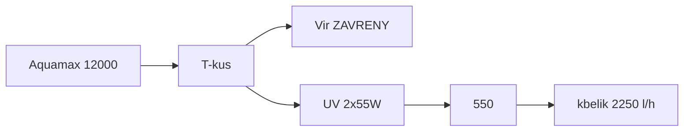

# Laboratorní poznámky — kbelík a zákal

Měření **5. 9. 2026** (kbelíkový test). Hydraulika as-built: [zapojeni.md](zapojeni.md). Cílový postup: [provoz.md](provoz.md).

Podmínky (doplněno po měření): **filtry vyčištěné**; větev 2 se **zavřeným vírem** — **všechno šlo přes UV** (2×55 W → Biofiltr 550). Místa: větev 1 = **výtok IBC**, větev 2 = **výtok 550**.

---

## Naměřené hodnoty

| Větev | Podmínka | Naměřeno | Katalog čerpadla | Dříve v dokumentaci | Cíl po bubnu |
| --- | --- | ---: | ---: | ---: | ---: |
| 1 (skimmer → 6000 → Green Reset → IBC) | čisté pěny | **950 l/h** | 6 000 l/h | 1 500–3 000 l/h | nehonit na 6 000 |
| 2 (12000 → UV → 550) | vír **zavřený**, vše přes UV, čisté filtry | **2 250 l/h** | 11 400 l/h | „A krade“ — **na tomto kbelíku neplatí** | **4 000–5 500 l/h** |

2 250 l/h je **strop** 12 V AquaMax 12000 proti 2×40 mm + 2×55 W v sérii + 550, ne zbytek po víru. Otevřený vír by z 2 250 jen ubral.

### Objem za den vs. 40 m³

| Tok | m³ / 24 h | Objemů jezírka / den |
| --- | ---: | ---: |
| Větev 1 | 22,8 | 0,57× |
| Větev 2 přes UV+550 (vír zavřený) | 54,0 | 1,35× |
| Součet přes UV (50 W + 110 W) | 76,8 | **1,9×** |
| Cíl větve 2 v [provoz.md](provoz.md) (4 500 l/h) | 108 | 2,7× |

Wattů UV je dost (160 W / 40 m³). **Záchyt shluků chybí.** Průtok 12 V čerpadly je ten, co je — ne špína v pěnách.

---

## Zákal

Vzhled: **velmi tmavě zelený až šedý**, vidět **jen na dně**. Odhad: **převážně mrtvá řasa** (plus zbytek živého fytoplanktonu a Dyofix).

UV při 2 250 l/h má na průchod **dlouhý kontakt** (na zabití spíš dobře). Šedé dno = buňky umírají, **síto za lampami není**. Buben v as-built není v řadě. 550 a Green Reset shluky neudrží.

| Co to není | Proč |
| --- | --- |
| Málo wattů UV | 2×55 W + 2×25 W; třetí 55 W nekupovat |
| Špinavé filtry při tomto kbelíku | pěny čisté |
| Vír ukradl 2 250 l/h | vír byl zavřený |
| Zeolit / uhlí | NH₄ / Dyofix+DOC, ne šedý prach |
| CPF-10000 / silnější čerpadlo | 6 m³, 0,3 bar; viz provoz |

Dno vysát na zahradu. Tryska ne do 30 cm police.

---

## Větev 1 — 950 l/h (čistý Green Reset)

AquaMax 6000 12 V: max. výtlak **3,2 m**. Statická výška k IBC **~1,2 m** plus čistý Green Reset (až 0,4 bar = 4 m — filtr umí čerpadlo udusit i prázdný). Katalog 6 000 l/h je bez této zátěže. Odhad 1 500–3 000 l/h byl **optimistický**; **950 l/h je reálný strop této větve**, dokud se nesníží výtlak (níž vtok IBC, kratší/širší hadice), ne dokud se znovu myjí pěny.

Hel-X: 950 l/h × IBC 1 000 l ≈ 1 h — nitrifikace OK při **60 l/min** vzduchu. UVC 2×25 W: 0,57 objemu/den.

---

## Větev 2 — 2 250 l/h (vír zavřený)

Cíl 4 000–5 500 l/h z [provoz.md](provoz.md) počítal s tím, že 12000 má přebytek na vír. **Přebytek není.** 2 250 / 11 400 ≈ **20 % katalogu**. 12 V, 3,2 m, **dvě UV v sérii**, **2×40 mm** místo 50 mm, gravitační 550.

**50 mm v kuse k T-kusu** (a dál k UV, pokud trn dovolí) může přidat stovky až nízké tisíce l/h — ne nutně na 4 500. Po 50 mm znovu kbelík. Buben (max. 6 000 l/h) při 2 250 **nepřeteče**; za UV pořád patří kvůli mrtvé řase, ne kvůli průtoku.

Vír jako obchoz dává smysl **až** bude na UV víc vody, než má jít přes buben. Teď otevřít A = méně než 2 250 přes lampy.

Křemenky otírat — voda je pořád hustá.

---

## Verdikt z tohoto měření

1. **Zákal = mrtvá (a zbylá živá) řasa bez záchytu.** UV při zavřeném víru už vodu vidí; chybí buben.
2. **950 a 2 250 l/h jsou stropy čistého 12 V zapojení**, ne špinavé pěny a ne otevřený vír.
3. **Buben za 2×55 W, před 550** — prací odpad na zahradu. 2 250 l/h je pod stropem síta.
4. **Hadice 50 mm** k T-kusu / UV; pak nový kbelík. Cíl 4 000–5 500 brát jako přání, ne slib.
5. **Vír nechat zavřený** (nebo skoro), dokud kbelík na 550 neukáže rezervu nad tím, co má jít přes buben.
6. Vysavač dna. Nekupovat další UV, CPF-10000, zeolit na zákal, uhlí se Dyofixem.

