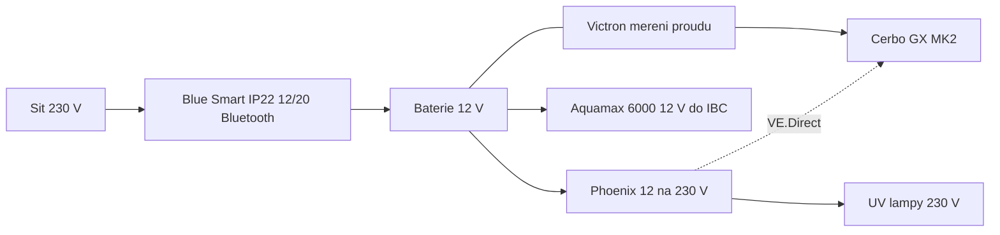
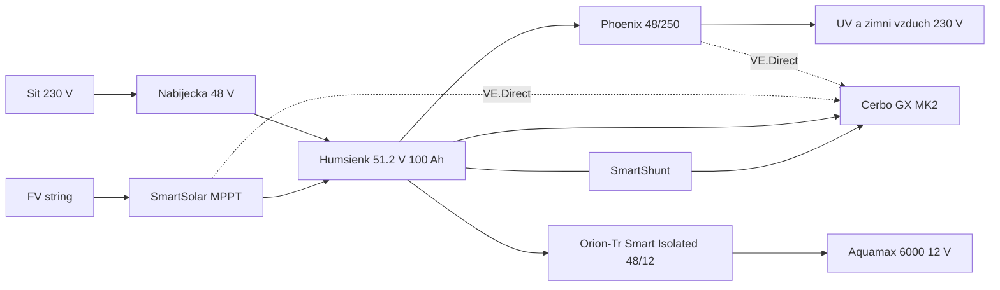

# Solární a záložní napájení

Hydraulika je v [zapojeni.md](zapojeni.md) a [provoz.md](provoz.md). Tady je elektřina: současná **12 V záloha** a plánovaný **48 V bus** (Humsienk 5,12 kWh + izolovaný Orion 48/12).

---

## Verdikt (48 V)

**48 V sběrnice + izolovaný Victron Orion 48 → 12 V na mokrou větev je správný směr.** Ne „jen vyměnit baterii a dát stepdown“.

| Co | Proč |
| --- | --- |
| 48 V na FVE, baterii, Cerbo, MPPT, střídač | Proud na 2 kWp klesne z ~140 A (12 V) na ~36 A; stačí **jeden** SmartSolar 150/35 místo 150/70–100 |
| 12 V jen do jezírka (Aquamax 6000) přes **izolovaný** Orion | SELV u vody; galvanické oddělení od FV stringu (Orion-Tr Smart Isolated, 200 V) |
| Střídač **48 → 230 V** (Phoenix 48/250), ne 48 → 12 → 230 | UV a zimní vzduchovač 230 V; 12 V Phoenix by žral celý Orion |
| Blue Smart IP22 12/20 pryč | Nabíjet 48 V baterii (Phoenix Smart IP43 48/10–15, nebo MultiPlus 48/500) |
| Humsienk 51,2 V 100 Ah (5,12 kWh) stačí na plán | Zima: vzduch 3–4 dny; léto: větev 1 + Green Reset UV ~1,5 dne. Celý objekt ostrovně **ne** |

Zima v Polabí: **vzduchování + Cerbo**, čerpadla a UV vypnuté. Na průměrný prosinec stačí **~2 kWp** jih, sklon spíš 45–60° než 30°. Inverzní týdny pořád chtějí síťovou 48 V nabíječku.

---

## Současný stav (as-built, 12 V)

Síť 230 V je hlavní zdroj. 12 V baterie je **záloha při výpadku**. Na ní visí větev 1 (Aquamax 6000) a přes střídač UV.

| Kus | Role |
| --- | --- |
| Baterie 12 V | Ostrov při výpadku; Ah doplnit, pokud 12 V sběrnice ještě žije |
| Victron měření proudu (SmartShunt / BMV) | Proud, Ah, SOC; VE.Direct do Cerbo |
| Victron Blue Smart 20 A, 230 V → 12 V, Bluetooth | Dobíjení ze sítě; typicky **IP22 12/20**, bez VE.Direct |
| Victron Cerbo GX MK2 | VRM; napájení 8–70 V (půjde i na 48 V) |
| Aquamax Eco Premium **6000 12 V** | Jediné čerpadlo na baterii (větev 1 → Green Reset → IBC) |
| Nejmenší Victron střídač 12 → 230 V | UV; Phoenix **12/250**: **200 W** trvale / 250 VA / špička 400 W |

Na baterii **není**: Aquamax 12000 (12 V trafo ze sítě), skimmer CSP-8000 (230 V), vzduchování IBC (230 V), buben.

---

## Zátěže

Oase 6000 12 V má v sadě spínaný zdroj **12 V DC / 8 A**. Na DC sběrnici má viset **12 V strana čerpadla**, ne 230 V trafo přes střídač.

Na 12 V baterii (dnes): nabíjení cca 14,4 V vs. regulovaných 12 V z Oase zdroje — ověřit, nebo **Orion-Tr 12/12**.

Na 48 V (plán): izolovaný Orion v režimu **power supply**, výstup **12,0–12,5 V** (ne 14,4 V). Čerpadlo pak vidí stejné napětí jako z Oase zdroje.

| Spotřebič | Napětí | Příkon řádově | Kde teď | Při výpadku / v plánu 48 V |
| --- | --- | ---: | --- | --- |
| Aquamax 6000 12 V | 12 V DC | 45–55 W (až 8 A na zdroji) | 12 V baterie | Orion 48/12 izolovaný |
| Green Reset UVC 2×25 W | 230 V | 50 W | Střídač nebo síť | Phoenix **48**/250; jen když teče větev 1 |
| UV 2×55 W (větev 2) | 230 V | 110 W | Střídač nebo síť | **Bez Aquamax 12000 vypnout** |
| Phoenix 12/250 (klid) | 12 V DC | 4,2 W (ECO 0,8 W) | 12 V baterie | Nahradit **48/250** (ne tahat přes Orion) |
| Cerbo GX MK2 | 8–70 V DC | cca 3–7 W | 12 V baterie | Přímo z 48 V |
| SmartShunt | 6,5–70 V | zanedbatelné | 12 V | Minus 48 V sběrnice |
| Aquamax 12000 12 V | 12 V přes síťové trafo | 90–95 W | Jen 230 V | Léto ze sítě; zima vypnuto |
| Skimmer 230 V | 230 V | 80 W | Síť | Zima vypnuto |
| Vzduch 60 l/min | 230 V | 30–55 W | Síť | Zima **jediná** filtrační zátěž na Phoenix 48/250 |

### Střídač vs. UV (platí pro 12/250 i 48/250)

Oba mají **200 W** trvale při 25 °C (při 40 °C klesá na 175 W).

- 2×55 W = 110 W AC → na DC cca 130 W — v pohodě.
- 2×55 W + Green Reset 50 W = 160 W AC → na DC cca 185 W — rezerva malá.
- Vzduch 40 W + Green Reset 50 W — v pohodě.
- 2×55 W + vzduch + Green Reset — **ne** na 250 VA.

UV bez průtoku křemen přehřívá. Při výpadku / zimě:

1. Čerpadlo 6000 běží → Green Reset UVC **smí** na střídači.
2. Čerpadlo 12000 stojí → **2×55 W vypnout** (relé / asistovaný spínač Cerbo, nebo ručně).

### Denní energie (hrubý odhad, 24 h)

| Scénář | Wh / den | Poznámka |
| --- | ---: | --- |
| Zima: vzduch 40 W + Cerbo 5 W + ztráty Orion/střídač | cca **1 200–1 400** | Cílový zimní provoz |
| Jen 6000 + Cerbo | cca 1 300 | Větev 1 bez UV |
| 6000 + Green Reset UVC 50 W + střídač | cca 2 800 | Léto minimum na baterii |
| + 2×55 W | cca 6 000 | Jen když teče 12000 |
| Vše (12000 + skimmer + obě UV + vzduch) | cca **8–10 kWh** | 5,12 kWh baterie to neunese ostrovně |

---

## Cílový 48 V bus

12 V Phoenix a Blue Smart IP22 12/20 na téhle sběrnici **nejsou**. Cerbo z 48 V, SmartShunt na minusu 48 V. Orion **nemá** VE.Direct — proud do 12 V větve je vidět na SmartShuntu jako zátěž 48 V.

### Kusovník (plán, nic nekupovat naslepo)

| Kus | Role | Poznámka |
| --- | --- | --- |
| [Humsienk 48 V 100 Ah 3U](https://allegro.cz/produkt/bateriove-uloziste-humsienk-48v-100ah-lifepo4-3u-rack-2def33de-5578-4f6d-aa42-1723393b91e8) | 5,12 kWh, 100 A BMS | IP20, nabíjení **jen 0–55 °C**; EU shop cca 800–1 100 EUR |
| SmartSolar **150/35** (nebo 250/45 při 3s stringu) | FV → 48 V | 2 kWp ≈ 36 A při 56 V; 150/35 stačí |
| **Orion-Tr Smart Isolated 48/12-20** (240 W / 20 A) | 48 → 12 V SELV | Režim power supply, 12,0–12,5 V. Čerpadlo ~5 A — rezerva velká |
| Phoenix **48/250** VE.Direct | 48 → 230 V | UV + zimní vzduchovač; stávající 12/250 prodat / nechat jako náhradní |
| 48 V síťová nabíječka | Zima, inverze, výpadek FVE | Phoenix Smart IP43 48/10–15 (~0,5–0,8 kW) |
| Cerbo GX MK2 + SmartShunt | VRM, SOC | Už jsou; Shunt 6,5–70 V OK na 48 V |
| Pojistky / DC spínače 48 V | MPPT→baterie, střídač, Orion | 48 V DC jističe, ne 12 V auto pojistky naslepo |

**Orion 48/12-20 izolovaný** utáhne jen čerpadlo. Kdyby na 12 V zůstal i Phoenix 12/250 + UV, 20 A je na hraně (pumpa ~5 A + střídač ~15 A) — to nedělat. Neizolovaný Orion 48/12-60 je výkonnější, ale **společný minus** s 48 V; do jezírka ne.

Volitelně malá 12 V buffer baterie za Orionem (20–40 Ah) proti restartu DC-DC. Není nutná, pokud čerpadlo snese krátký výpadek.

---

## Humsienk 51,2 V 100 Ah 3U

Nabídka: 5 120 Wh, Bluetooth, CAN/RS232/RS485, 100 A BMS, paralelně až 16 ks, články inzerované jako BYD A+. SKU v inzerátu `HS48V100AH100RACK-3U-EU`.

**Hodnocení: použitelná 48 V LiFePO₄ rack baterie za cenu, ne plug-and-play Victron a ne „15 000 cyklů / BYD auto“.**

| Tvrzení inzerátu | Co platí |
| --- | --- |
| 15 000 cyklů | Manuál řady: **≥8 000** při 25 °C / 70 % SOH; FAQ **6 000 při 80 % DoD**; při 45 °C **≥3 000**. Počítat 6–8 tis. |
| Active balancing | Manuál téže řady uvádí **pasivní** vyrovnání. Neplatit prémii za aktivní, dokud to neschválí BMS app |
| Články BYD | Rebrand Grade A; brát jako slušné LFP, ne jako BYD Battery-Box |
| Kompatibilita Victron | Komunita: protokol **Pylontech, 500 kbit/s**, často **vlastní kabel** (Type B **bez GND**). Ověřit CAN, než se spolehne DVCC |
| Doporučené nabíjecí napětí 51,2 V (web EU) | To je **nominál**, ne absorpce. LFP absorpce **56,8–57,6 V**, strop BMS 58,4 V. Victron LiFePO4 asistent / CAN z BMS |
| Rychlé nabíjení 1C | Maximum BMS 100 A. **Doporučeno 20 A (0,2C)** ≈ 1 kW — sedí na 2 kWp MPPT |
| IP20 | Vnitřek, sucho. Ne ven, ne do vlhké šachty u jezírka |
| Nabíjení 0–55 °C | Polabí: v nevytápěné kůlně v zimě **BMS zakáže nabíjení**. Místnost nad 0 °C, nebo malý temper (a ten počítat do zimní spotřeby) |

CAN není podmínka provozu. Záložní režim: BMS samostatně + SmartShunt + v MPPT/nabíječce ruční LiFePO4 limity. Bluetooth app „HumSienk Smart BMS“ pro články.

Umístění: ~44 kg, 3U 500×440×133 mm, větrání, ne vedle Green Resetu ve vlhku.

Využitelná energie: cca **4,6 kWh** při 90 % DoD (šetrněji 80 % → 4,1 kWh).

| Scénář | Autonomie z 4,6 kWh |
| --- | ---: |
| Zima jen vzduch ~1,3 kWh/den | **3–3,5 dne** |
| Léto 6000 + Green Reset UV ~2,8 kWh/den | **~1,5 dne** |
| Plný letní provoz 8–10 kWh/den | **půl dne** — nesmysl ostrovně |

---

## Proč 48 V šetří MPPT

| | 12 V bus | 48 V bus |
| --- | ---: | ---: |
| 2 kWp nabíjecí proud (při ~14,4 / 56 V) | ~140 A | ~36 A |
| Jeden Victron MPPT | 150/70 = max ~1 kW; na 2 kWp 150/100 nebo dva kusy | **150/35** utáhne 2 kWp |
| Průřez kabelů baterie | tlusté, drahé, ztráty | běžné 16–25 mm² na krátko |
| Oase 6000 | přímo | přes izolovaný Orion (~4–8 % ztráta na ~50 W = 2–4 W) |

Na 400 Wp etapě 1 by 12 V MPPT 100/20 stačil a 48 V by se nevyplatilo. Na **1,5–2 kWp** (zima v Polabí) 48 V dává smysl. Ztráta Orionu na čerpadle je zanedbatelná proti úspoře mědi a regulátoru.

String (orientačně, vždy podle Voc panelu v −10 °C):

- Typický 400–450 Wp: Voc ~50 V, Vmp ~42 V, Isc ~13 A.
- **2s2p** na MPPT **150/35**: Voc za studena 2×50×~1,2 ≈ 120 V < 150 V. Proud 2×13 A = 26 A < 35 A.
- **3s** na 150 V **ne** (studený Voc > 150 V) → MPPT **250/45** nebo 250/60.

---

## Panely v Polabí (~50,1 °N, 220 m n. m.)

Proxy: PVGIS Litoměřice 50,5 °N / 178 m, sklon 34°, jih, 1 kWp, ztráty 14 % (tabulka je spíš AC; DC do baterie bývá o něco lepší). Polabí 220 m je srovnatelné; mlha a inverze v údolí Labe zhorší **prosinec** víc než nadmořská výška.

| Měsíc | kWh / kWp · den (průměr) |
| --- | ---: |
| Prosinec | **0,70** |
| Leden | 0,85 |
| Únor | 1,65 |
| Březen | 2,84 |
| Červen | **4,00** |
| Rok | 2,60 (~950 kWh/kWp·rok) |

Inverzní týden: i **0,2–0,4 kWh/kWp·den** několik dní v kuse — na to je 48 V nabíječka ze sítě, ne víc panelů.

Sklon **45–60°** (zimní bias, sníh sklouzne) zvedne prosinec řádově o 10–20 % proti 30–35°. Léto klesne málo; na jezírko to nevadí.

### Kolik Wp k zimnímu vzduchování

Zátěž: vzduch 30–55 W × 24 h = 0,7–1,3 kWh + Cerbo/Orion/střídač ~0,2 kWh → plánovat **~1,3 kWh/den**.

| Pole | Průměrný prosinec | Verdikt |
| --- | ---: | --- |
| 1,0 kWp | ~0,7 kWh/den | Málo; skoro každý šedý den síť |
| **1,5 kWp** | ~1,05 kWh/den | Na hraně průměru; strmější sklon pomůže |
| **2,0 kWp** | ~1,4 kWh/den | **Cíl** — průměrný prosinec pokryje vzduch; inverze pořád ze sítě |
| 3,0 kWp | ~2,1 kWh/den | Rezerva na listopad/leden a letní větev 1+UV bez přemýšlení; MPPT pořád jeden 150/35 nebo 250/45 |

**Doporučení: 4× 400–450 Wp ≈ 1,6–1,8 kWp, nebo 4× 500 Wp ≈ 2 kWp**, 2s2p, jih, sklon 50° pokud střecha/konstrukce dovolí. Víc než 2,5 kWp kvůli zimě nemá smysl — baterie 5 kWh stejně nesežere celodenní letní přebytek a inverzi panely nezlomí.

Léto (2 kWp × 4 kWh/kWp ≈ **8 kWh/den**):

- Větev 1 + Green Reset UV (~2,8 kWh) — bez problému, baterie se dobije dopoledne.
- + 12000 24 h (~2,3 kWh) — průměrný červen utáhne, přeháňkový týden už sahá do sítě.
- Plný provoz 8–10 kWh — průměrně na nule, bez rezervy. **12000, skimmer a 2×55 W nechat na síti** (nebo sezónně), baterii šetřit na výpadek a na větev 1.

---

## Zimní provoz (jen vzduch)

1. Aquamax 6000 i 12000 **stojí** (led, hadice, koi u dna).
2. UV **vypnuté** (bez průtoku).
3. Skimmer vypnutý.
4. IBC Hel-X: bez cirkulace vody nitrifikace spí; **vzduch 60 l/min** drží biofilm a kyslík, pokud IBC nezamrzne.
5. Střídač 48/250 napájí **jen** vzduchovač (30–55 W). ECO mode, když kompresor cykli.
6. Orion 48/12 může být vypnutý (žádné 12 V čerpadlo) — ušetří klidový odběr.
7. Baterie v místnosti **> 0 °C**, jinak MPPT/nabíječka nesmí tlačit proud (BMS cut-off).

Kámen v hlubině jezírka (kyslík pro 40 Koi pod ledem) je pořád 230 V ze sítě, pokud není na stejném střídači. Pokud má jít ze zálohy, musí se vejít do 200 W spolu se vzduchovačem IBC.

---

## Cerbo, nabíječky, FVE

Blue Smart IP22 **nemá VE.Direct**. Proud z něj je na SmartShuntu. Po přechodu na 48 V ho **nepoužívat** (12 V výstup).

VE.Direct na Cerbo (3 porty) po přestavbě:

1. SmartShunt  
2. Phoenix **48**/250  
3. SmartSolar MPPT  

Humsienk CAN: samostatný VE.Can / BMS-Can, protokol Pylontech 500 kbit/s, kabel podle pinoutu v manuálu baterie (komunita: Type B bez země). Dokud CAN neběží, SOC ze SmartShuntu.

MPPT a 48 V nabíječka ze sítě smí viset paralelně (Victron, stejné LiFePO4 limity, nebo DVCC z BMS).

---

## Co při výpadku / zimě tahle záloha neřeší

- Cirkulace mělčiny a UV 2×55 W, dokud 12000 není na 48 V střídači (a na 250 VA se nevejde).
- Skimmer CSP-8000.
- Čištění Green Resetu (230 V ventily podle modelu).
- Nabíjení Humsienk pod 0 °C.

Priorita je **kyslík a biofilm v zimě** (vzduch) a **větev 1 v létě při výpadku**, ne ostrovní dům.

---

## Otevřené otázky

1. Kam přesně půjde rack (místnost > 0 °C v zimě)?  
2. Půjde CAN (Pylontech) napevno, nebo stačí Shunt + Bluetooth BMS?  
3. Zimní vzduchovač IBC a/nebo kámen v hlubině na Phoenix 48/250?  
4. Střecha/konstrukce: azimut, sklon, stín stromů (Polabí inverze + ranní mlha).  
5. Nechat 12000 natrvalo na síti, nebo později větší střídač (MultiPlus 48/500–800) jen na sezónu?

Dokud není 1 a 4, držet **2 kWp / 2s2p / MPPT 150/35** jako výchozí číslo, ne 400 Wp z původní 12 V etapy.
