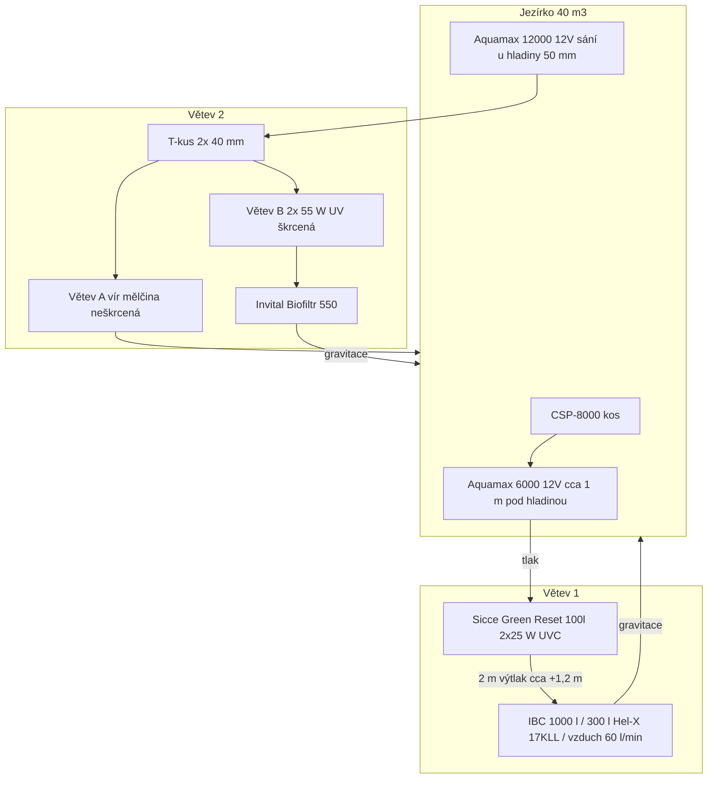

# Technický popis současného zapojení

Stav k **5. 9. 2026**. Jde o **as-built** okruh, ne o cílový stav v [provoz.md](provoz.md) (buben za UV tam ještě není v řadě).

Ceny ve **filtraci** jsou **odhad náhrady s DPH** podle veřejných e-shopů k **5. 9. 2026**, ne faktury. Fólie je **skutečný nákup** (12. 7. 2020). Kde je známý nákupní odkaz z podkladů, je použit. Kde model chybí, je to v poznámce a cena je analog.

---

## Jezírko

| Parametr | Hodnota |
| --- | --- |
| Objem | 40 000 l (40 m³) |
| Půdorys | ovál ve vnějším obdélníku 8 × 5 m |
| Plocha hladiny | cca 30–35 m² |
| Max. hloubka | cca 1,5 m |
| Mělká zóna | 30 cm, šířka 30–150 cm |
| Obsádka | 40× Koi |
| Provoz | koupací, čerpadla ve vodě 12 V |
| Fólie | Firestone PondGard EPDM 1 mm, šíře 9,15 m × 7 bm (64,05 m²) |

Celý sloupec je v dosahu slunce. Barvivo **Dyofix Pond Blue** je v jezírku kvůli stínění řas (spolu s UV).

---

## Hydraulika — současný tok

Tlakový je **jen** Sicce Green Reset. Za ním žádné další čerpadlo. IBC a Biofiltr 550 jsou netlakové (gravitační výtok).

### Větev 1 — skimmer, tlaková mechanika, MBBR

1. **Stěnový skimmer CSP-8000** na okraji, koš 12 l, výkyv hladiny do 100 mm, plocha do 50 m². **Bez vlastního čerpadla** — hladinu táhne Aquamax 6000. Do Green Resetu nepatří druhé čerpadlo souběžně s 6000 (přetlak / EFC).
2. **Oase AquaMax Eco Premium 6000 12 V** (art. 50730) cca **1 m pod hladinou**. Katalog 6 000 l/h, max. výtlak **3,2 m**, hrubé nečistoty do 10 mm, druhý sací vstup (satelit se nepoužívá). Trafo 230/12 V v dodávce. Ponořené čerpadlo: statická výška se počítá **od hladiny k nejvyššímu bodu výtlaku**.
3. Čerpadlo tlačí do **Sicce Green Reset 100 l** (vstup na úrovni hladiny): 5 pěn, **2× 25 W UVC**, max. 16 000 l/h, max. 0,4 bar, trn 32/38/50. Režim čištění: odpad **na zahradu**, ne do IBC.
4. Z filtru **2 m výtlak** do IBC, vtok IBC cca **1,2 m nad hladinou** jezírka. Kbelík **5. 9. 2026 = 950 l/h při čistém Green Resetu** ([lab.md](lab.md)); katalog 6 000 l/h na tento výtlak nesedí.
5. **IBC 1 000 l**, náplň **300 l Hel-X 17 KLL bílý** (30 % objemu; chráněný povrch 393 m²/m³ → cca 118 m²). Spodní distanční rastr, **60 l/min vzduchu** (3,6 m³/h) na fluidní lůžko. Výtok gravitačně zpět do jezírka (síto proti úniku média).

### Větev 2 — cirkulace, UV, gravitační biofiltr

1. **Oase AquaMax Eco Premium 12000 12 V** (art. 50382) sání **těsně u hladiny**, přívod **50 mm**. Katalog 11 400 l/h, max. výtlak **3,2 m**, nečistoty do 11 mm, druhý vstup (satelit zkoušen, **nevyhovoval** — koupání v 1,5 m, zima, malý efekt). Trafo v dodávce.
2. Výtlak rozdělen na **dvě 40 mm** s regulací:
   - **A — vír / mělká zóna:** neškrcená, vratná voda pravotočivě roztáčí mělčinu a strhává kal. Tryska má jít **podél oválu**, ne kolmo do 30 cm police.
   - **B — filtrace:** škrcená, **2× 55 W UV** (průtočné, v sérii před 550) → **INVITAL Biofiltr 550** (130 l, vstup 20–40 mm, výtok 40–72 mm, max. doporučený průtok 12 000 l/h). Výtok gravitací do jezírka.
3. Neškrcená A bere tok z B, **když je otevřená**. Kbelík **5. 9. 2026: vír zavřený, vše přes UV, čisté filtry → 2 250 l/h** na výtoku 550 ([lab.md](lab.md)). To je strop 12 V + 2×40 mm + 2× UV, ne krádež vírem.

### Chemie a měření

- **Dyofix Pond Blue** v objemu jezírka (stínění PAR). UV barvivo postupně bledí; uhlí barvivo vytáhne.
- **2× akvarijní měřič** teplota / pH / EC — v majetku, osazení: hlubina 0,7–1 m a výtok IBC ([provoz.md](provoz.md)).

### V majetku, mimo popsanou řadu

- **Malý netlakový buben**, strop **6 000 l/h**, s přepadem. Zamýšlené místo: **za UV, před Biofiltr 550**, s obchozem A. Zatím není v diagramu as-built.

---

## Položky, odkazy, odhad ceny

Částky **Kč s DPH**. Sloupec *Zdroj ceny* je e-shop použitý pro odhad (ideálně stejný jako nákup).

| Položka | ks | Kč / ks | Kč celkem | Odkaz | Poznámka |
| --- | ---: | ---: | ---: | --- | --- |
| Skimmer SUNSUN CSP-8000 (koš) | 1 | 6 900 | 6 900 | [jezirkabanat.cz](https://www.jezirkabanat.cz/skimmer-stenovy-csp-8000-s-cerpadlem-x14950) | analog e-shopu „s čerpadlem“; **v zapojení jen koš, bez 230 V čerpadla** |
| Oase AquaMax Eco Premium 6000 12 V | 1 | 16 268 | 16 268 | [jezirkabanat.cz](https://www.jezirkabanat.cz/oase-aquamax-eco-premium-6000-12v-jezirkove-cerpadlo-x147) | art. 50730, trafo v ceně |
| Sicce Green Reset 100 l, UVC 2×25 W | 1 | 13 790 | 13 790 | [jezirka-eshop.cz](https://www.jezirka-eshop.cz/sicce-green-reset-100l-tlakovy-filtr-s-uvc-2x-25w/pro2364.html) | nákupní odkaz z podkladů |
| Hel-X 17 KLL bílý, 300 l | 3×100 l | 2 500 | 7 500 | [bubnovefiltrace.cz](https://www.bubnovefiltrace.cz/filtracni-material/hel-x/) | analog; koipro uvádí 24 Kč/l |
| IBC 1 000 l (zahradní / vymytý) | 1 | 2 600 | 2 600 | [nadrze.navsechno.cz](https://nadrze.navsechno.cz/cs/6-ibc) | model nádoby neuveden |
| Vzduchování 60 l/min | 1 | 2 370 | 2 370 | [doltak.cz Hailea HAP-60](https://www.doltak.cz/vzduchovani-pro-jezirko-hailea-hap-60/) | značka kompresoru neuvedena; analog 60 l/min |
| Oase AquaMax Eco Premium 12000 12 V | 1 | 23 385 | 23 385 | [jezirkabanat.cz](https://www.jezirkabanat.cz/oase-aquamax-eco-premium-12000-12v-jezirkove-cerpadlo-x151) | art. 50382, trafo v ceně |
| UV-C 55 W průtočná | 2 | 5 999 | 11 998 | [jezirkabanat.cz Vitronic 55 W](https://www.jezirkabanat.cz/uv-lampa-oase-vitronic-55-w-x1957) | značka 2×55 W neuvedena; analog ze stejného e-shopu jako čerpadla |
| INVITAL Biofiltr 550 | 1 | 4 670 | 4 670 | [rostlinna-akvaria.cz](https://www.rostlinna-akvaria.cz/invital-biofiltr-550-pro-jezirka) | nákupní odkaz z podkladů |
| Dyofix Pond Blue (dávka na 40 m³) | 1 | 1 000 | 1 000 | [dyofix.co.uk](https://www.dyofix.co.uk/) | český e-shop nenašli; odhad SGP Blue 50 / malé sáčky |
| Hadice 38/40/50 mm, T-kusy, šoupátka | 1 sada | 8 000 | 8 000 | [50 mm spirálová](https://www.jezirka-eshop.cz/sicce-green-reset-100l-tlakovy-filtr-s-uvc-2x-25w/pro2364.html) (příslušenství 272 Kč/m) | délky přesně nezadané; paušál |
| **Součet v okruhu** | | | **98 481** | | |

### Stavba — fólie (nákup)

| Položka | ks / bm | Kč / bm | Kč celkem | Odkaz | Poznámka |
| --- | ---: | ---: | ---: | --- | --- |
| Firestone PondGard EPDM 1 mm, šíře 9,15 m (EPDM915) | 7 bm | ≈1 912 | 13 386 | [eshop.okzahrady.cz](https://eshop.okzahrady.cz/kaucukova-jezirkova-folie-1mm-firestone-epdm-pondgard-s-9-15m-p15525/) | nákup **12. 7. 2020** 20:11; 7 × 9,15 m = **64,05 m²**; doprava zdarma. Náhrada k 5. 9. 2026: 2 736 Kč/bm → **19 152 Kč** |

### Mimo řadu (majetek)

| Položka | ks | Kč / ks | Kč celkem | Odkaz | Poznámka |
| --- | ---: | ---: | ---: | --- | --- |
| Netlakový buben max. 6 000 l/h | 1 | 12 000 | 12 000 | — | model neuveden; střed odhadu malého čerpadlového bubnu, ne Oase ProfiClear |
| Akvarijní měřič teplota / pH / EC | 2 | 990 | 1 980 | — | nákupní e-shop neuveden |
| **Součet mimo řadu** | | | **13 980** | | |

### Celkem odhad

| | Kč s DPH |
| --- | ---: |
| Technika v popsaném zapojení (odhad náhrady 2026) | 98 481 |
| Buben + měřiče (zatím mimo řadu, odhad 2026) | 13 980 |
| Fólie EPDM (nákup 12. 7. 2020) | 13 386 |
| **Součet technika 2026 + fólie 2020** | **125 847** |
| Fólie, kdyby se kupovala 5. 9. 2026 | 19 152 |

Není v součtu: výkop a geotextilie, elektropřípojky, krmivo, náhradní pěny/zářivky, vysavač.

---

## Katalog vs. reálný provoz (12 V)

| Čerpadlo | Katalog l/h | Max. výtlak | Příkon (řádově) | Co ho v zapojení brzdí |
| --- | ---: | ---: | ---: | --- |
| AquaMax 6000 12 V | 6 000 | 3,2 m | 45–55 W | Green Reset + výtlak +1,2 m; kbelík 950 l/h čistý |
| AquaMax 12000 12 V | 11 400 | 3,2 m | 90–95 W | 2×40 mm + 2× UV + 550; kbelík 2 250 l/h, vír zavřený |

Hobby tlakový filtr třídy FiltoClear má max. **0,2 bar**. Proto se na větev 2 **nedává** druhý velký tlakový stupeň — viz [provoz.md](provoz.md).
